# GPU关联知识
- GPU架构
    - 4090的架构
        - Ad102架构：拥有 12 个 GPC（图形处理簇，每个 GPC 接近于一枚完整图形流水线的小 GPU,GA102有8组），每个 GPC 里包含有 6 个 TPC（纹理处理簇），一个Raster Enginer，每个 TPC 里包含有两个 SM（流式多处理器）合计 144 个 SM，每个 SM 内包含有 4 组各 32 个 CUDA Core（按照 OpenCL 术语则是 PE）的 SubCore，因此，一个完整的 AD102 GPU 一共有 18432 个 CUDA Core。相对于完整版的 AD102，4090禁用了其中一个 GPC，因此 GeForce RTX 4090 的 CUDA Core 数量是 16834 个 CUDA Core。 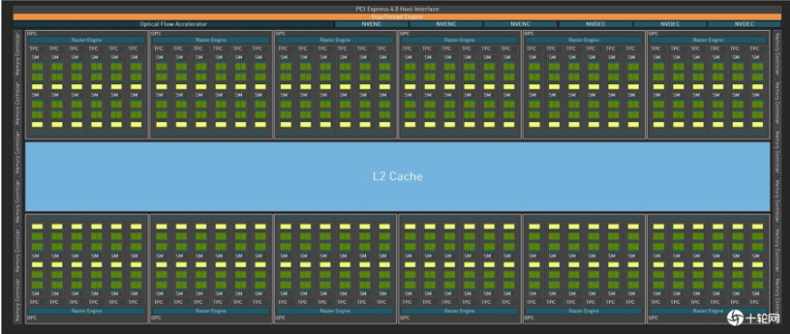
        -  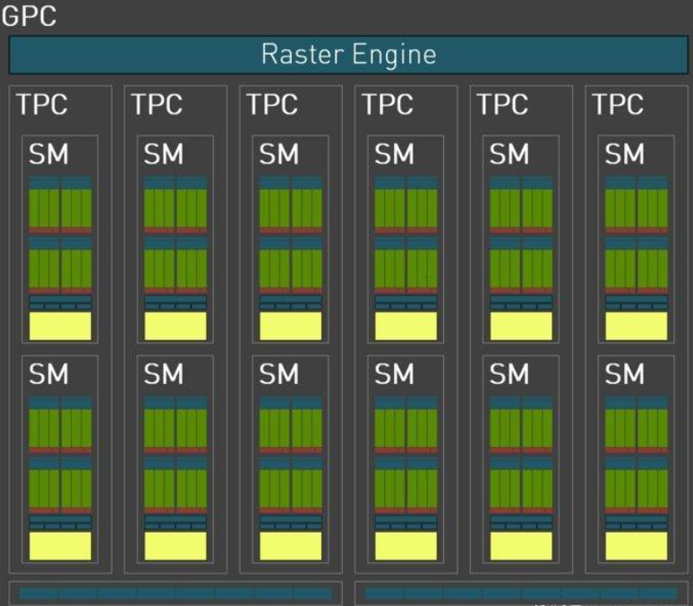
            - 光栅引擎由三个阶段组成。在边缘设置(edge setup)阶段，获取顶点位置并计算三角形边缘方程，边缘方程是用来判断像素是否在三角形内用到的。不面向视锥体的三角形通过背面剔除(Back Culling)被移除。每个边缘设置单元每个时钟周期最多处理一个点、线或三角形。光栅器(Rasterizer)为每一个图元而运行边缘方程并计算像素的覆盖。如果开启了抗锯齿功能，那么就会为每一个多采样以及覆盖采样执行覆盖操作。每个光栅化器每个时钟周期输出 8 个像素，整个芯片上每个时钟周期内总共有 32 个光栅化完成的像素，可以说是性能大大提升。光栅化器产生的像素被发送到 Z-Cull单元。 Z-Cull 单元获取一个像素tile(这里是以tile为单元进行测试)，并将tile中的像素深度与帧缓冲区中的现有像素tile进行比较。完全位于帧缓冲区像素后面的像素tile从管道中剔除，无需进一步的像素着色工作。这里是在还未进行像素着色之前的粗粒度的剔除，还有的时候可以做的是Early-Z同样都是为了提早剔除不必要的图元，避免OverDraw。 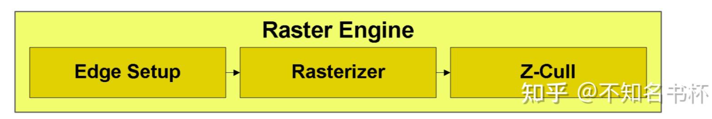
        -  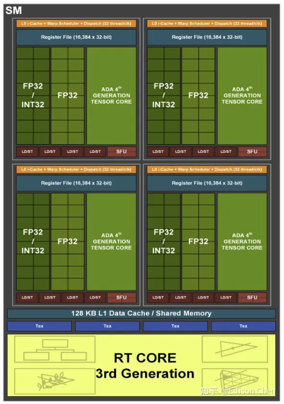
    -  [A100的架构]("https://blog.csdn.net/han2529386161/article/details/106411138")
        - GA100架构：整个 GPU 有8个 GPC(图形处理集群)，单个GPC包含8组TPC，每个TPC包含2个 SM（流式多处理器），GPC 可以被认为是一个独立的 GPU。SM是GPU的核心计算单元，GPU硬件的并行性就是由SM决定的。把大量这样的 SM 排布在一起，将它们连接在 L2 Cache 即显存和全局的调度器（GigaThread Engine）上，再为整张芯片设置与外部通信的线路——这就是用于 Data Center 的安培架构显示核心 **GA100** 的所有组成成分。8 GPCs, 8 TPCs/GPC, 2 SMs/TPC, 16 SMs/GPC, 128 SMs per full GPU; 64 FP32 CUDA Cores/SM, 8192 FP32 CUDA Cores per full GPU;4 third-generation Tensor Cores/SM, 512 third-generation Tensor Cores per full GPU;6 HBM2 stacks, 12 512-bit memory controllers 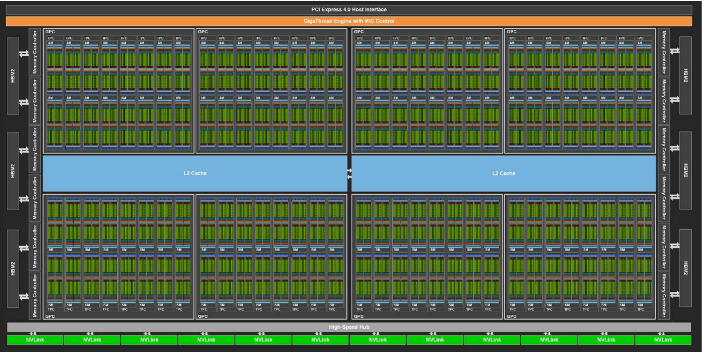
            - 每个SM包含4个处理单元，它们共用这个 SM 的 **L1 Instruction Cache** （一级指令缓存）、 **L1 Data Cache** （一级数据缓存/共享内存）、和4个Tex(内含Texture cache）。每个处理单元包含1个 Warp Scheduler（每个 Warp最多同时执行 32 个 thread），1个Dispatch Unit，8个FP64 Core, 16个FP32 Core, 16个INT32 Core, 1个Tensor Core, 8个Load/Store units (LD/ST Unit)，4个Special Function Units (SFU)用于运算超越函数（sin、cos、exp、log……）,寄存器文件，L0指令缓存。Tensor Core 有着专门设计的硬件结构，可以把整个矩阵都载入寄存器中批量运算，有十几倍的效率提升,Tensor Core支持(FP16,BF16,TF32,FP64,INT4,INT8)的运算类型。Tensor Cores，是FP16单元的变种，认为是半精度单元，致力于张量积算加速常见的深度学习操作。图灵TensorCore还可以执行INT8和INT4精度的操作，用于可以接受量化而且不需要FP16精度的应用场景。 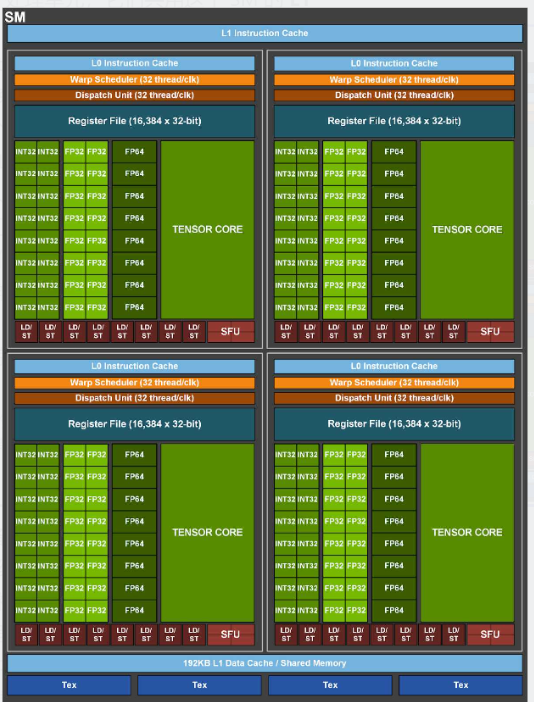
            - 纹理单元（Texture）是一种针对GPU图像应用场景设计的存储处理单元，texture指令的操作输入一般是纹理坐标，而输出可以是像RGBA这样的颜色坐标，整个过程完成了坐标到过滤后的样本的转换。一般而言，在cpu上面存储数据都是线性且连续的，而且读取数据往往是按照某一个数量单位（比如64B）读到缓存cache中，要读取小于这个数量单位的数据时，会浪费掉大量带宽，比如读取局部的图像数据（大小4B）信息时，会读入60B无用的信息。为了解决这个问题，texture单元设计成2维坐标（现在支持3D多维功能）拿取并处理数据的能力，texture被设计为只读属性，且操作顺序相对严格。所以：texture的带宽开销更小，时延更低，但操作灵活度更小。在硬件上面，texture有配套的地址生成器单元address generation units (AGUs)和过滤器单元（filter units），每个sm还配备专门的纹理缓存。
    -  [H100架构]("https://zhuanlan.zhihu.com/p/659738090")
        -  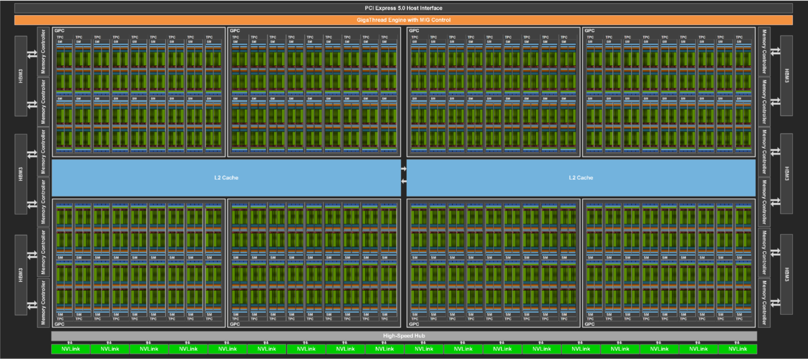
        -  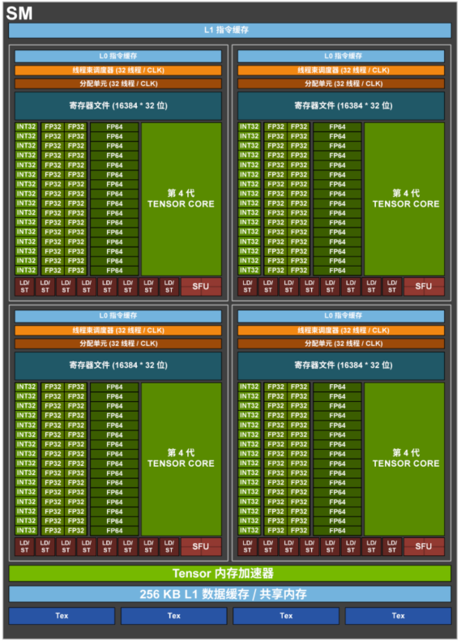
- Tensor Core历史
    - 2017年5月发布的NVIDIA Volta架构中的 ，Tensor Core是一种新型处理核心，它执行一种专门的矩阵数学运算，适用于深度学习和某些类型的HPC。每个Tensor Core可执行64次融合乘法加法（FMA,其中两个4*4 FP16矩阵相乘，然后将结果添加到4*4 FP16或FP32矩阵中，最终输出新的4*4 FP16或FP32矩阵。），一个SM的所有8个Tensor core每时钟共执行512次FMA或1024次单个浮点运算，Tesla V100 Tensor Core可为训练和推理提供125 Tensor TFLOPS。 [第一代 Tensor Core]("https://www.sohu.com/a/253070882_651893")
        - 融合乘加（FMA 或 fmadd）是一种单步舍入的浮点乘加运算。 也就是说，一个未融合的乘加法将计算乘积 b × c，将其四舍五入为 N 个有效位，将结果加到 a，然后四舍五入为 N 个有效位，而一个融合乘法加法将计算整个表达式 a + (b × c) 在将最终结果四舍五入到 N 个有效位之前达到其全精度。
        - 对于Volta架构，SM被划分为四个处理块或子核。对于每个子核，调度器每个时钟向本地分支单元（BRU）、Tensor Core阵列、数学分派单元或共享MIO单元发出一个warp指令，这就首先阻止了Tensor运算和其他数学运算同时进行。在利用两个Tensor Core时，warp调度器直接发出矩阵乘法运算，并且在从寄存器接收输入矩阵之后，执行4*4*4矩阵乘法。待完成矩阵乘法后，Tensor Core再将得到的矩阵写回寄存器。给定A*B+C Tensor Core操作，片段由A的8个FP16*2元素（即16个FP16元素）和B的另外8个FP16*2元素，以及FP16累加器的4个FP16*2元素或 FP32累加器的8个FP32元素组成。从概念上讲，Tensor Core在4*4子矩阵上运行，以计算更大的16*16矩阵。warp线程被分成8组，每组4个线程，每个线程组连续计算一个8*4块，总共要经过4组的过程，每一个线程组都处理了目标矩阵的1/8。 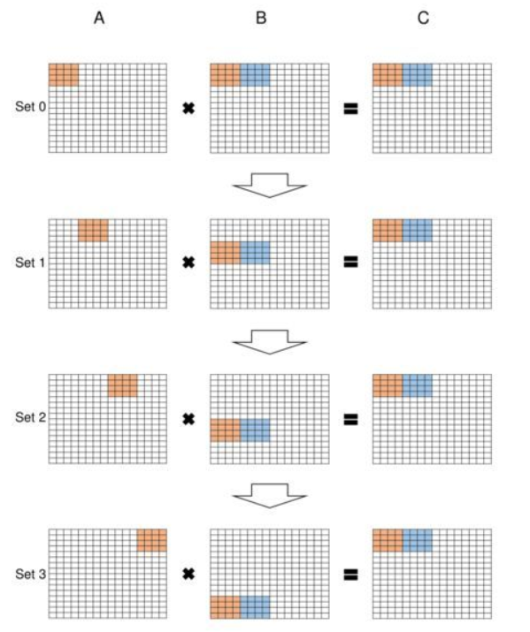
    - 第二代Turing架构tesor core支持的精度FP16、INT8、INT4、INT1。每个张量核心可以执行 64 个浮点融合乘法加法（ FMA ）操作，每个时钟使用 FP16 输入。一个 SM 中的八个张量核心每时钟执行 512 个 FP16 乘法和累加运算，或每个时钟总共执行 1024 次浮点运算。新的 INT8 精度模式以两倍的速率工作，即每时钟 2048 次整数运算。可支持112 TFLOPS FP16, 228 TOPS INT8, 455 TOPS INT4。
    - 第三代Ampere架构tensor core支持的精度：FP64、TF32、bfloat16、FP16、INT8、INT4、INT1。每个 TensorCore 在每个时钟周期支持的混合精度矩阵乘加从 Volta 的 4 x 4 x 4 进化到 8 x 4 x 8 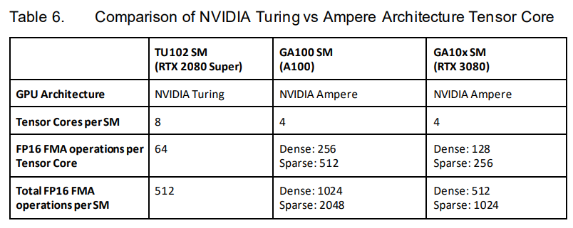
    - 第四代Hopper架构tensor core支持的精度：FP64、TF32、bfloat16、FP16、FP8、INT8。与上一代16位浮点计算相比，Tensor Core在同等数据类型上计算速度是A100 SM的MMA的2倍，而在使用FP8数据类型时，计算速度是A100的4倍。每个 TensorCore 在每个时钟周期支持的混合精度矩阵乘加进化到 4 x 8 x 16。 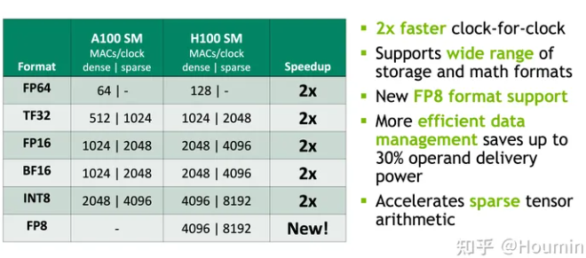
-  [GPU的内存管理]("https://zhuanlan.zhihu.com/p/651179378?utm_id=0")
    - GPU 内存硬件的分类，按照是否在芯片上面可以分为片上 (on chip) 内存和片下 (off chip) 内存。 **片上内存** 主要用于 **缓存 (cache)** 以及少量特殊存储单元（如texture）。特点是速度快，存储空间小。 **片下内存** 主要用于全局存储 (global memory) **即常说的显存** ，特点是速度相对慢，存储空间大。不同于 CPU 系统内存可扩展的设计，GPU 的整体内存大小是固定的，在选择好显卡型号后就会确定好，包括缓存和全局存储。高带宽存储 HBM (High Bandwidth Memory) 是常用的off-chipGPU 存储硬件。它将很多个 DDR 芯片堆叠在一起后和 GPU 封装在一起，实现大容量，高位宽的 DDR 组合阵列。按照存储功能进行细分，GPU 内存可以分为：局部内存（local memory）、全局内存（global memory）、常量内存（constant memory）、共享内存（shared memory）、寄存器（register）、L1/L2 缓存等。RAM 分为静态 RAM（SRAM）和动态 RAM（DRAM）。SRAM 只要存入数据后，即使不刷新也不会丢失记忆；而 DRAM 的电容需要周期性地充电，否则无法确保记忆长存。DRAM 密度高、成本低、访问速度较慢、耗电量大。SRAM 则刚好相反。因此 SRAM 首选用于带宽要求高，或者功耗要求低的情境。如：CPU Cache、GPU On-Chip Buffer。DRAM 则一般用于系统内存、显存。GPU 的片上内存都是 SRAM。 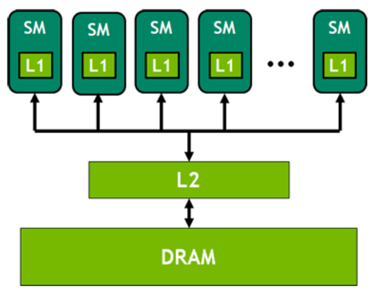
        - on-chip/SRAM [GPU内存(显存)的理解与基本使用]("https://zhuanlan.zhihu.com/p/462191421?utm_id=0&wd=&eqid=c561dba000046f1e000000036497aedd")
            - L2 缓存可以被所有 SM 访问，速度比全局内存快；合理运用 L2 缓存能够提速运算。A100 的 L2 缓存能够设置至多 40MB 的持续化数据 (persistent data)，能够拉升算子 kernel 的带宽和性能。Flash attention 的思路就是尽可能地利用 L2 缓存，减少 HBM 的数据读写时间。
            - L1 缓存用于存储 SM 内的数据，被 SM 内的 CUDA cores 共享，但是跨 SM 之间的 L1 不能相互访问。
            - 寄存器（register）是线程能独立访问的资源，它是片上（on chip）存储，用来存储一些线程的暂存数据。寄存器的速度是访问中 **最快** 的，但是它的容量较小，只有几百甚至几十 KB，而且要被许多线程均分。
            - 共享内存（shared memory) 是一种在线程块内能访问的内存，是片上（on chip）存储，访问速度较快。共享内存主要是缓存一些需要反复读写的数据。共享内存与 L1 缓存的位置、速度极其类似，区别在于共享内存的控制与生命周期管理与 L1 不同：共享内存受用户控制，L1 受系统控制。共享内存更利于线程块之间数据交互。
            - 图像/纹理（texture memory）是一种针对图形化数据的专用内存，其中texture直接翻译是纹理的意思，但根据实际的使用来看texture应该是指通常理解的1D/2D/3D结构数据，相邻数据之间存在一定关系，或者相邻数据之间需要进行相同的运算。 texture内存的构成包含 global + cache + 处理单元，texture为只读内存。
        - off-chip/DRAM
            - 全局内存（global memory）能被 GPU 的所有线程访问，全局共享。它是片下（off chip）内存，前面提到的硬件 HBM 中的大部分都是用作全局内存。跟 CPU 架构一样，运算单元不能直接使用全局内存的数据，需要经过缓存，其过程如下图所示。 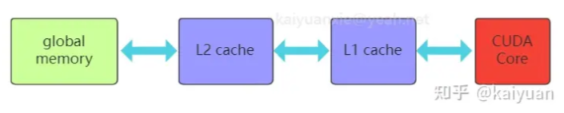
            - 常量内存（constant memory）是片下（off chip）存储，但是通过特殊的常量内存缓存（constant cache）进行缓存读取，它是只读内存。常量内存主要是解决一个 warp scheduler 内多个线程 **访问相同数据** 时速度太慢的问题。假设所有线程都需要访问一个 constant_A 的常量，在存储介质上 constant_A 的数据只保存了一份，而内存的物理读取方式决定了多个线程不能在同一时刻读取到该变量，所以会出现先后访问的问题，这样使得并行计算的线程出现了运算时差。常量内存正是解决这样的问题而设置的，它有对应的 cache 位置产生多个副本，让线程访问时不存在冲突，从而保证并行度。在硬件上面，constant单元也分了多级（L1/L1.5/L2）
            - 局部内存 (local memory) 是线程独享的内存资源，线程之间不可以相互访问。局部内存属于片下内存，所以访问速度跟全局内存一样。它主要是用来应对 **寄存器不足** 时的场景，即在线程申请的变量超过可用的寄存器大小时，nvcc 会自动将一部数据放置到片下内存里。
- GPU任务管理
    - 线程单元
        - **thread：** 一个CUDA并行程序由多个，thread来执行thread是最基本的执行单元（the basic unit of execution）。 **warp：** 一个warp通常包含32个thread。每个warp中的thread可以同时执行相同的指令，从而实现SIMT（单指令多线程）并行。 **warp是SM中最小的调度单位** （the smallest scheduling unit on an SM），一个SM可以同时处理多个warp。 **thread block：** 一个thread block可以包含多个warp，同一个block中的thread可以同步，也可以通过shared memory进行通信。 **thread block是GPU执行的最小单位（the smallest unit of execution on the GPU）。** 一个warp中的threads必然在同一个block中，如果block所含thread数量不是warp大小的整数倍，那么多出的那个warp中会剩余一些inactive的thread。也就是说，即使warp的thread数量不足，硬件也会为warp凑足thread，只不过这些thread是inactive状态，但也会消耗SM资源。 **grid：** 在GPU编程中，grid是一个由多个thread block组成的二维或三维数组。grid的大小取决于计算任务的规模和thread block的大小，通常根据计算任务的特点和GPU性能来进行调整。 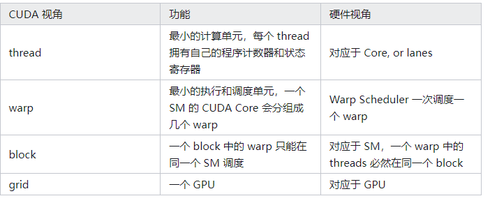
    - 线程管理
        - SM采用的是Single-Instruction Multiple-Thread（SIMT，单指令多线程）架构，warp是最基本的执行单元，一个warp包含32个并行thread，这些thread **以不同数据资源执行相同的指令** 。当一个kernel被执行时，grid中的thread block被分配到SM上，大量的thread可能被分到不同的SM上，但是 **一个线程块的thread只能在一个SM上调度** ， **SM一般可以调度多个block** 。每个thread拥有自己的程序计数器和状态寄存器，并且可以使用不同的数据来执行指令，从而实现并行计算，这就是所谓的Single Instruction Multiple Thread。一个CUDA core可以执行一个thread，一个SM中的CUDA core会被分成几个warp，由warp scheduler负责调度。GPU规定warp中所有thread在同一周期执行相同的指令，尽管这些thread执行同一程序地址，但可能产生不同的行为，比如分支结构。 **一个SM同时并发的warp是有限的** ，由于资源限制，SM要为每个block分配共享内存，也要为每个warp中的thread分配独立的寄存器，所以SM的配置会影响其所支持的block和warp并发数量。
- GPU基本数据
    - GPU由计算元素（如浮点运算单元）和内存层次结构组成。现代GPU中通常包含专门的单元来加速低精度（如FP16/BF16）的矩阵乘法运算，例如Nvidia GPU上的Tensor Core。内存层次结构包括高带宽存储器（HBM）和芯片上的静态随机存取存储器（SRAM，又称共享内存、一级数据缓存）。以A100 GPU为例，它拥有40-80GB的高带宽存储（HBM，二级缓存），带宽达到1.5-2.0TB/s，以及每个流式多处理器108个中的192KB芯片上SRAM，其带宽估计约为19TB/s。Nvidia的A100 GPU具有最大理论吞吐量达到312 TFLOPs/s（每秒万亿次浮点运算）的FP16/BF16格式矩阵乘法性能，然而对于非矩阵乘法的FP32格式计算，这一数字仅为19.5 TFLOPs/s。A100 SM包括新的第三代Tensor内核，每个Tensor Core每个时钟执行256个FP16 / FP32 FMA操作。A100每个SM有四个Tensor Core，每个时钟总共可提供1024个密集的FP16 / FP32 FMA操作。用于AI训练的默认数学是FP32，没有张量核心加速。NVIDIA Ampere架构引入了对TF32的新支持，使AI培训默认情况下可以使用张量内核，而无需用户方面的努力。非张量操作继续使用FP32数据路径，而TF32张量内核读取FP32数据并使用与FP32相同的范围，但内部精度降低，然后生成标准IEEE FP32输出。TF32包含一个8位指数（与FP32相同），10位尾数（与FP16相同的精度）和1个符号位。 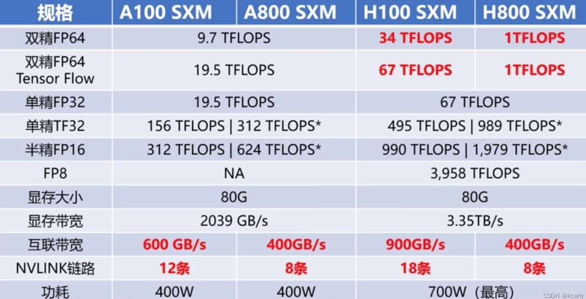
    - A100 vs H100 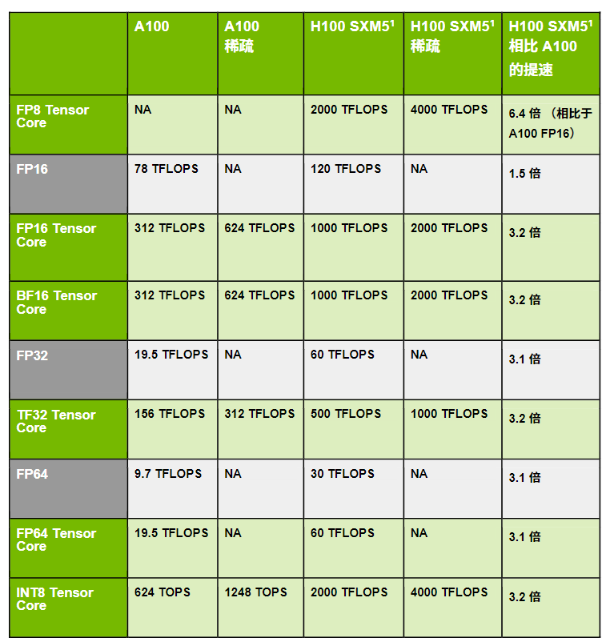
    - 基本概念 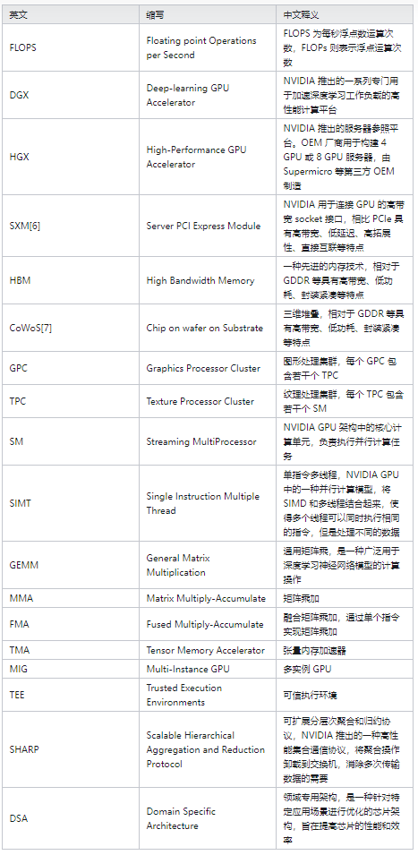
-  [GPU的发展历程]("https://www.zhihu.com/column/c_1552001218175766528")
    - **Fahrenheit 架构（1998年）-> Celsius 架构 （1999年）-> Kelvin 架构（2001年）->Rankine 架构（2003年）->Curie 架构（2004年）** 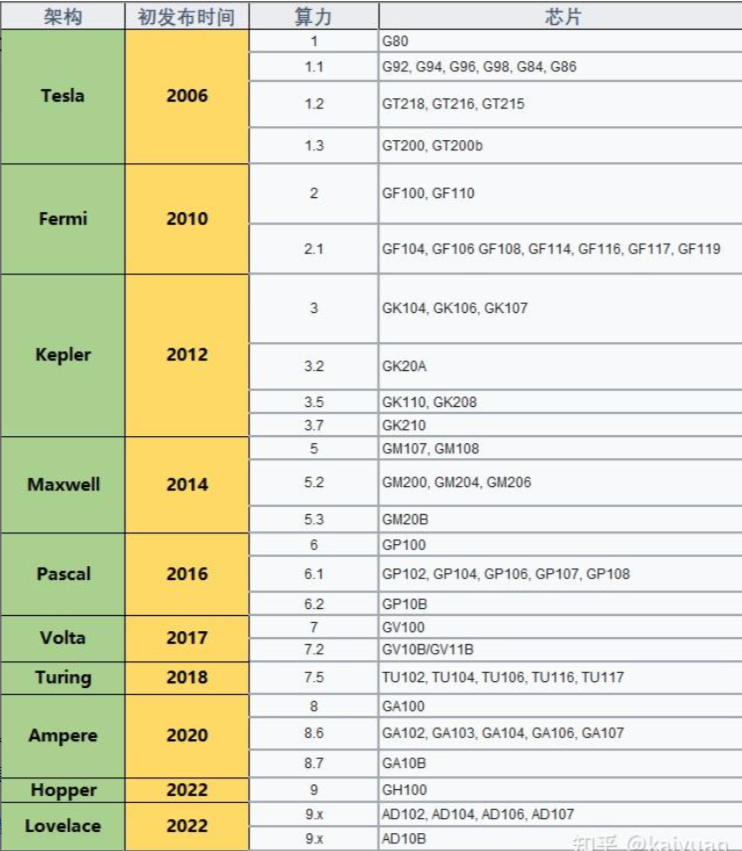