# LLM+KG
- LLM-based KG
    - KnowLM
    - OpenSPG
- KG-based RAG
    - 基本原理
        - 从query出发的语义解析
            - pre-LLM方法
                - **思想** ：直接将问题解析为对应的逻辑表达式，然后到知识图谱中查询。
                - **方法** ：通常包含逻辑表达式、语义解析算法、语义解析模型训练三部分。一般步骤是将问句解析成中间表示，再将中间表示向知识库映射，获得最终的逻辑表示。
                    - **逻辑表达式** ：lambda-calculus（支持实体，数词，函数等常量，支持多种逻辑连接词，支持 \ exists, \ forall等存在量词，argmax,argmin等额外量词）,lambda-DCS（组合语法更简单，支持最基本的实体、关系、Join/intersection操作，支持Bridging操作，可以把两个独立的语义片段组合起来，将离散语义组合为更完整的语义）, 组合范畴语法CCG（由解析规则、解析算法、解析模型训练组成，解析规则由词汇、句法类型、语义类型构成，CCG支持应用、组合、类型转化、并列等操作）。
                    - 语义解析的基本步骤： **短语检测** （识别短语的实体和关系，包括分词、词性标注POS、命名实体识别NER，依赖关系分析构造短语依存图等步骤）， **资源映射** （grouding，包括实体链接、概念匹配、关系分类/关系抽取，目标是将问句与知识图谱上的本体匹配，可以从短语依存图出发实现）， **语义组合** （包括句法分析，组合模型训练，语义组合等步骤）， **逻辑表达生成** 。
                    - **语义解析器的训练** ：目标是通过大规模知识库上的问题/答案对集合训练Parser，用在语义组合阶段。以词法、语法、对齐、桥接、实体链接、关系识别为特征，以候选逻辑表达式为目标 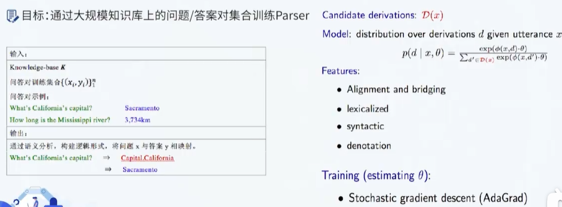
                - **难点** ：1. 语义解析的Bridging操作，通常谓词不是明确表示的,导致问句中的谓词无法与知识图谱中的关系直接映射，将实体周边的谓词与问句中真正的谓词对应，即Bridging。2. 知识图谱是高度不完备的，因此需要进行问句的短语重写来匹配知识（Prapharasing），因此需要搜集高质量的语料来训练短语重写模型。 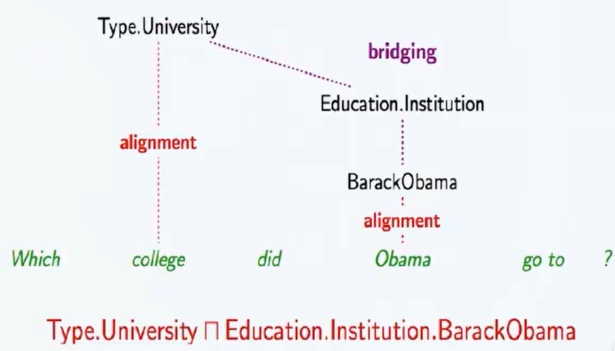
                - **缺点** ：最大缺点是对知识图谱中资源的利用程度不够,知识图谱中的海量知识是可以极大的增强问句的理解过程的,更好的方法应该充分深挖问句和知识图谱两方面资源所包含的信息。
            - LLM-based方法
                - 增加一路与向量库平行的KG上下文增强策略，基于模型的NL2X能力或单独的NL2X模块，将query解析为图查询语言，直接执行图查询，然后后查询的结果转换为文本片段。
        - 从图谱出发的检索排序
            - pre-LLM方法
                - **主要思路** ：根据query抽取实体，然后把实体作为种子节点对图进行采样（必要时，可把KG中节点和query中实体先向量化，通过向量相似度设置种子节点），然后把获取的子图转换成文本片段，针对query进行排序。
                - 关键模块：排序模型
                    - **基于特征的检索排序模型** ：针对每个答案构造特征，常用的问题特征包括：疑问词特征、问题实体特征、问题类型特征、问题动词特征、问题上下文特征。常用的答案特征包括：谓词特征、类型特征、上下文特征。
                    - **基于子图匹配的检索排序模型** ：从输入问题中定位问题实体,随后答案候选检索模块以该问题实体为起点按照特定规则从知识图谱中选择答案候选,接下来,答案子图生成模块为每个答案候选实体从知识图谱中抽取出一个子图,作为该答案实体的一种表示。最后答案检索排序模块计算输入问题和每个答案子图之间的相似度用来对子图对应的答案候选进行打分,从而排序得到最终答案，Wen-tau Yih, Ming-Wei Chang, Xiaodong He, Jianfeng Gao. Semantic Parsing via StagedQuery Graph Generation: Question Answering with Knowledge Base, ACL, 2015。
                    - **基于向量表示的检索排序** ：为输入问题Q 和答案候选 A 分别学习两个稠密的向量表示f(Q)和g(A):并在向量空间中计算问题向量和答案向量之间的相似度，用于对不同的答案候选进行打分。
                    - **基于记忆网络的检索排序** ：除问答模块之外,引入记忆网络模块，记忆网络模块负责将有限的记忆单元表示为向量，问答模块从记忆网络模块中寻找与问题有关的答案，如Key-value Memory Network将外部数据输入表示为记忆单元，通过问句与记忆单元之间的计算来寻找答案。
                - 主要难点：实体链接
                    - **难点1** ： **实体链接** ，在文本中对知识图谱中的命名实体进行识别和消歧的任务。标准方法使用实体对齐工具（如TagMe）来检测输入文本中提到的知识图谱实体并将它们链接到正确的知识图谱条目。但也可以将实体链接问题的两部分——识别和消歧——作为一个联合任务,使用端到端的神经网络进行优化
                    - **难点2：多语言实体链接** ，在实际应用中,我们经常需要把多语言的文本中的实体链接到一个或多个不同语种的知识图谱上这类型的设定被称为是跨语言实体链接当语种数目足够多时,会出现低资源语种或实体对应的训练数据极少的情况，因此,需要格外关注零样本和少样本的情形。《Entity Linking in 100 Languages》
            - LLM-based方法
                - 基本方法：基于LLM进行中心实体抽取，然后从中心实体出发，获取知识图谱中有关的实体的子图，转换为自然语言作为候选答案，然后对候选答案进行向量化，根据与query的语义相似度进行排序，选出得分最高的候选答案作为上下文，输入LLM进行编排得到最终回答。
                - 实体链接实现（KG-RAG）：实体识别使用LLM实现，预先将KG中的节点使用特定的embedding模型进行向量化，查询时计算抽取实体与KG节点的相似度，选择topk相似节点作为候选实体。问题：1，理论层面，没有消歧，不能解决实体异名、同名异意的问题；2. 实现层面，需要预先向量化，指定向量集合和KG数据库。
    - KAPING：直接以KG中抽取的三元组作为提示
        - 从知识图谱中抽取相关的事实三元组，并将其作为提示信息输入到大模型。因此在这一方法中，如何抽取最相关的三元组是需要解决的主要问题。所提方法分为三个模块：知识获取-知识表达-知识注入。 **知识获取** 的目标从给定问题中抽取相关的实体。本模块采用的方法为传统的实体链接方法。然而，该实体相关三元组可能规模较大，且并非所有都与问题相关。基于这一考虑，本文首先采用已有的句子表示模型，分别将三元组和问题映射到统一表示空间，选择前K个与问题语义最相似的三元组。 **知识表达** 的目标是将三元组转化为文本形式的表示。 **知识注入** 的目标是根据三元组和给定问题构建大模型提示词。构建方法为首先列出N个相关三元组，然后增加说明信息“Below are facts in the form of the triple meaningful to answer the question”。
    - Think on Graph：从KG中搜索下一步推理路径
        - 从给定问题出发，每一步推理都要经过扩展-推理的过程，每步推理都是基于问题通过大模型在知识图谱数据中搜索下一步推理的相关路径。主要步骤为首先识别输入问题中的主题实体， **然后利用大模型对外部知识图谱进行探索和推理** ，检索相关的路径。如此循环直到达到最大步数或得到推理答案。具体来说，该算法为一个可循环的迭代过程，每次循环需先后完成搜索剪枝、推理决策两个任务，搜索剪枝用于找出最有希望成为正确答案的推理路径，推理决策任务则通过LLM来判断已有的候选推理路径是否足以回答问题，如果判断结果为否，则继续迭代到下个循环。在ToG之外，ToG-R根据实体搜索得到的以EDcand结尾的所有候选推理路径执行推理步骤。与ToG相比，ToG-R省去了使用LLM修剪实体的过程，从而降低了总体成本和推理时间，并且强调关系的字面信息，当中间实体的字面信息缺失或不为LLM所熟悉时，可以降低误导推理的风险。 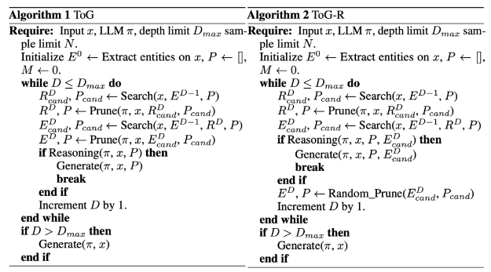
        - 1. **主题实体提取** ，使用LLM初始化实体提取，得到若干后续主题实体；2. **子图查询** ，包括关系查询和实体查询，先根据实体，查找其存在的关系，然后再根据关系，查询对应的实体；3. **关系裁剪** ，对于给定的实体，通过查询，可以得到多个路径（关系），需要对路径进行排序，在这里，利用大模型进行评估，通过prompt完成，如：请检索对问题有贡献的N个关系（用分号隔开），并按0到1的等级对其贡献进行评分（N个关系的分数总和为 1）；4. **实体裁剪** ，让大模型用0至1分给各实体对问题的贡献打分（所有实体得分之和为1），用来做评分对比，也是通过prompt实现；5. **相关度判断** ，通过探索过程获得当前推理路径P后，会提示LLM评估当前推理路径是否足以生成答案。如果评估结果是肯定的，就提示LLM以查询为输入，使用推理路径生成答案。反之，如果评估结果为负，则重复探索和推理步骤，直到评估结果为正或达到最大搜索深度Dmax。如果算法尚未结束，则表明即使达到最大搜索深度Dmax，ToG仍无法探索出解决问题的推理路径。在这种情况下，ToG将完全根据LLM中的固有知识生成答案。这一目标，同样也是依赖prompt完成处理，思想在于：给定一个问题和相关的检索知识图谱三元组（实体、关系、实体），要求大模型回答用这些三元组和大模型知识是否足以回答这个问题（是或否）。6. **生成结果，** 直接将检索到的文本加入到prompt中，送入大模型，完成答案生成。
    - FlexKBQA：基于模板的KBQA方法
        - FlexKBQA一个关键组件是 **Automatic Program Sampling，** 负责从知识库（KB）中自动生成多样化的程序（如SPARQL查询），这些程序随后可以被转换为自然语言问题。这个过程分为两个主要步骤：模板收集（Template Collection）和逐步Grounding（Step-wise Grounding）： **模板收集（Template Collection）** ：首先，从知识库中收集结构化查询（如 **SPARQL** ）的模板，这些模板包含了变量（例如，ent0, rel0, ent1），用于表示实体和关系。这些模板的设计旨在捕捉不同类型问题的基本逻辑。例如，一个SPARQL查询模板可能如下图，?type 是一个占位符，用于在后续步骤中填充具体的实体和关系。模板的多样性对于生成覆盖用户可能遇到的各种问题类型至关重要。 **逐步Grounding（Step-wise Grounding）** ：在收集了多样化的模板之后，下一步是将模板中的变量逐步替换为具体的实体和关系值。这个过程称为“ **Step-wise Grounding** ”，通过迭代地确定模板中变量的值，将这些模板转换为可执行的程序。这个过程通过直接将模板中的变量视为查询对象，利用SPARQL的查询机制来实现。例如，对于上述SPARQL模板，可能的接地顺序是首先确定ent0，然后是rel0，最后是ent1。一旦这些变量被赋予了具体的值，就可以将它们填充到模板中，形成一个可执行的程序。 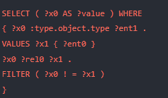
    - 开源项目
        -  [https://github.com/BaranziniLab/KG_RAG]("https://github.com/BaranziniLab/KG_RAG")
        -  [https://github.com/stanford-oval/WikiChat]("https://github.com/stanford-oval/WikiChat")
            - 1. **基于LLM生成从wiki百科检索的查询** ，发送到信息检索系统，从语料库中获取相关段落，并根据时间信息对结果进行重新排序，以获取近义词段落。 [再看有趣的大模型RAG问答优化策略:Wikichat七步走及KG-RAG实现范式 (qq.com)]("https://mp.weixin.qq.com/s/UsZy6TdnUaqQ3PtSq6F4yA")
                - 文本索引：使用 **WikiExtractor工具(** 从2023年4月28日获得的英文维基百科转储中提取纯文本，与ColBERT一样，将每篇文章（忽略表格和信息框）划分为不同的文本块作为段落，并在段落前加上文章标题，将段落和标题的总长度限制在120字以内。 [https://github.com/attardi/wikiextractor)]("https://github.com/attardi/wikiextractor)")
                - 检索召回：在维基百科上使用 **ColBERTv2(** 和 **PLAID(** 作为检索工具。ColBERT是一种快速准确的检索模型，可在数十毫秒内对大型文本集合进行基于BERT的可扩展搜索，ColBERT的后期交互，可有效地对查询和段落之间的细粒度相似性进行评分。ColBERT是表示-交互检索模型的代表，由一个线上encoder一个线下encoder组成，encoder具体采用的是bert，而且是共享权重的。此外，encoder的输出会进入一个没有激活函数的线性层，用于缩小每个token的维度，起到加速的作用。 而且还会将document的encoder输出结果中的标点符号去掉，也是起到加速作用。 [https://github.com/stanford-futuredata/ColBERT/)]("https://github.com/stanford-futuredata/ColBERT/)") [https://arxiv.org/abs/2205.09707)]("https://arxiv.org/abs/2205.09707)") 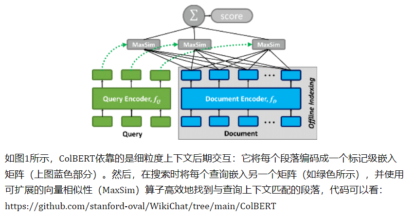
            - 2. **汇总和过滤检索到的段落，** 基于LLM从检索到的段落中提取相关部分，并将其归纳为要点
            - 3. **生成初始回复** ，提示LLM生成对对话历史的回复，这种回复通常包含有趣和有用的知识，但本质上并不可靠
            - 4. **从回复中提取声明** ，LLM回复被分解为多个声明(claim)。这一阶段解决共同参照问题，以减少歧义，并解决了"当前"和"去年"等相对时间信息
            - 5. **使用检索到的证据对回复中的声明进行事实检查** ，使用思维链提示，只有得到证据支持的声明才会被保留
            - 6. **起草最终回复** ，根据给定的要点清单和对话历史记录生成回复草稿
            - 7. **完善最终回复** ，根据相关性、自然性、非重复性和时间正确性生成反馈并完善回复
- KG-enhanced LLM
    - 知识注入训练的LLM
        - ERNIE
        - KnowBert
        - LUKE
        - KBERT
    - 基于知识图谱微调的LLM
        - KoPA（ ） [介绍]("https://mp.weixin.qq.com/s/HYAuUZfOPoJ1T0ozCrvDpg")
            - KoPA是一个两阶段的基于LLM的KGC框架。首先对给定的KG中的实体和关系进行结构嵌入预训练（上面的支路）,然后然后通过结构前缀适配器将这些信息注入输入序列，用于采用指令调优来微调LLM。 **结构嵌入预训练** ：KoPA从KG中提取实体和关系的结构信息，并将其适应到LLM的文本表示空间中。使用负采样的自监督预训练目标定义得分函数 ( F(h,r,t) ) 来衡量三元组的合理性。通过最小化这种预训练损失，实体和关系的结构嵌入被优化以适应所有相关的三元组。 **知识前缀适配器** ：在完成结构嵌入预训练后，通过知识前缀适配器将结构嵌入转换为虚拟知识Token。这些Token作为输入序列的前缀，由于解码器仅在LLM中的单向注意力，所有后续的文本Token都可以看到这些前缀。这样，文本Token可以对输入三元组的结构嵌入进行单向注意，从而在微调和推理期间实现结构感知提示。 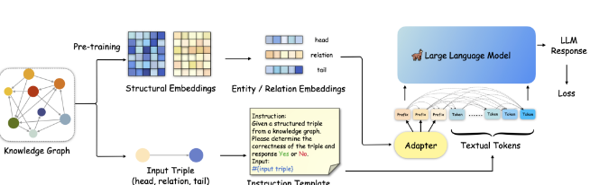
- KG-enhanced LMM
    - ：通过场景图知识增强多模态结构化表示增强CLIP [Structure-CLIP]("https://mp.weixin.qq.com/s/F6eJfKPx_02z8x_RvXKYDA")
        - **出发点** ：CLIP模型产生的通用表征能力无法区分那些包含相同单词但在结构化知识方面存在差异的文本段落。换言之，CLIP模型表现出类似于词袋模型的特点，未能有效理解和捕捉句子中的细粒度语义。思路：通过场景图知识增强多模态结构化表示。与NegCLIP的随机交换方法不同，Structure-CLIP采用了基于场景图的引导策略来进行单词交换，以更精确地捕捉底层语义意图。此外，还提出了一种知识增强编码器，它利用场景图来提取关键的结构信息，并通过在输入层面上融合结构化知识，从而增强结构化表示的能力。
- KG-enhanced Prompt Engineering
    - ：诱导LLM生成结构三元组来提高CoT推理中的依据可信度 [CoK]("https://mp.weixin.qq.com/s/N2Fj_bWVIWHZNrI5gz-lpQ")
        - **出发点** ：旨在解决CoT中中间生成理由错误的问题，方法是诱导LLM生成结构三元组的显式知识证据，基于此还引入F2-Verification方法，从事实性和忠实性两个方面来评估推理链的可靠性。对于不可靠的回答，可以指出错误的证据，促使LLM重新思考。 **主要创新点** ：提示格式，因为纯文本推理链不足以让LLM生成可靠而具体的推理过程。受知识库中三重结构的启发，需要用结构化特征来增强提示。事后验证。LLM通常无法检查他们所回答的答案，这就要求利用外部知识进行验证。 **方法** ：CoK由两个主要部分组成，即证据三元组（CoK-ET）和解释提示（CoK-EH）。CoK-ET代表一个由多个三元组组成的列表，每个三元组都代表从大模型那里获得的知识证据，以支持逐步思考的过程。在事实性验证上，事实性可视为每个生成的三元组证据与知识库中的基本真实知识之间的匹配度。具体来说，定义一个函数fv来表示每个证据的真实性。设计两种不同的fv策略：精确验证和隐式验证。在忠实性验证上，给定一个测试查询、一个证据三元组列表和最终答案，直接将它们连接成一个新的序列，利用预置的句子编码器SimCSE来计算新序列与先前序列之间的相似度，最后，对于每个查询，可以得到一个分数Ci（0<Ci<1），表示该理由对答案是否可靠。当LLM生成的推理链未能通过验证且可靠性得分低于阈值θ时，会在反思阶段为它们提供额外的再次生成机会。
    - BSChecker:将大模型输出分解为三元组分步进行幻觉检测
        - BSChecker其思想在于，与传统的段落或句子级别的分析方法不同，将大模型的输出文本分解成知识三元组，该工作将幻觉检测的最小单元称为一个声明（claim）。在计算方式上，不同于传统幻觉检测方法将整个输出文本分类为是否存在幻觉这两种类别标签，BSChecker对输出文本中的每一个声明都进行幻觉检测并分类。输出文本和其相应的参考文本之间的关系可以分成蕴涵（Entailment，图中绿勾✅）和矛盾（Contradiction，图中红叉❌）以及中立（图中的问号）。BSChecker具有模块化的工作流程，分为声明抽取器E，幻觉检测器C，以及聚合规则τ，将输入文本分解成一组知识三元组。每个三元组都要经过验证，验证。随后，根据预定义的规则，汇总各个结果，以确定给定文本的整体幻觉标签。本质上是以文本抽取的多个三元组为评估基准，来评估整个输出的幻觉可能。
        - Extractor使用GPT-4和Claude 2，Checker使用大量现有的ZERO-SHOT校验器，而无需额外的训练，主要考虑两种类型：基于LLM的检查器和基于NLI的检查器,在汇总阶段，得到整个输入文本的整体幻觉标签。
    - : 通过图表示/验证步骤引导CoT [graph-guided reasoning]("https://mp.weixin.qq.com/s/A-uXNGbD1WwCkGqFVJ4YiA")
        - 包括如下几个步骤：1. 图表示， **利用LLMs构建一个“问题/理由图”，该图是一个有向无环图，其中每个节点是一个问题或一个理由，每条边是一个关系** 。图表示的目的是将问题和理由的语义结构显式地表示出来，以便于后续的推理。2. 图验证， **利用LLMs对当前的理由节点进行诊断，通过将其与现有的问题/理由图进行比较，来过滤掉无关的理由，并生成后续的问题，以获取更多的相关信息** 。图验证的目的是检查和纠正当前的推理路径，以避免错误或不完整的推理。3. 图补充， **利用LLMs生成不包含图中提取信息的CoT路径，以表示图抽取中遗漏的上下文信息** 。图补充的目的是补充和完善当前的推理路径，以提高推理的全面性和鲁棒性。
        - 具体实现： **问题图构建** 是指利用大型语言模型从问题中提取知识三元组，并将其表示为一个图结构。 **中间问题生成** 是指根据问题图中的三元组，生成一个与初始问题相关的子问题，以获取回答问题所需的信息。 **中间答案生成** 是指利用大型语言模型回答中间问题，并生成一个作为推理步骤的中间答案。在开放领域的设置中，还可以利用检索增强的方法，根据中间问题作为查询，从外部知识库中检索相关的段落，以辅助中间答案的生成。 **理由验证** 是指将生成的中间答案转换为三元组的形式，并与问题图进行匹配，以验证其是否有效和有用。如果中间答案被拒绝，就返回到中间问题生成的步骤。 **这个过程重复进行，直到生成的理由图与问题图匹配，或者达到重复的限制。然后，大型语言模型根据所有的中间答案，生成最终的答案** 。
- 应用案例
    - 京东
        - 场景
            - 商品推荐：推荐优质商品，有图片、商品卖点标题以及商品文案等展示形式
            - 导购机器人：根据用户需要咨询的商品，首先给他推送一条商品的介绍文案，预期达到通过介绍文案直接解答用户的一些疑问和进一步对商品进行促销的效果
            - 社交团购：对文案进行一些个性化的处理（加一些表情符号、促销信息），方便分享到社交平台
            - 直播机器人：生成比较长的文案，用于给虚拟主播或者一些没有经验、没有运营团队的真人直播提供文案参考
        - 技术点：可控文本生成
            - 控制输入
            - 控制词表：以调整词表的形式，在解码端对词的概率进行调整，从而鼓励或禁止某些词的生成
            - 调整模型：过改变解码器的初始化、编码器的初始化、添加一些辅助任务以及做一些多任务学习来调整模型
        - 基于领域知识图谱的商品文案生成
            - 低频属性值生成
                - 传统的复制机制，在输入的所有信息里面找到一个正确的解码的词。改进的复制机制就不仅仅是从输入的文本中进行复制，而是先找到 token 的属性类型，再检索属性类型的属性值。 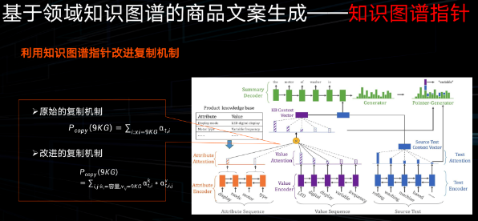
            - 利用多模态信息进行知识图谱补全
                - 1. 局部的视觉门，就是想在描述不同的商品属性时，让模型关注到具体商品图片的某个区域；2. 全局视觉门，利用图片信息增强文本理解。 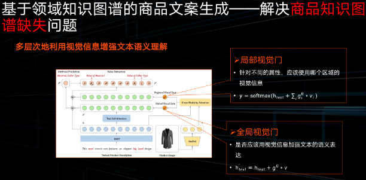
            - 加强复制机制
                - 复制机制：解码文本是由两部分构成的，第一部分是一个生成概率，需要计算生成词表里哪个词的概率是最大的，第二个方面是复制概率，计算在当前时刻输入里哪个词放到输出里，最终解码概率实际上是两个概率的叠加。传统的复制概率，在选择复制某一个词时，是从输入里去复制，但是生成概率则不一定。
                - 改进的复制机制：在生成属性值的时候，将生成概率置 0，也就是说当生成属性值时，它的解码概率只剩下复制概率，只有出现在输入中的属性值才能被解码到输出里，这样就避免了错误的属性值出现在解码文本中。 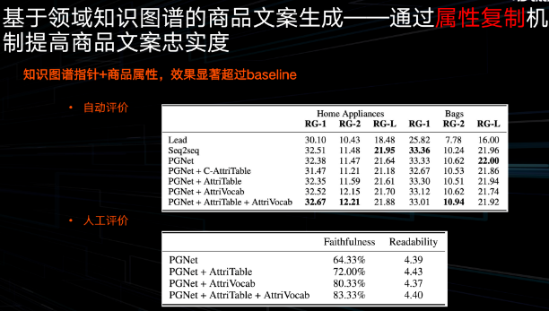
        - 基于通用知识图谱的商品文案生成
            - 领域知识图谱和通用知识图谱融合时，难以区分哪个通用知识图谱的信息是忠实的
                - 加入商品token的类别向量：当我们模型在解码时，在参考输入信息的过程中，如果是参考的是商品知识图谱应该完全信赖，但是在使用通用知识图谱时，应该选择性地使用，而不是一味从里面拿信息。 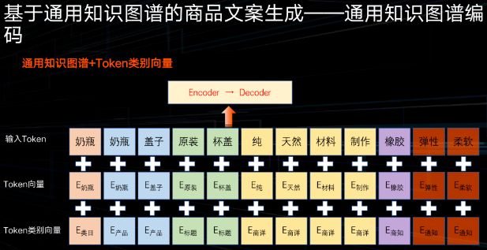
        - 基于领域知识图谱的LLM
            - 其中要素边界检测任务：在描述一款商品时会分很多角度，能否让模型意识到该描述是否每部分在描述不同的角度。 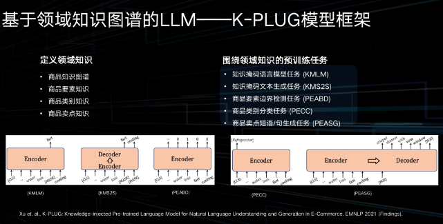
            - 评估任务：知识图谱补齐、电商多轮对话以及商品摘要生成任务。评估模型：三类模型，一个是 C-PLUG，C-PLUG 就是通用的、不加入任何知识的模型；一个是 E-PLUG 就是将通用知识加入到模型里去；最后就是 K-PLUG，是将电商知识注入到模型中去。 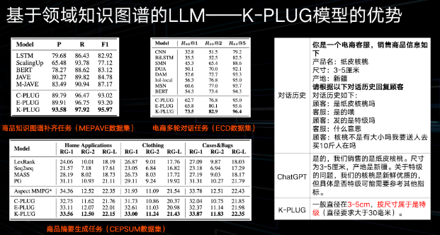
        - 基于通用知识图谱的LLM
            - 降噪自编码训练模式的缺陷：第一个方面是在训练过程中，模型不会对所有的信息进行区分对待，比如如果是对知识进行加强学习，我们会希望知识的掩码概率要大。第二个方面是在训练过程中，无论是掩码语言模型，还是现在比较流行的 Decoder-only 的语言模型，训练方式都是 Teacher-Forcing 的形式，就是当我们预测下一个词时，模型会给到上个词或者说历史信息的真值的词。（decoder-only该咋办？）
            - 解决：不仅要在编码器或者在输入信息里加噪，还要在输出里加噪，就是当模型去预测这样的一个知识 entity（实体）时，我们并不只是用 Teacher-Forcing形式，而是要让他完整地预测，比如说在预测第二词“约”时，我们并不把“纽”作为一个输入，而是把噪音作为输入，例如一个[MASK]token，让模型完整地依次预测出“纽”、“约”这两个字。 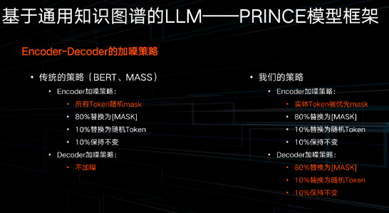