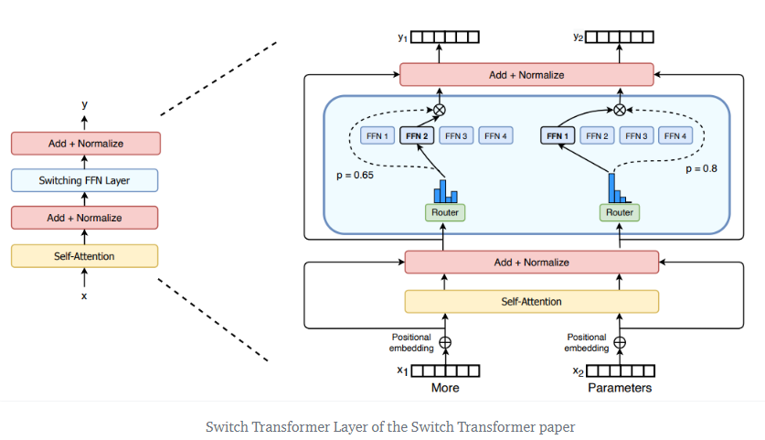
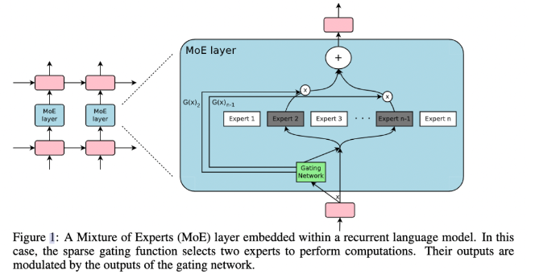
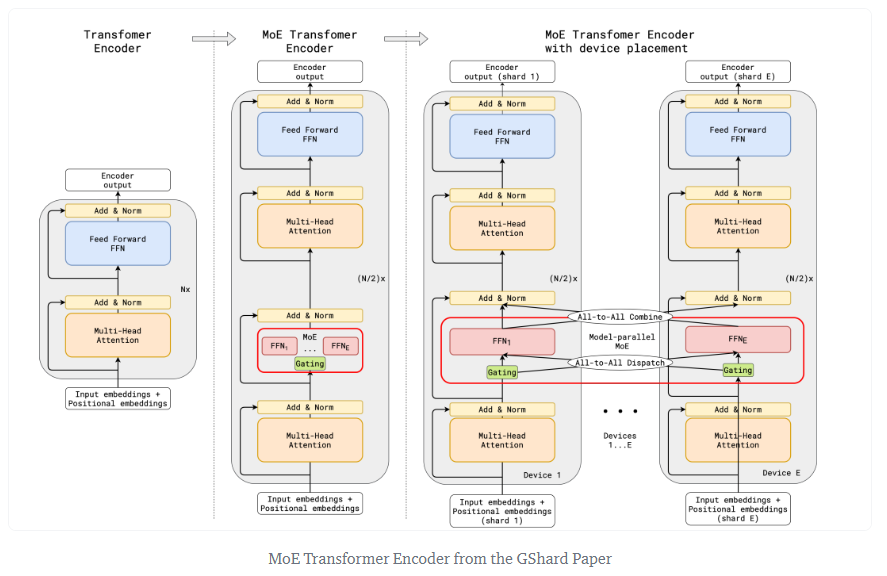
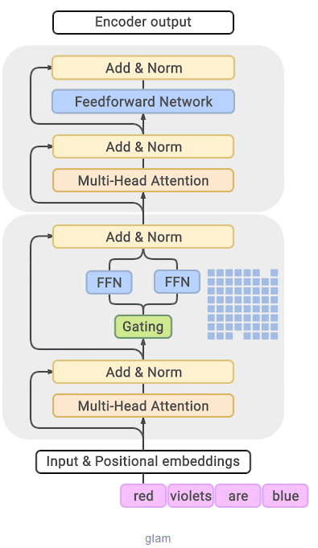
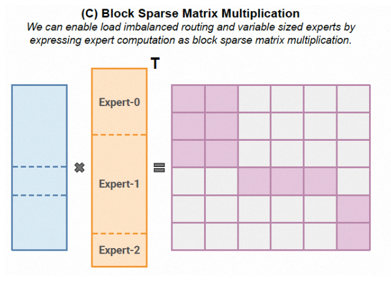
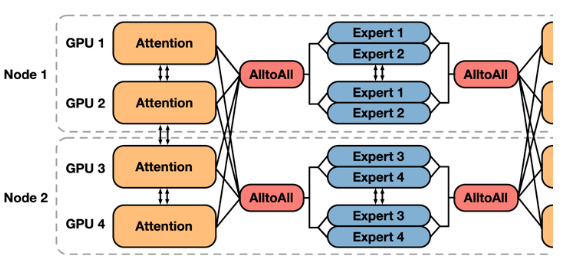

# MoE
-  [原理]("https://huggingface.co/blog/moe#what-is-a-mixture-of-experts-moe; https://mp.weixin.qq.com/s/aE0XCqgFMEEbDjXU_8Vcfw")
    - 简介：Mixture of Experts (MoE) 是一种模型设计策略，它通过将多个模型（称为"专家"）直接结合在一起，以获得更好的预测性能。在大模型中，MoE方案可以有效地提高模型的容量和效率。一般而言，大模型的MoE有一个 **门控机制** 和一套 **门控输出机制** 来合并和平衡专家的选择，用于决定每个专家对最终预测的；有一套 **专家选择机制** ，会根据门控机制的输出选择一部分专家进行预测。这样可以减少计算量，并使模型能够针对不同的输入选择最合适的专家。目前有如下几种常见的模式： **Switch Transformer-MoE** 模型的每个block都是一个专家网络的集合，输入数据会被动态地路由到不同的专家进行处理; **EC (Expert Choice)** : Expert Choice的方法是设置一组具有预定缓冲区容量的专家，给专家分配给前k个令牌，产生一个令牌到专家的得分矩阵，然后用该矩阵做出路由决策。 **GLaM (Generalist Language Model)** 使用稀疏激活的混合专家架构来扩大模型容量,GLaM的做法是在Transformer层之间加一个MoE层。对于每个输入标记，门控模块会动态地从64个专家中选择两个最相关的专家。这两个专家的输出的加权平均值将然后传递给上面的Transformer层。对于输入序列中的下一个标记，将选择两个不同的专家来达到平衡。目前MoE的主流方案是SMoE模型，它是一种特殊的神经网络，其中一组参数被划分为 “专家”，每个“专家” 具有唯一的权重。在训练和推理期间，模型将输入样本给到特定的专家权重，让每个样本仅与网络参数的子集交互，这与将整个网络用于每个输入的常规方法不同。由于每个样本仅使用一小部分专家，因此相对于总模型来说计算量大幅减小了。 **MoE 的基本思路是通过宽度换取深度，因为模型深度越深，计算层数越多，进而推理时间越长。** 在transformer中，MoE的实现是在每一层中，注意力部分的结构保持不变，但在多层感知器（MLP）的部分，有多组专业化的前馈神经网络，并通过一个门控网络（Router）来确定哪些专家应该被激活以处理特定的输入数据。 **Router算法** 是所有稀疏专家架构的关键特性，它决定了将样本发送到哪里。该领域已被广泛研究，包括使用固定的、非学习路由模式的反直觉方法（Roller et al., 2021）。由于要对选择哪些专家做出离散决策，因此路由决策通常是不可微的。
- Sparse MoE
    - ST-MoE
        - Swith Transformer 的主要亮点在于——简化了MoE的routing算法，从而大大提高了计算效率。Swith Transformer 在论文中提到其设计的指导原则是—— **尽可能地把Transformer模型的参数量做大，跟其他MoE模型的一个显著不同就是，Switch Transformer 的 gating network 每次只 route 到 1 个 expert，而其他的模型都是至少2个。** 
    - Sparsely-Gated MoE
        - **Sparsely-Gated** ：不是所有expert都会起作用，而是极少数的expert会被使用来进行推理。这种稀疏性，也使得我们可以使用海量的experts来把模型容量做的超级大。 **token-level** ：传统的MoE是 sample-level 的，即不同的样本使用不同的experts，但是这篇则是 token-level 的，一个句子中不同的token使用不同的experts。 **RNN-based** : 在RNN的结构上加入MoE layer。 **Gated Network** : 输出结果为每个expert的加权和，使用Softmax作为gated网络，并加入噪音以及使用topk结果作为softmax的输入。 **Expert Balancing** :不同 experts 在竞争的过程中，会出现“ **赢者通吃** ”的现象：前期变现好的 expert 会更容易被 gating network 选择，导致最终只有少数的几个 experts 真正起作用。因此作者额外增加了一个 loss，来缓解这种不平衡现象，方式为把一个batch所有样本的gating weights加起来，然后计算变异系数（ coefficient of variation）。总之，这个反映了不同 experts 之间不平衡的程度。最后这个 loss 会加到总体 loss 中，鼓励不同的 experts 都发挥各自的作用。 
    - GShard
        - 把Transformer的encoder和decoder中，每隔一个（every other）的FFN层，替换成position-wise 的 MoE层，使用的都是 Top-2 gating network。Expert capacity balancing：强制每个expert处理的tokens数量在一定范围内。ocal group dispatching：通过把一个batch内所有的tokens分组，来实现并行化计算。Auxiliary loss：也是为了缓解“赢者通吃”问题。Random routing：在Top-2 gating的设计下，两个expert如何更高效地进行routing。 
    - GLaM
        - 跟GShard几乎一模一样。 
    - WideNet
        - 想解决的主要问题是，如何在压缩模型参数量的情况下取得更好的效果。比如Albert通过参数共享机制降低了BERT的参数量，像tiny-bert之类的则是减少了Transformer的层数，但他们的性能都有了显著的下降。这篇文章提出， **首先通过层之间的参数共享，来压缩模型大小，然后我们使用MoE的设计，扩大模型容量** （但是模型在feed forward的时候计算量并没怎么提升），这样就可以达到“既要模型参数少，还要模型效果好”的效果。 **使用了recurrence机制** ，即层之间的参数共享（MoE layer也共享）。另外，为了增加学习的多样性， **normalization layer 并不共享** 。
    - Megablock
        - 出发点：减少Experts数量，增加TopK的数量，并且增大每个专家的参数规模是不损失模型性能的一个更好的实践。那么带来的代价就是Token负载不均衡的问题以及Token由于Expert Capacity导致drop性能损失的问题。因此对于MoE模型来说，打破原来动态路由负载均衡的限制是必须要去做的了，MegaBlocks采用基于Block的稀疏矩阵乘法的方式来构建，通过对矩阵采用BCSR+BCOO的编码，并将转置的信息也编码在其中，并配合高效的稀疏计算核来实现 
    - Tutel MoE
        - 相对于MegaBlock压根就不管Expert Capacity(EC)的事情，直接稀疏矩阵乘法去干。而Tutel则考虑采用自适应的并行策略来处理，其核心机制是自适应并行性切换，能够在每次迭代时动态切换并行策略，而不会引入任何额外的切换开销。另外针对All-to-All通信Tutel对NCCL有一些优化，当然这些都是工程实践上的问题，和代数结构无关就不多展开了。
    - MoEBERT
        - 结合了 MoE 和 knowledge distillation，在提升 inference 速度的情况下，还能提高效果。主要想解决传统的distillation方法掉点的问题。具体做法是把一个 **预训练好** 的模型（比如BERT）的FFN层分解成多个experts，这样在计算的时候速度可以大幅提高（相当于只激活原始FFN网络的一部分）。然后再通过模型蒸馏把原始模型的知识蒸馏到MoE版本的模型中。WideNet是自己从头开始pre-train的，但是本文的MoEBERT则是想尽可能地把已经pre-train好的模型迁移过来，通过distillation的方式在downstream task上直接学。 **Importance-Guided Adaptation：** 在把 Transformer 中的FFN layer 改造成 MoE layer 时，我们先去计算 FFN layer 各个 neuron 的 importance。然后，在把 FFN 分解的时候，我们 **取最重要的一部分 neurons 在每个expert 中共享** ，剩下的部分平均分配到每个 expert。由于共享机制的存在，一定会多出一些 neurons，这部分就直接丢弃。另外一个值得注意的点在于 expert routing 的方式，这里没有使用一个 gating network，而是 **在训练前直接给每个 token 都随机分配了一个 expert** （具体是通过一个 hash function）。在distillation部分，这里使用的逐层的distillation MSE loss，以及最后预测概率的 KL loss，二者加起来就是distillation 所使用的 loss。然后，再和原本自己的 CE loss 加起来，就是总体模型训练的loss。
- 开源项目
    -  [OpenMoE]("https://zhuanlan.zhihu.com/p/666063752")
        - OpenMoE 是开源社区中第一个仅包含解码器部分的 MoE Transformer 模型。OpenMoE的改进是基于ST-MoE，经过在 The RedPajama 和 The Stack Dedup 数据集上的训练而来。 [https://github.com/hpcaitech/ColossalAI/tree/main/examples/language/openmoe]("https://github.com/hpcaitech/ColossalAI/tree/main/examples/language/openmoe")
        - 在进行Mixture of Experts（MoE）的训练时，我们采用一种叫做专家并行（Expert Parallel）的方法。专家并行的思路是将不同的专家分配到不同的计算设备上，这有助于减少内存消耗并提高训练效率。在这个过程中，每个设备会根据MoE模型的路由规则，将自身的数据发送到相应专家所在的设备上，然后等待专家完成计算后再将结果返回到原设备。这个过程中，每两个专家之间需要进行通信，这个通信过程被称为AlltoAll通信。专家并行带来的一个主要问题是AlltoAll通信需要的时间较长，而且计算负载不够均衡。这两个问题的根本原因在于专家并行的规模太大，带来了以下两个主要挑战：1）AlltoAll通信的规模和频率呈指数级增长，导致通信时间增加，从而降低了整体训练效率。2）即使尽量进行负载均衡，每个计算设备上分配的专家数量仍然很少，这导致了单个批次内的负载不均衡问题，这一问题在训练过程中会引发显著的性能波动。
        - 异构专家并行，即EZ-MoE（Hierachical **E** P- **Z** eRO **MoE** ）。在EZ-MoE中，我们结合了异构ZeRO并行与专家并行，旨在以不损失性能的方式减少EP的并行规模，从而缓解了之前提到的问题。对于MoE模块，我们在同一设备内复制多份拷贝，只在设备内进行参数通信，而将跨设备通信限定为AlltoAll通信。这种设计背后的理念是：1）尽管MoE模块的参数数量大幅增加，但张量的大小并没有改变，这导致AlltoAll通信的数据量通常明显小于参数通信的数据量，通常只占3%-10%。2）尽管AlltoAll通信的效率相对较低，但由于其受机器间通信带宽的限制较小，传输时间更短。3）专家并行规模得到了缩减。4）计算能够弥补AlltoAll通信的时间开销。综合考虑，AlltoAll通信成为了更为优化的选择。然而，这种方法也导致了每张卡上专家所占用的显存大幅增加。为了解决这个问题，我们采用了异构的ZeRO并行策略。对于非MoE模块，我们采用全局ZeRO并行，因为这些模块的参数相对较少。在OpenMoE中，非MoE模块的参数通常仅占总参数量的20%左右，因此完全可以通过异步通信来处理这部分数据。对于MoE模块，由于机内互联速度快，而且每台设备上只有少数专家，因此通信量也不会很大，可以通过计算来弥补，从而实现无损的优化。 