# 分布式训练技术原理
- 数据并行
    - DataParallel(DP)
        - 基于单进程多线程实现，它使用 **一个进程来计算模型权重** ，在每个批处理期间将数据分发到每个GPU，每个GPU处理一部分输入，然后进行前向传播和反向传播，将所有卡中的梯度进行汇聚(规约)来更新主卡中的模型参数，最后将主卡中的模型参数再次分发到每一块GPU中，进行下一轮循环。问题：主卡的通信很快成为瓶颈，GPU利用率通常很低。 **不能使用apex进行混合精度训练（是apex实现上的问题）** 。要求所有的GPU都在同一个节点上（不支持分布式） 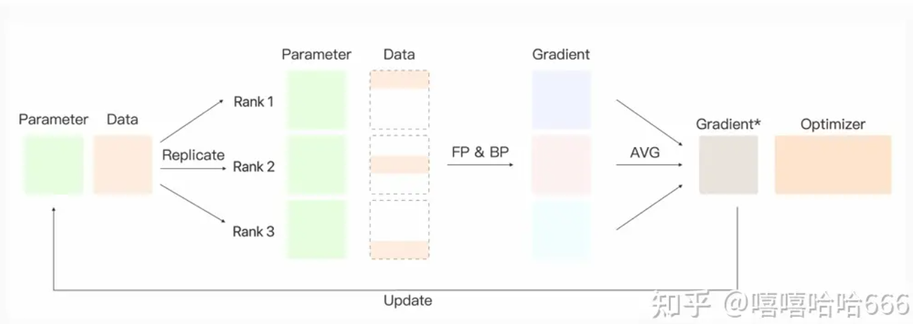
    - DistributedDataParallel (DDP)
        - 基于多进程多线程实现，在每个设备上维护一个模型副本，并通过后向传递的集体AllReduce操作同步梯度，从而确保在训练期间跨副本的模型一致性。为了加快训练速度， **DDP将梯度通信与后向传播计算重叠** ，促进在不同资源上并发执行工作负载。 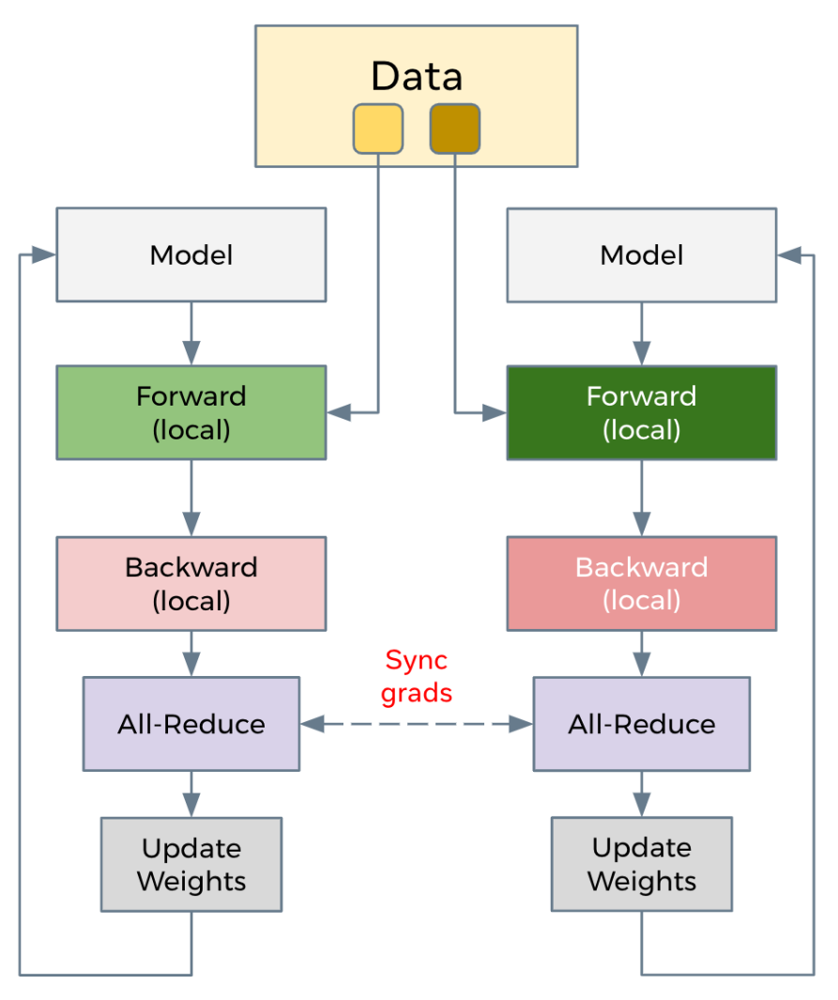
        - DDP需要额外的建立进程组阶段（Construction），Construction阶段需要首先明确通信协议和总进程数。总进程数就是指有多少个独立的并行进程，被称为worldsize。根据需求每个进程可以占用一个或多个GPU，但并不推荐多个进程共享一个GPU，这会造成潜在的性能损失。并行组建立之后，每个GPU上会独立的构建模型，然后GPU-1中模型的状态会被广播到其它所有进程中以保证所有模型都具有相同的初始状态。推理、损失函数计算、梯度计算都是并行独立完成的。DDP实现并行训练的核心在于梯度同步。通常每个GPU也会建立独立的优化器。由于模型具有同样的初始状态和后续相同的梯度，因此每轮迭代后不同进程间的模型是完全相同的。为了优化性能，DDP中针对allreduce操作进行了更深入的设计。 **通过将全部模型参数划分为无数个小的bucket，在bucket级别建立allreduce** 。当所有进程中bucket0的梯度计算完成后就立刻开始通信，此时bucket1中梯度还在计算。这样可以实现计算和通信过程的时间重叠。这种设计能够使得DDP的训练更高效。 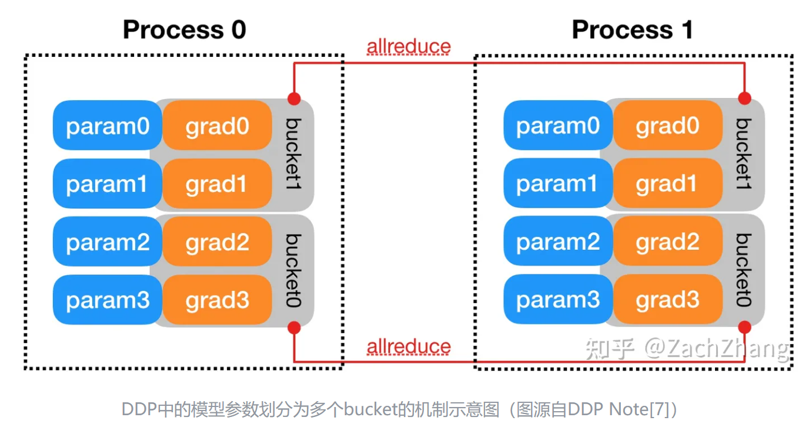
    - ZeRO
        - Model state
            - Optimizer->ZeRO1
                - 将optimizer state分成若干份，每块GPU上各自维护一份
                - 每块GPU上存一份完整的参数W,做完一轮foward和backward后，各得一份梯度,对梯度做一次 **AllReduce（reduce-scatter + all-gather）** ， **得到完整的梯度G,由于每块GPU上只保管部分optimizer states，因此只能将相应的W进行更新,对W做一次All-Gather**
            - Gradient+Optimzer->ZeRO2
                - 每个GPU维护一块梯度
                - 每块GPU上存一份完整的参数W,做完一轮foward和backward后， **算得一份完整的梯度,对梯度做一次Reduce-Scatter，保证每个GPU上所维持的那块梯度是聚合梯度,每块GPU用自己对应的O和G去更新相应的W。更新完毕后，每块GPU维持了一块更新完毕的W。同理，对W做一次All-Gather，将别的GPU算好的W同步到自己这来**
            - Parameter+Gradient+Optimizer->ZeRO3
                - 每个GPU维护一块模型状态
                - 每块GPU上只保存部分参数W，做forward时，对W做一次 **All-Gather** ，取回分布在别的GPU上的W，得到一份完整的W， **forward做完，立刻把不是自己维护的W抛弃，做backward时，对W做一次All-Gather，取回完整的W，backward做完，立刻把不是自己维护的W抛弃. 做完backward，算得一份完整的梯度G，对G做一次Reduce-Scatter，从别的GPU上聚合自己维护的那部分梯度,聚合操作结束后，立刻把不是自己维护的G抛弃。用自己维护的O和G，更新W。由于只维护部分W，因此无需再对W做任何AllReduce操作**
        - Residual state
            - activation->Partitioned Activation Checkpointing
                - 每块GPU上只维护部分的activation，需要时再从别的地方聚合过来就行。需要注意的是，activation对显存的占用一般会远高于模型本身，通讯量也是巨大的
            - temporary buffer->Constant Size Buffer
                - 优点：1. 提升带宽利用率。当GPU数量上升，GPU间的通讯次数也上升，每次的通讯量可能下降（但总通讯量不会变）。数据切片小了，就不能很好利用带宽了。如果等数据积攒到一定大小，再进行通讯，可以提高带宽的利用率。2. 使得存储大小可控。在每次通讯前，积攒的存储大小是常量，是已知可控的，更方便使用者对训练中的存储消耗和通讯时间进行预估。
            - unusable fragment->Memory Defragmentation
                - 对碎片化的存储空间进行重新整合，整出连续的存储空间。防止出现总存储足够，但连续存储不够而引起的存储请求失败。
        - offload
            - ZeRO-Offload
                - 原理 **：forward和backward计算量高** ，因此和它们相关的部分，例如参数W（fp16），activation，就全放入GPU； **update的部分计算量低** ，因此和它相关的部分，全部放入CPU中。例如W(fp32)，optimizer states（fp32）和gradients(fp16)等
                - 实现：ZeRO-Offload 分为 Offload Strategy 和 Offload Schedule 两部分，前者解决如何在 GPU 和 CPU 间划分模型的问题，后者解决如何调度计算和通信的问题
            - ZeRO-Infinity
                - 一是将offload和 ZeRO 的结合从 ZeRO-2 延伸到了 ZeRO-3，解决了模型参数受限于单张 GPU 内存的问题；二是解决了 ZeRO-Offload 在训练 batch size 较小的时候效率较低的问题；三是除 CPU 内存外，进一步尝试利用 NVMe 的空间
    - FSDP
        - FSDP算法是由来自DeepSpeed的ZeroRedundancyOptimizer（ZeRO-3）技术驱动的，但经过修改的设计和实现与PyTorch的其他组件保持一致。FSDP 通过让各数据并行进程分片存储优化器状态、梯度和模型参数来解决DDP需要保存每个模型副本的问题。还支持通过将数据卸载到 CPU 内存来支持那些 GPU 显存容纳不下的大模型。在具体运行时，与 DDP 类似，FSDP 的每个进程获取不同的数据。在前向传播过程中，如果启用了 CPU 卸载，则首先将本地分片的参数搬到 GPU上。然后，每个进程对给定的 FSDP 模块/层执行 all-gather 操作以获取所需的参数，执行计算，然后释放/清空其他进程的参数分片。在对所有 FSDP 模块全部执行该操作后就是计算损失，然后是后向传播。在后向传播期间，再次执行 all-gather 操作以获取给定 FSDP 模块所需的所有参数，执行计算以获得局部梯度，然后再次释放其他进程的分片。最后，使用 reduce-scatter 操作对局部梯度进行平均并将相应分片给对应的进程，该操作使得每个进程都可以更新其本地分片的参数。如果启用了 CPU 卸载的话，梯度会传给 CPU，以便直接在 CPU 上更新参数。FSDP的主要特点是参数切片，优化器状态切分、梯度切分是参数切分的自然后果。 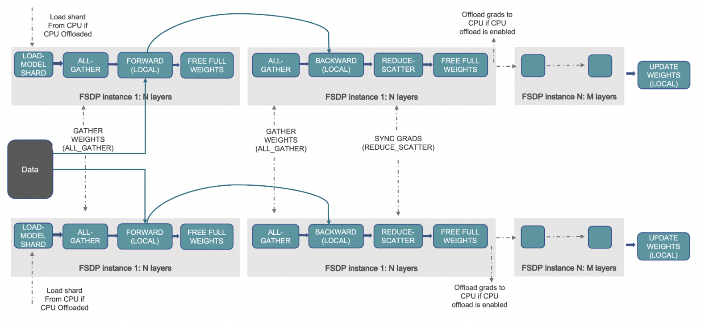
        - 1. **初始化** ：具体分片操作是通过 **将每个参数视为一维张量并仅保留一个切片来实现的** ，其中切片大小由数据并行worker的数量决定。需要注意的是：模型参数必须在加载到GPU之前就进行拆分，然后才能加载到各个worker的GPU之上。2. **前向传播** ：每个GPU之上进行前向传播，同时为后向传播建立控制关系，这样后向传播知道应该如何收集参数，如何释放参数。因为前向传播利用的是完整模型，所以先要使用All-gather来从其他GPU收集所有权重，完成重建所有模型参数，然后为后向传播建立 reduce-scatter，然后执行前向计算，然后为后向传播建立all-gather。3. **分层优化** ：为了最大限度地提高内存效率，我们可以在每层向前传播后丢弃全部权重，为后续层节省内存。这可以通过将FSDP包装应用于网络中的每一层来实现 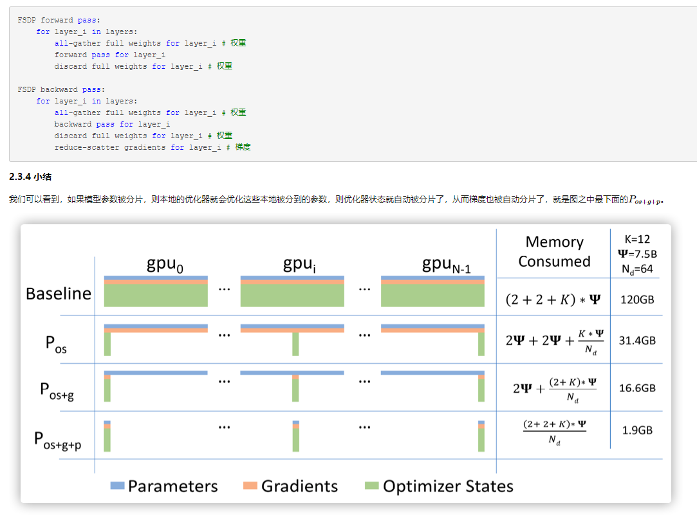
- 通信原理
    - 通信原语
        - **Broadcast** (广播)：将根服务器(Root Rank)上的数据分发广播给所有其他服务器(Rank)。 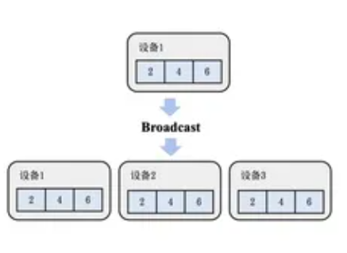
        - **Scatter** (散射)：将根服务器上的数据散射为同等大小的数据块，每一个其他服务器得到一个数据块。 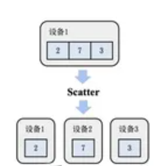
        - **Gather** （聚集）：将其他服务器上的数据块直接拼接到一起，根服务器(Root Rank)获取这些数据。 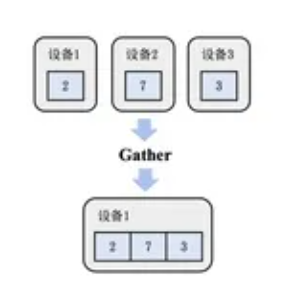
        - **AllGather** (全聚集)：所有的服务器都做Gather的操作，于是所有服务器都获得了全部服务器上的数据。 
        - **Reduce** (规约)：对所有服务器上的数据做一个规约操作（如最大值、求和），再将数据写入根服务器。 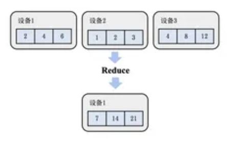
        - **AllReduce** (全规约)：先执行一次Reduce，然后再执行一次Broadcast将数据分发到所有服务器。分布式训练的主要通信手段。 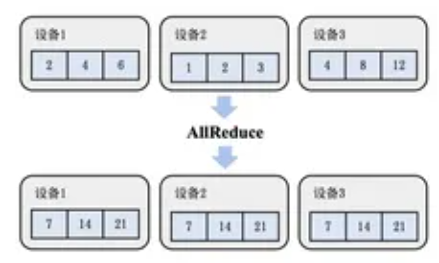
            - Ring AllReduce
                - 以环形相连，每张卡都有左手卡和右手卡，一个负责接收，一个负责发送，循环完成梯度累积，再循环做参数同步。分为Scatter Reduce和All Gather两个环节。第一阶段，将N个worker分布在一个环上，并且把每个worker的数据分成N份。具体看第k个worker，这个worker会把第k份数据发给下一个worker，同时从前一个worker收到第k-1份数据。之后worker会把收到的第k-1份数据和自己的第k-1份数据整合，再将整合的数据发送给下一个worker。以此循环N次之后，每一个worker都会包含最终整合结果的一份。第二阶段，每个worker将整合好的部分发送给下一个worker。worker在收到数据之后更新自身数据对应的部分即可。假设每个worker的数据是一个长度为S的向量，那么个Ring AllReduce里，每个worker发送的数据量是O(S)，和worker的数量N无关。这样就避免了主从架构中master需要处理O(S*N)的数据量而成为网络瓶颈的问题。Ring算法在中等规模的运算中非常有优势，较小的传输数据量，无瓶颈，带宽完全利用起来。缺点则是在大型规模集群运算中，巨大的服务器内数据，极长的Ring环，Ring的这种切分数据块的方式就不再占优势。 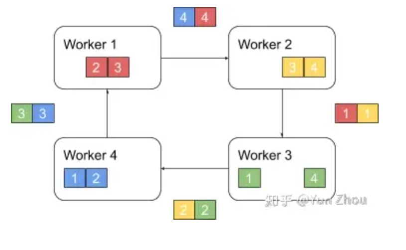
            - Halving and doubling (HD)
                - 服务器间两两通信，每步服务器都可以获得对方所有的数据，从而不断进行，使得所有服务器全部数据。这种算法规避了单节点瓶颈的问题，同时每个节点都将它的发送、接受带宽都运用起来，是目前极大大规模通信常用的方式，但是它也有着它的问题，即是在最后步数中会有大量数据传递，使得速度变慢。如果 **服务器数为非二次幂** 的情况下，如下图13台服务器，多出的5台会在之前与之后做单向全部数据的通信，其余服务器按照二次幂HD的方式进行通信，详情请参考Rabenseifner R.的Optimization of Collective Reduction Operations论文。但是在实用场景下，最后是将HD计算后含有所有参数数据的最大块的数据直接粗暴地向多出来的那几台服务器发送，导致这步的通信时间占比极大。 
            - reduce+broadcast Parameter Server( ) [PS]("https://www.cnblogs.com/zhanxiage1994/p/15185689.html")
                - **同步(reduce+broadcast) PS** : 根服务器将数据分成N份分到各个服务器上(Scatter)，每个服务器负责自己的那一份mini-batch的训练，得到梯度参数grad后，返回给根服务器上做累积(Reduce)，得到更新的权重参数后，再广播给各个卡（broadcast）。PS是最初的分布式通信框架，也是在几卡的较小规模的训练时，一种常用的方法，但是显而易见的当规模变大模型上则会出现严重问题：1. 每一轮的训练迭代都需要所有卡都将数据同步完做一次Reduce才算结束，并行的卡很多的时候， **木桶效应** 就会很严重，一旦有一张卡速度较慢会拖慢整个集群的速度，计算效率低。2. Reducer服务器任务过重，成为瓶颈，所有的节点需要和Reducer进行数据、梯度和参数的通信，当模型较大或者数据较大的时候，通信开销很大， **根节点收到巨量的数据** ，从而形成瓶颈。 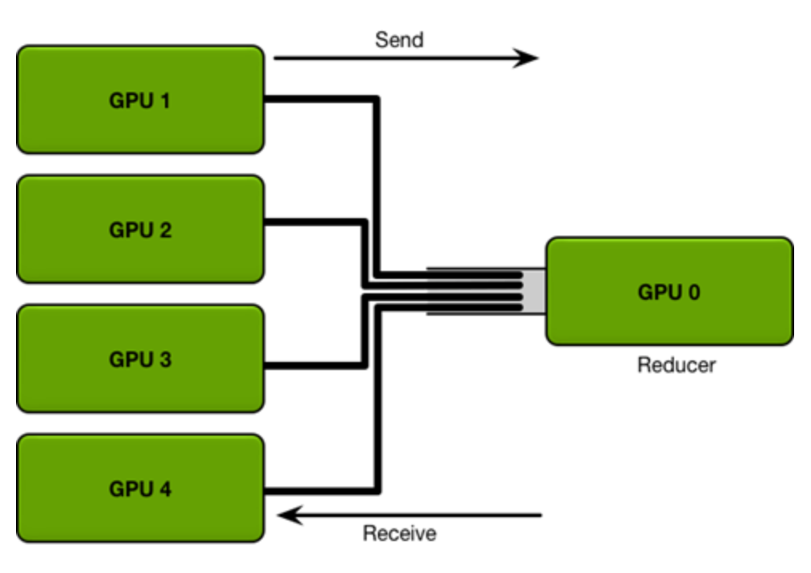
                - PS框架
                    - **PS的执行模式** ：Sequential: 同步模式，下一任务必须在前一任务完成后执行；Eventual: 异步模式，所有任务独立执行；bounded delay: 有界延迟，折中方案，限定阈值内强制更新模型参数。异步梯度更新方式大幅加快了训练速度，但牺牲了模型一致性同时影响了收敛速度，最终选择需具体问题具体对比验证。 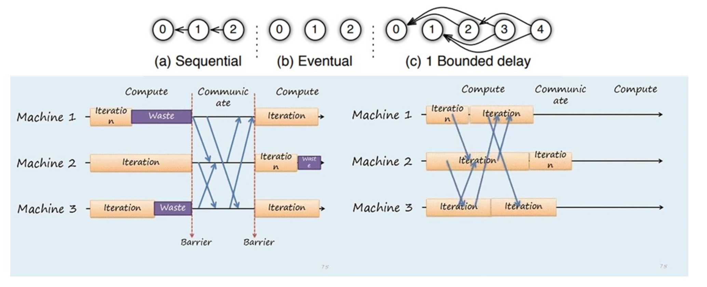
                    - **PS部分实现细节** : 使用一致性哈希保证数据存储的一致性问题，使用向量时钟来记录每个节点中参数的时间戳，用来跟踪状态或避免数据的重复发送。 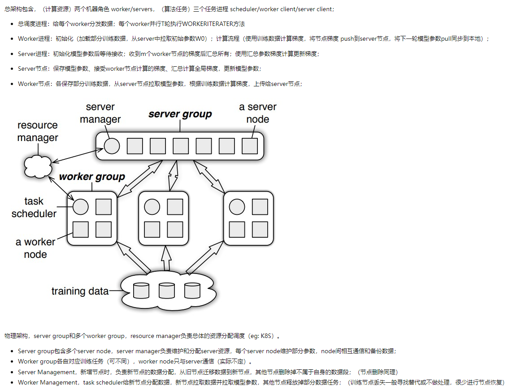
                    - **PS基本原理** ：ParamerterServer论文有两个版本，NIPS偏向算法层面， OSDI偏向系统设计层面。 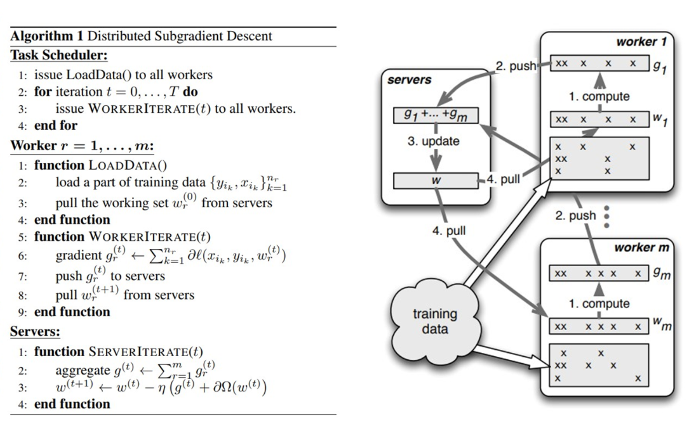
            - Butterfly
                - 充分利用上行和下行带宽，先减少通信worker的数量进行通信，再恢复通信worker的数目 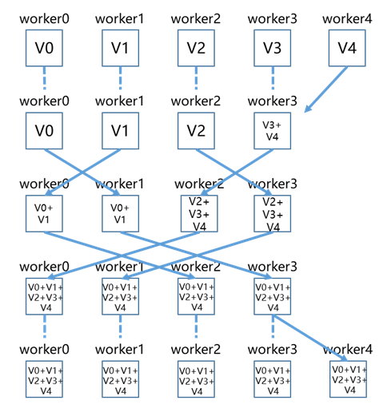
            - 2D-Torus AllReduce
                - 利用分层思想将集群中GPU分组排列为2D网格，第一阶段水平组内执行scatter-reduce，第二阶段竖直组间执行all-reduce，第三阶段水平组内执行all-gather；即执行两遍all-reduce； 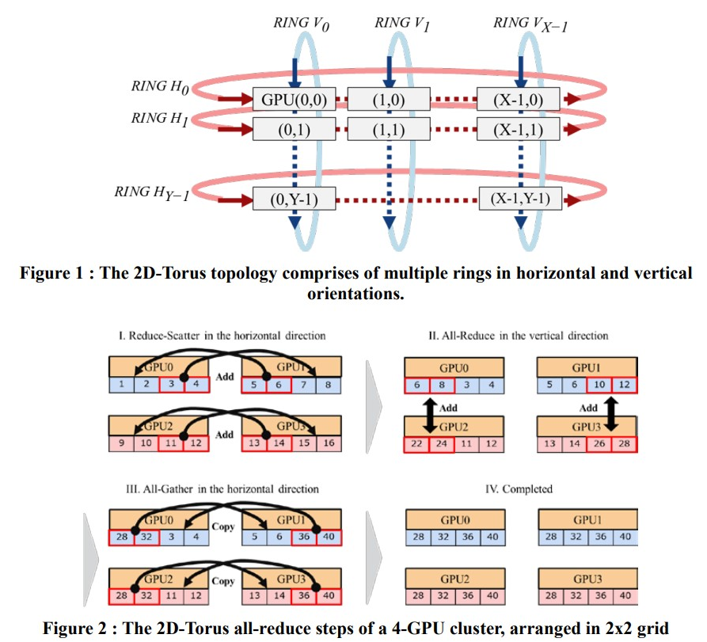
        - **ReduceScatter** (散射规约)：服务器将自己的数据分为同等大小的数据块，每个服务器将根据index得到的数据做一个规约操作即，即先做Scatter再做Reduce。在ZeRO算法中比较常用。 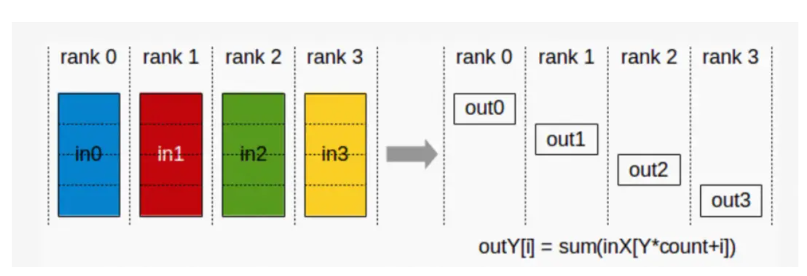
        - AlltoAll:将输入数据在特定的维度切分成特定的块数，并按顺序发送给其它rank，同时从其它rank接收输入，按顺序在特定的维度拼接数据
    - 同步和异步
        - 同步：在同步模式下，所有的设备同时读取同一套参数，同步处理输入数据、执行正向和反向传播，并且仅当所有设备完成反向传播之后，才同步更新参数，在训练中所有设备使用同一个优化器，优点是可以原生地保证所有设备使用相同的参数，避免参数过时的问题，缺点是数据聚合时会产生大量的通信开销，会因为某个节点而产业木桶效应。
        - 异步：在异步模式下，所有的设备都独立地读取数据，各自执行正向传播和反向传播，独立地进行参数更新，更新过程中，不同设备会读取参数最新的取值。因为不同设备，读取参数取值的时间不一样，所以得到的值也有可能不一样。就每个设备上参数的生命周期来看，可以认为异步模式，就是单机模式复制了多份，每一份使用不同的训练数据进行训练。
    -  [MPI通信库]("https://blog.csdn.net/taoqick/article/details/126449935")
        - OpenMPI
            - 项目是一个开源MPI（ ）实现，由学术，研究和行业合作伙伴联盟开发和维护。因此，Open MPI可以整合高性能计算社区中所有专家，技术和资源，以构建可用的最佳MPI库。 [Open MPI]("https://link.zhihu.com/?target=https%3A//www.open-mpi.org/") [消息传递接口]("https://link.zhihu.com/?target=http%3A//www.mpi-forum.org/") 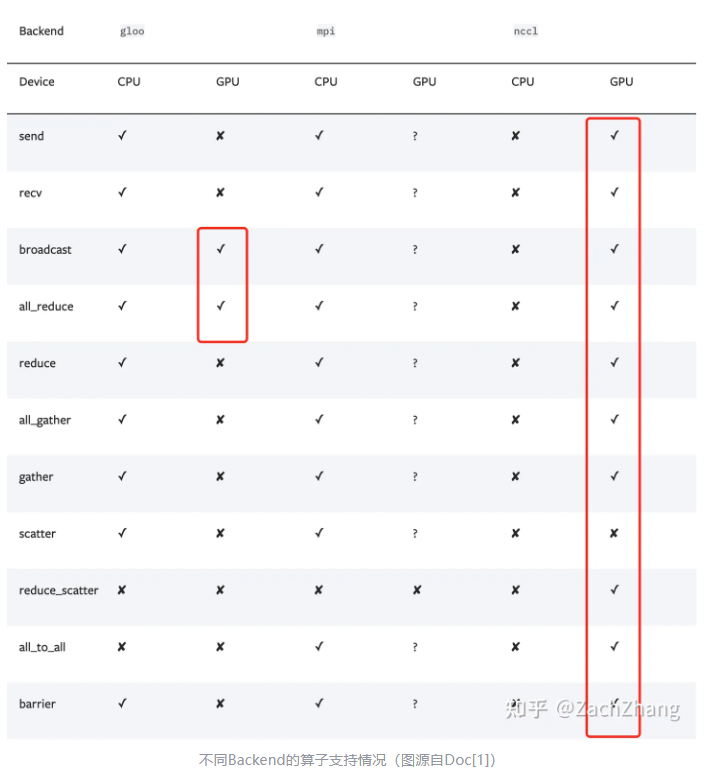
        - Gloo
            - 是facebook开源的一套集体（collective）通信库，他提供了对机器学习中有用的一些集合通信算法如：barrier, broadcast, allreduce [Gloo]("https://link.zhihu.com/?target=https%3A//github.com/facebookincubator/gloo")
        - NCCL
            - 是英伟达基于NVIDIA-GPU的一套开源的集体通信库，NVIDIA集体通信库（NCCL）实现了针对NVIDIA GPU性能优化的多GPU和多节点集体通信原语。NCCL提供了诸如all-gather, all-reduce, broadcast, reduce, reduce-scatter等实现，这些实现优化后可以通过PCIe和NVLink等高速互联，从而实现高带宽和低延迟。 因为NCCL是NVIDIA基于自身硬件定制的，能做到更有针对性且更方便优化，故在英伟达硬件上，NCCL的效果往往比其它的通信库更好 **。** [NCCL]("https://link.zhihu.com/?target=https%3A//developer.nvidia.com/nccl")
- 模型并行
    - tensor-wise parallelism
        - MLP切分
            - 对第一个线性层按列切分，对第二个线性层按行切分
            - 其中f,g为all-reduce操作符 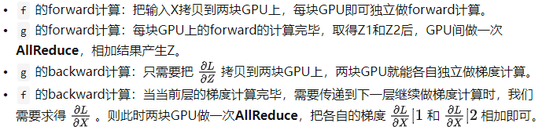
            -  
            -  
        - self-attention切分
            - attention的多头计算天然适合tensor并行，因为每个头上都可以独立计算最后再将结果concat起来，从而 **可以把每个头的参数放到一块GPU上**
            - 对线性层， **按照“行切割”** 。切割的方式和MLP层基本一致，其forward与backward原理也一致
        - 输入层Embedding切分
            - 对positional embedding来说，max_s本身不会太长，因此每个GPU上都拷贝一份，对显存的压力也不会太大
            - 将word embedding拆分到不同GPU上，每块GPU维护一分部词表。当输入X去GPU上查找时，能找到的词，就正常返回词向量，找到不到就把词向量中的全部全素都置0。按此方式查找完毕后，每块GPU上的数据做一次AllReduce，就能得到最终的输入。
            -  
        - 输出层Embedding切分
            - 输入层和输出层共用一个word embeding，当模型的输入层到输入层都在一块GPU上时（即流水线并行深度=1），我们不必担心这点（实践中大部分用Megatron做并行的项目也是这么做的）。但若模型输入层和输出层在不同的GPU上时，我们就要保证在权重更新前，两块GPU上的word embedding梯度做了一次AllReduce。
            -  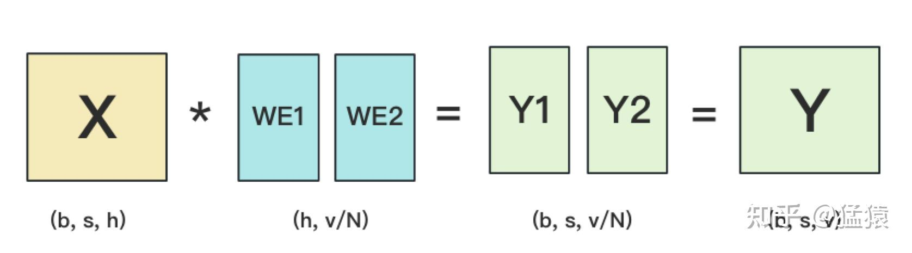
        - cross-entroy
            -  
            -  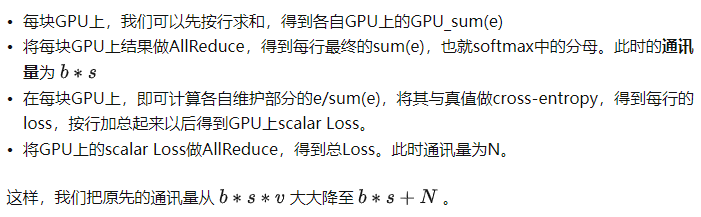
    -  [pipeline paralelism]("https://zhuanlan.zhihu.com/p/653860567")
        - GPipe [罗西的思考]("https://blog.csdn.net/weixin_47364682?type=blog")
            - **（google）思路** ：将mini-batch分为若干个micro-batch，像 allreduce 一样，计算完一些就传给下个节点，最后同步更新参数；将被训练的这些层划分为多个阶段，每个阶段包含模型之中一组连续的层；GPipe使用现有的技术，如梯度累积来优化内存效率，通过丢弃前向传播和后向传播之间的activation存储来交换内存，在后向传递需要activation时再重新计算它们。 **劣势** ：过多流水线刷新导致空闲时间的增加；如果m很小，Gpipe可能会由于重新计算开销和频繁的刷新而降低硬件效率，所以 m 一般都设置的较大，于是需要缓存 m 份 activation导致内存增加。原因是每个micro-batch前向计算的中间结果activation都要被其后向计算所使用，即便使用了Checkpointing 技术，前向计算的 activation 也需要等到对应的后向计算完成之后才能释放。令micro-batch的数目为m,pipe的阶段为p,则空泡的比例为(p-1)/(p-1+m) 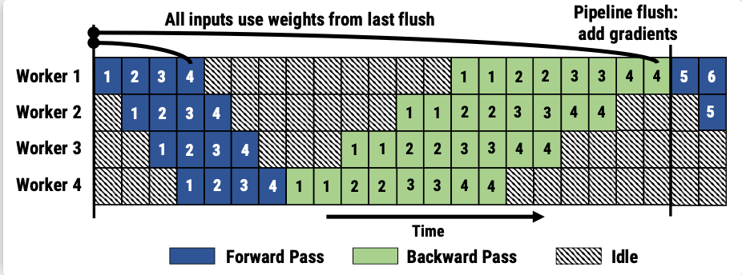
        -  [1F1B/PipeDream]("https://blog.csdn.net/weixin_47364682/article/details/122914719?spm=1001.2014.3001.5502")
            - **（microsoft）思路** ：1F1B努力减少每个 activation 的保存时间，即这就需要每个 micro-batch 数据尽可能早的完成后向计算，从而让每个 activation 尽可能早释放。 **方法** ：每个 GPU 以交替的方式执行每个 micro-batch 的正向和反向过程，使得 activation 的缓存数量只跟阶段（stage）数相关，从而进一步节省显存。 **步骤** ：在训练开始的启动阶段（图上的Startup State），输入的stage的先读入足够多micro-batch的数据，以保证pipeline在稳定阶段时，各个设备上都有相应的工作在处理。一旦输出阶段完成第一个小批次的前向传播（就是Machine 4 第一个蓝色1），它就对 同一个小批次 执行后向传播（就是Machine 4 的第一个绿色 1），然后开始交替执行后续小批次的前向传播和后向传播（就是 Machine 4 的 2前，2后，3前，3后…），当反向传播过程开始传播到管道中的早期阶段时（就是Work 3 ~ Work 1），每个阶段开始在 不同小批次 的正向和反向过程之间交替进行。权重问题： 同一个micro-batch在不同stage做同样操作（同样做前向操作，或者同样做后向传播）使用的参数版本不一致 。如对于 minibatch 5 在 worker 1 上的前向计算部分（蓝色5），他的前向逻辑在 microbatch 1 的后向计算以后执行。但是 microbatch 5 在 worker 2 上的前向计算部分（蓝色5），是在 “microbatch 1, microbatch 2” 的后向计算结束后才执行。为解决这两个问题，PipeDream 分别采用了 weight stashing 和 Vertical Sync 两种技术。 **Weight stashing :** 为权重维护多个版本，每个active micro-batch都有一个版本。每个stage 都用最新版本的权重进行前向计算，处理输入的micro-batch。计算前向传播之后，会将这份参数保存下来用于同一个micro-batch的后向计算。 Weight stashing确保在一个阶段内，相同版本的模型参数被用于给定小批量的向前和向后传播，但是不能保证跨阶段间，一个给定的小批次使用模型参数的一致性 。 **Vertical Sync :** 每个micro-batch进入pipeline时都使用输入stage最新版本的参数，并且参数的版本号会伴随该micro-batch数据整个生命周期， 在各个阶段都是用同一个版本的参数（而不是Weight stashing那样都使用最新版本的参数），从而实现了stage间的参数一致性 。 
            - PipeDream 的一个depth-d流水线中，最差的情况是d个权重版本，而PipeDream-2BW 在流水线之中维护了两个版本的模型权重，“2BW” 是 双缓冲权重（double-buffered weights）”，PipeDream-2BW 会为每个微批次生成一个新的模型版本K（K>d），但是因为有些剩余后向传递仍然依赖于旧版本模型，所以新的模型版本无法立即取代旧版本，但是由于只保存了两个版本，所以极大降低了内存占用。作者利用了这样一个事实，即每个输入生成的梯度不需要立即应用于权重，而是可以累积为“合并（coalesced）”梯度，以限制保留的权重版本的数量。2BW没有在使用最近更新的权重之前刷新流水线，而是将新权重用于新进入流水线的输入，同时将以前的权重版本（称为阴影版本）用于已在训练中的输入（in-flight inputs）。 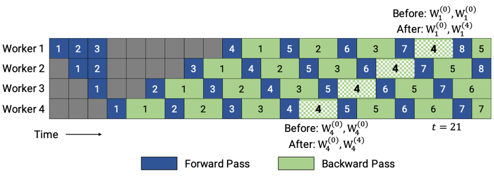
            - PipeDream-flush 则在 PipeDream-2BW 之上添加了一个全局同步的流水线更新刷新操作， 通过限制仅保留进行中（in-flight）微批次的激活来保持较低的内存占用 。思路类似 GPipe。这种方法通过牺牲吞吐量的能力来减少了内存占用（即只维护一个版本的模型权重）。 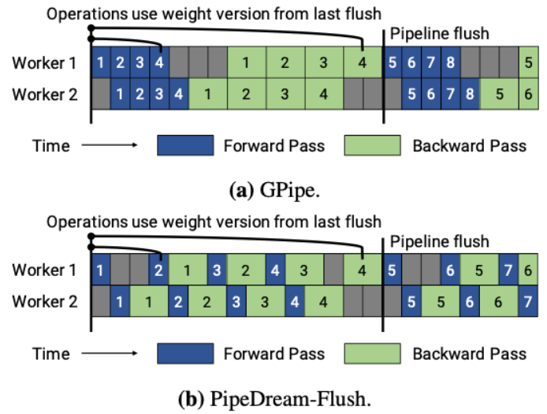
            - (Megatron-LM ) interleaved 1F1B:1F1B 并不能减少 bubble time， **为了进一步减少 bubble time，Megatron-LM 又提出了 interleaved 1F1B 模式** 。也就是将原本每个 GPU 负责若干个连续层的计算变成负责若干个不连续层的计算，即负责的数量不变，但顺序变了，从而每个stage负责的计算更少，stage的数目变多，从而 bubble time 也变少,但这种方式要求micro-batch 的数量是流水线阶段（Stage）的整数倍，且增加了额外的通信量。bubble时间占比从(n-1)/(n-1+m)优化为(n-1)/(n-1+km)，k为每个计算设备上的stage数。 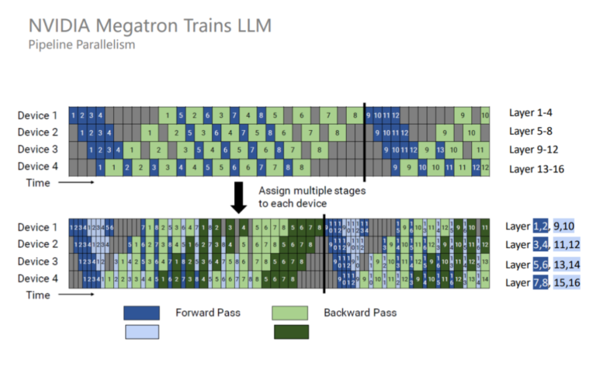
    - sequence parallelism
        - Sequence 并行的好处在于不会增加通信量，并且可以大大减少显存占用，其出发点是Layer-norm 和 Dropout 沿着序列的维度是独立的，因此可以按照 Sequence 维度进行拆分
        - 使用了 Sequence 并行之后，对于超大规模的模型而言，其实显存占用量还是很大的。因此，Megatron 又引入了激活重计算技术，找到一些计算量很少但显存占用很大的算子，比如 Attention 里的 Softmax、Dropout 等算子，对这些算子进行激活重计算就可以显著减少显存，并且计算开销增加不大