# 多模态模型
- 图文理解模型
    - ViT+Adapter+LLM模态特征对齐训练
        - LLaVA/Yi-VL：线性投影Adapter+一次Adapter+一次LLM的两阶段训练，数据：图文对
            - LLaVA和BLIP-2在训练方面的思想基本是一致的，都是两阶段训练方式。不过LLaVA的核心是构建多模态数据集，并验证在构建的数据集进行指令微调的有效性。因此 **它在跨模态对齐的模型结构方面选择最简单的线性层** 。 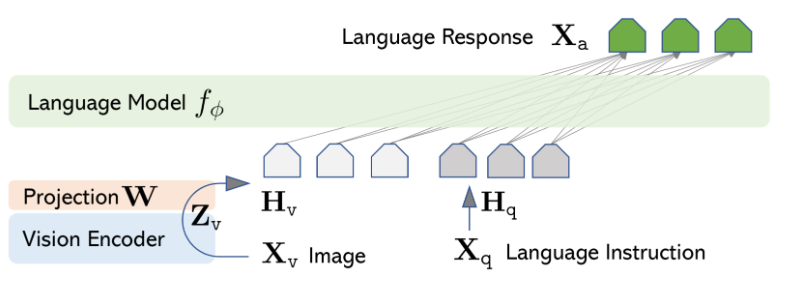
            - **第一阶段(特征对齐预训练)：** 为冻结的大语言模型训练一个visual tokenizer。在这个阶段image encoder和大语言模型都冻结。引入一个linear layer(project matrix)，将image encoder输出转换成大语言模型的embedding。相当于学习了一个visual tokenizer：project matrix。 **第二阶段(端到端微调)：让大语言模型具有理解文本和图片的对话能力** 。在这个阶段，image encoder冻结，大语言模型没有冻结住，project matrix也没有冻结。第一阶段是将image和text特征进行对齐，是一个预训练过程，使用相对简单、大量的单轮指令即可。第二阶段是让大语言模型理解图片和文本，并具有多轮对话能力，是一个微调过程，使用相对复杂、一定量的多轮指令才行。 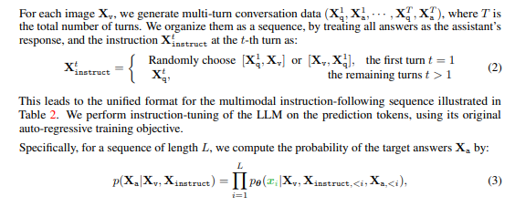
        - LLaVA-1.5：采用双层MLP Adapter+一次Adapter+一次LLM的双阶段训练，数据：图文对
            - 该模型由视觉模型、大语言模型和视觉语言连接器三大块组成。其中，视觉模型使用了预先训练好的CLIP ViT-L/336px，通过CLIP编码可得到固定长度的向量表示，提升图像语义信息表征。与前版本相比，CLIP模型参数和输入分辨率均有显著提升。大语言模型采用了拥有130亿参数的Vicuna v1.5，用于理解用户输入文本并捕获语义信息，具备强大的推理和生成能力。不同于仅进行图像编码器调优的方法，LLaVA-1.5在训练中更新大语言模型参数，使其能够直接学习如何整合视觉信息进行推理，提高模型自主性。视觉语言连接器方面，LLaVA-1.5 **采用双层MLP连接器替代线性投影** ，有效将CLIP编码器输出映射到大语言模型的词向量空间。
            - 在训练流程上，LLaVA-1.5遵循双阶段训练方式。首先，进行视觉语言表示的预训练， **使用约60万张图像文本对** ，训练时间约1小时。随后，在65万多模态指令数据上进行调优，训练时间约20小时。这种高效的双阶段训练确保了模型的收敛性，并在一天内完成整个流程，相较于其他模型大幅度减少了AI算力和时间成本。研究人员还设计了匹配的响应格式提示，指导模型根据交互类型调整输出形式以满足特定场景需求。在视觉指令调优方面，LLaVA-1.5使用不同类型的数据集，包括VQA、OCR、区域级VQA、视觉对话、语言对话等，总计约65万条数据，为模型提供丰富的视觉场景推理和交互方式。
        - MiniGPT-4：额外使用Q-Former进行视觉提取+两次都仅训练线性投影层的两阶段训练，数据：图文对
            - 模型结构上，与LLaVA的区别是，MiniGPT-4在视觉特征提取部分额外用了Q-Former；训练细节上，与LLaVA的区别是，MiniGPT-4的两阶段训练都只更新Projection层的参数，只是用到的数据不同（第二阶段是为了调优）；而LLaVA两阶段训练数据不同、更新的参数也不同。
            - MiniGPT-4 使用了与 BLIP-2 相同的预训练视觉语言模型。该模型由两个部分组成：视觉编码器 ViT（Vision Transformer）和图文对齐模块 Q-Former。输入图像在传入视觉编码器后，首先会通过 ViT 做一步初步的编码，提取出图像中的基本视觉特征。然后通过预训练的 Q-Former 模块，进一步的将视觉编码与文本编码对齐，得到语言模型可以理解的向量编码。对于视觉编码器 ViT，MiniGPT-4 使用了 EVA-CLIP中的 ViT-G/14 进行实现。 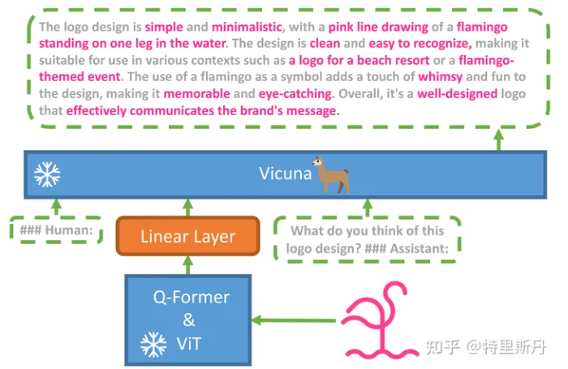
            - MiniGPT-4 将预训练的大语言模型和视觉编码器同时冻结，只需要单独训练线性投影层，使视觉特征和语言模型对齐。为了获得真正具备多模态能力的大语言模型，MiniGPT-4 提出了一种分为两阶段的训练方法。 **第一阶段，MiniGPT-4 在大量的图像-文本对数据上进行预训练** ，以获得基础的视觉语言知识。 **第二阶段，MiniGPT-4 使用数量更少但质量更高的图像-文本数据集进行微调，以进一步提高预训练模型的生成质量与综合表现。** 预训练共进行了约 2 万步，批量大小为 256，覆盖了 500 万个图像-文本对，在 4 张 A100 上训练了 10 个小时。在第一轮训练完成后，MiniGPT-4 获得了关于图像的丰富知识，并且可以根据人类查询提供合理的描述，但是它在生成连贯的语句输出方面遇到了困难。研究者精心构建了一个高质量的、视觉语言领域的图像-文本数据集进行微调。
        - CogVLM：MLP的Adapter+LLM每个block都加一个视觉专家模块（QKV+MLP），数据：图文对
            - CogVLM模型包括以下四个基本组件：1. **ViT编码器** ：这个组件利用了预训练的EVA2-CLIP-E模型，它负责将图像转化为特征表示。在CogVLM-17B中，移除了ViT编码器的最后一层，因为该层专注于整合[CLS]特征以用于对比学习。2. **MLP适配器** ：MLP适配器是一个两层的MLP（SwiGLU），用于将ViT的输出映射到与文本特征相同的空间。所有的图像特征在语言模型中共享相同的位置ID。3. **预训练大语言模型** ：CogVLM的模型设计兼容任何现成的GPT风格的大型预训练语言模型。在CogVLM-17B中，选择了Vicuna-7B v1.5进行进一步的训练。此模型在所有的注意力操作中都应用了因果掩码(causal mask)，包括图像特征之间的注意力。4. **视觉专家模块** ：在LLM每一层中都添加了一个视觉专家模块，以实现深度的视觉-语言特征对齐。每个层的视觉专家模块包括一个QKV矩阵和一个MLP。QKV矩阵和MLP的形状与预训练语言模型中的相同，并从中进行初始化。其目的是使得语言模型中的每个注意力头捕获特定的语义信息，而可训练的视觉专家可以将图像特征转换为与不同的头部对齐，从而实现深度融合。 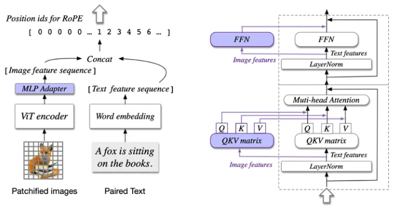
            - **在CogVLM的预训练阶段，它使用了公开可用的图像文本对进行训练** ，包括LAION-2B和COYO-700M。在筛选过程中，移除了损坏的URL、含有不适当内容的图像、带有噪声字幕的图像、具有政治偏见的图像，以及长宽比大于6或小于1/6的图像。经过筛选后，大约还剩下15亿个图像文本对用于预训练。此外，作者还构建了一个包含4000万个图像的视觉定位数据集。在这个数据集中，每张图像的名词都与边界框相关联，以指示其在图像中的位置。构建过程遵循了Peng等人的方法，使用spaCy提取名词，使用GLIPv2预测边界框。这些图像文本对是从LAION-400M的子集LAION-115M中抽取的，LAION-115M是由Li等人进行了筛选的。筛选后，保留了4000万张图像的子集，以确保超过75%的图像至少包含两个边界框。
            - **在预训练的第一阶段中，模型训练的是图像字幕损失函数(image captioning loss)，即对文本部分进行下一个标记的预测** 。预训练的第一阶段使用了上述提及的150亿个图像文本对，共进行了12万次迭代，批量大小为8192。预训练的第二阶段涉及图像字幕和指代表达理解（REC）任务。REC任务是根据物体的文本描述来预测图像中的边界框位置。这个任务以VQA的形式进行训练，即"问题：物体在哪里？"和"答案：[[x0,y0,x1,y1]]"。其中，x和y坐标的取值范围从000到999，表示在图像中的归一化位置。在答案的部分，只考虑了下一个标记的预测损失。 **预训练的第二阶段同时涵盖了图像字幕和REC任务，进行了6万次迭代，批量大小为1024** 。在最后的3万次迭代中，将输入分辨率从224×224改变为490×490。整个预训练过程中可训练参数总数为65亿，预训练过程消耗了约4096个A100×天。
            - CogVLM-Chat进行监督微调（SFT）的过程如下： **数据来源** ：监督微调使用了来自以下数据集的高质量数据：LLaVA-Instruct（Liu et al., 2023b）,LRV-Instruction（Liu et al., 2023a）,LLaVAR Zhang et al. (2023),一个内部数据集。 **数据规模** ：总共包括约 500,000 个视觉问答（VQA）对。 **微调过程** ：在监督微调阶段，模型进行了以下训练：进行了 8,000 个迭代，使用批量大小为 640，学习率为 10^-5，前 50 个迭代进行学习率的预热（warm-up）。在监督微调过程中，为了避免过拟合数据集的文本答案，使用了一个较小的学习率（其他参数的学习率的10%）来更新预训练语言模型。所有参数（除了ViT编码器）在SFT期间都是可训练的。
        - LLaVA-1.6：多分辨率支持，OCR和世界知识注入的LLaVA-1.5
            - LLaVA-1.6，主要改进了模型在推理、OCR 和世界知识方面的性能。将输入图像分辨率提升 4 倍，支持三种宽高比，最高可达 672x672、336x1344、1344x336 分辨率。这使得 LLaVA-1.6 能够掌握更多的视觉细节。通过改进的视觉指令调整数据混合，LLaVA-1.6 获得了更好的视觉推理和 OCR 能力。更好的视觉对话，更多场景，覆盖不同应用。LLaVA-1.6 掌握了更多世界知识，具备更好的逻辑推理能力。使用 SGLang 进行高效部署和推理。
            - LLaVA-1.6 保持了 LLaVA-1.5 的极简设计和数据效率，它复用了 LLaVA-1.5 的预训练连接器，并且仍然使用不到 1M 的视觉指令调优样本。最大的 34B 模型使用 32 个 A100 在大约 1 天内完成了训练。LLaVA-1.6 使用 130 万个数据样本，计算 / 训练数据成本约为其他方法的 100-1000 分之一。
        - BLIP-2：预训练的视觉和文本模型+(ITC,ITM,LM)任务训练的Q-Former，数据：图文对
            - BLIP-2 希望借助现成的预训练好的单模态视觉模型和单模态文本模型.简单的冻结预训练好的视觉模型的参数或者语言模型的参数会带来一个问题：就是 **视觉特征的空间和文本特征的空间不容易对齐** 。出现这个问题的原因是：文本模型 LLM 在单模态预训练期间没有看过对应的图片，视觉模型在单模态预训练期间没有看过对应的文本。为了解决这个问题，BLIP-2 提出了一个轻量级的 Querying Transformer（Q-Former ），它是一个轻量级 Transformer，它使用一组可学习的 Query 向量从冻结的视觉编码器中提取视觉特征，并充当视觉编码器和文本编码器之间的瓶颈。 **Q-Former 分两个阶段进行预训练，把关键的视觉信息传递给 LLM，第一个预训练阶段，强制 Q-Former 学习与文本最相关的视觉表征。第二个预训练阶段，通过将 Q-Former 的输出连接到冻结的 LLM 来执行视觉语言生成学习，使其输出的视觉表征可以直接由 LLM 解释。** 这样一来，Q-Former 就可以有效地利用冻结的预训练图像模型和语言模型。采用了 BLIP 里面提出的 CapFilt 方法为网络图像创建合成标题。 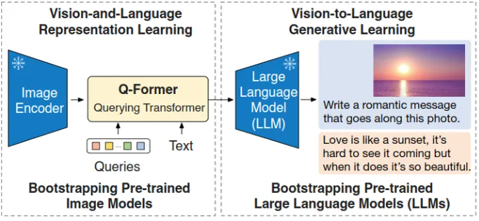
            - BLIP-2 由预训练好的，冻结参数的视觉模型和文本模型，外加所提出的可训练的 Q-Former 构成。固定的图像编码器从输入图片中提取视觉特征，Q-Former 架构是由2个 Transformer 子模块构成，其中注意 Self-Attention 是共享的，可以理解为 Self-Attention 的输入有2个，，即：Queries 和 Text。 **第1个 Transformer 子模块：** 是 Image Transformer，它与图像编码器交互，用于视觉特征提取。它的输入是可学习的 Queries，它们先通过 Self-Attention 建模互相之间的依赖关系，再通过 Cross-Attention 建模 Queries 和图片特征的依赖关系。因为两个 Transformer 的子模块是共享参数的，所以 Queries 也可以与文本输入做交互。 **第2个 Transformer 子模块：** 是 Text Transformer，它既可以作为文本编码器，也可以充当文本解码器。Q-Former 一共包含了 188M 参数，其权重使用 BERT-Base 做初始化，Cross-Attention 的参数做随机初始化。作者使用 32 个 Queries，其中每个 Queries 的维度为 768。Queries 随着预训练目标一起训练，迫使它们提取到与文本最相关的视觉信息。 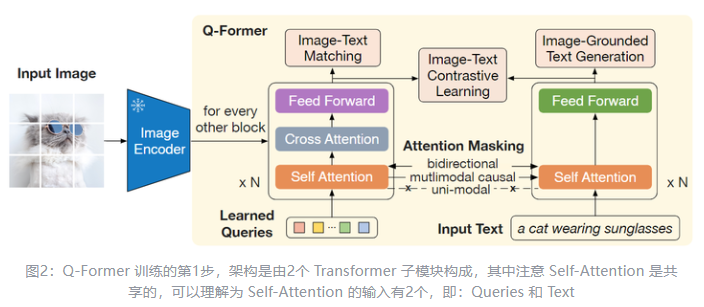
            - Q-Former 训练的第一步，作者将 Q-Former 连接到冻结参数的图像编码器，并使用图像-文本对进行预训练，这一步的目标是训练好 Q-Former，以便 Queries 可以学习到如何更好地结合文本提取图片信息。训练的目标函数，作者遵循 BLIP 的做法，联合优化3个具有相同输入格式和模型参数的预训练目标（ITC,ITMLM），每个目标函数使用不同的 mask Attention 来控制注意力的交互。
            - 第二步：冻结的Image Encoder生成原始的图像特征，而query tokens和Q-Former从原始图像特征中生成转化好的图像特征，然后该图像特征经过全连接层映射到LLMs的文本embedding空间中。然后 **这些映射后的图像特征，就相当于soft visual prompts** ，和文本embedding一起，输入到冻结的LLMs中，最后生成目标文本。 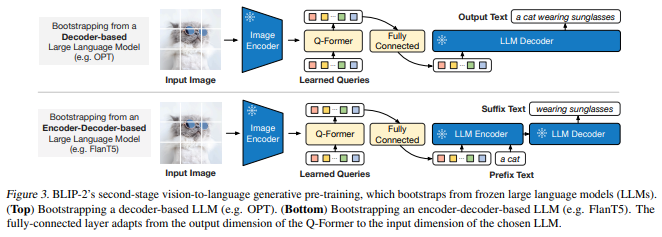
        - VILA：验证了图文交织数据比图文对在缓解了LLM能力的退化上的重要性，在SFT期间添加纯文本数据也可以弥补退化。
        - DRESS：强调人类偏好对齐
            - 设计初衷是利用来自LLMs的Natural Language Feedback（NLF）来改善之前工作中缺失的两个关键方面：（1）与人类偏好的一致性，和（2）交互能力。第一个方面关注的是回复是否尊重人类价值观，特别是三大标准（有帮助性、诚实性和无害性） 。第二个方面关注的是根据多轮交互中提供的反馈来改进回复的能力。我们通过将NLF划分为两个主要类别（批评和改进）来实现这一目标。
            - DRESS 和 DRESSft 具有相同的模型架构设计，其遵循常见的LVLMs设计原则，其中包括一个冻结图像编码器和一个带有Transformer模块的LLM的Adapter。我们使用具有13亿参数的EVA-CLIP-Giant以及Vicuna-13b-v1.5 来初始化预训练的图像编码器和LLM，而线性projector则是随机初始化的，此外还在LLM中添加了一个LoRA 模块。 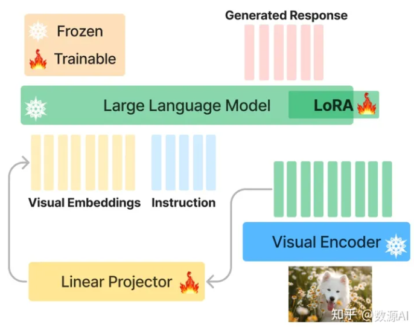
            - DRESSft 采用了两阶段的训练过程，包括预训练和指令微调（即 SFT）。对于预训练，使用由 BLIP 生成的800万个合成字幕，图片来源于CC3M 、CC12M和SBU。对于SFT，采用高质量的 LLaVA 视觉指令微调数据集，该数据集包含80K个样本，涵盖了2种数据类型：对话和推理。由于多轮 LLaVA 数据之间的相关性有限，将其分为单独的轮次，有效增加了样本数量。分别保留了2.5万个对话样本和5千个推理样本，以遵循以下两个原则进行反馈收集：（1）反馈数据集中不应有重复的图片；（2）问题只能通过视觉信息回答2。通过使用 LLMs 进行过滤的方式来实现这一点。剩余的16.1万个样本用于 SFT。由于缺乏关于安全性对齐方面的视觉数据，研究者创建了一个新的数据集– VLSafe，其中包含了对 LVLMs 的无害对齐进行训练和验证的对抗性提示。该构建过程涉及 LLM-Human-in-the-Loop 迭代创建和过滤数据集的过程。VLSafe 数据集包含4,764个训练样本和1,110个测试样本。从训练集中保留了3千个样本用于反馈注释，剩下的1,764个样本用于 SFT。
            - 先使用SFT训练的DRESSft ，来收集用于随后从LLM获取反馈的示例。对于先前描述的数据集中的反馈子集中的每个问题，我们指示DRESSft使用贪婪解码生成一个响应。最后，每个样本由图像mi、问题qi、DRESSft 生成的响应r1i 和来自LLaVA数据集的真实参考gi组成。利用GPT-4对DRESSft生成的响应提供 反 馈。 这是基于两个关键因素的动机： (1) 我们数据集中的图片来自COCO数据集，该数据集包含了经过仔细注释的密集描述和每个图片中物体的边界框。因此，GPT-4可以根据这些注释信息有效理解图片； (2) 先前的研究，例如，强调使用强大的LMs来模拟人类偏好的有效性。考虑到我们对收集详细NLF的额外关注，当资源有限时，GPT-4成为了人类注释的可行替代方案，如果提供足够的上下文信息和适当的指令，GPT-4可以生成与人类注释相媲美的NLF。一个有效利用注释反馈数据集来改进LVLM的对齐和交互的训练框架。该框架在SFT阶段完成后，在LLMs（AI）反馈（RLAIF）阶段进行操作。我们推广了条件强化学习，以促进数值分数和不可微的NLF的使用。基本概念包括训练模型在NLF的条件下产生适当的回应，使其能够区分对齐或不对齐的回应和有效或无效的交互行为。我们用DRESSft 的权重初始化DRESS ，并进行连续训练，以优化生成第j个回应的可能性，给定图像、问题、数值分数、批评NLF、细化NLF和所有先前的交互轮次。这通过最小化交叉熵损失函数实现，定义如下： 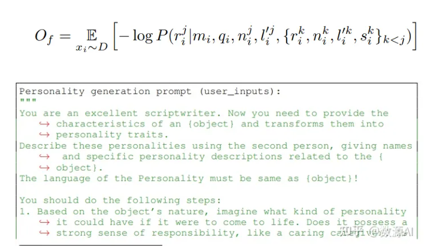
    - 统一tokenizer/embedding
        - Uni-Perceiver：统一tokenzier（type embed, pos embed,video的temporal pos embed）+多任务训练 [多模态：模型架构总结]("https://zhuanlan.zhihu.com/p/662451790")
            - 采用了通用的Transformer编码器处理不同的模态，而只是用轻量级的tokenizer来对不同模态输入分别处理。 **Transformer Encoder：** 用于实验的Transformer编码器与BERT-BASE模型具有相同的配置。Uni-Perceiver和CLIP一样，都实现了多模态数据的建模，将它们对齐统一到了同一表示空间，便于实现多种下游任务。Uni-Perceiver的参数量稍比CLIP少一点（＜300M），又能处理的模态多了视频模态，多任务迁移能力上表现与很多SOTA不分伯仲，还是很不错。创新点还是模态无关任务无关的单塔感知模型，展现了Transformer超强的能力。 
            - **Tokenizer：使用 BPE tokenizer 表示文本模态，使用图像 patch tokenizer表示图像模态，使用时间帧 patch tokenizer 表示视频模态。** 这些输出的标记附加有额外的模态类型嵌入，以识别原始输入属于哪种模态。关于tokenizer的具体架构文章并未给出，看图觉得是线性层+归一化层，不过可以确定的是，tokenizer的参数量小于Encoder的参数量。这也意味着Uni-Perceiver的参数量其实很小。 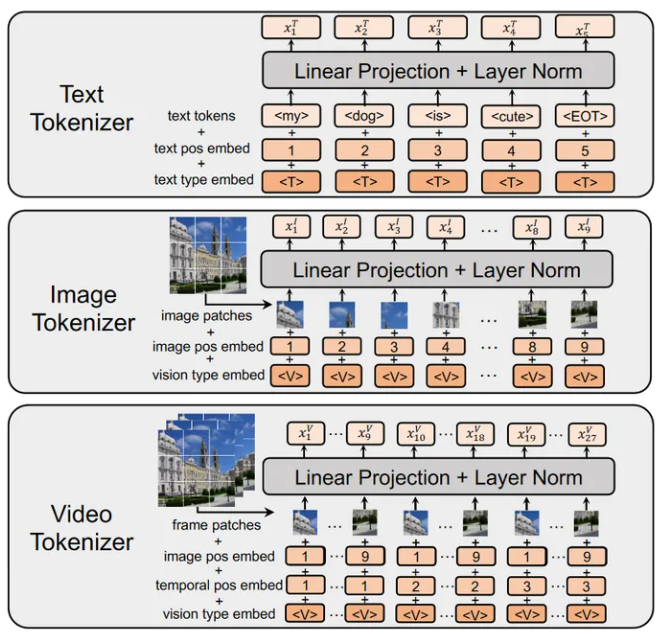
            - **训练** ： **Uni-Perceiver同时用多个任务预训练模型。在每次迭代中，每个 GPU 独立对单个任务和数据集进行采样。** 梯度反向传播后，不同GPU的梯度是同步的。这是因为Uni-Perceiver的Encoder是任务、模态无关的，不同的预训练任务目的还是让Encoder建立起不同模态的整体印象。使用 AdamW 优化器，基础学习率为 0.0002，权重衰减为 0.05。 5.0 的梯度裁剪用于稳定训练。我们还在训练期间使用概率为 0.1 的 drop path 。该模型在 128 个 V100 GPU 上分布式进行了 50 万次迭代的预训练。
        - KOSMOS系列
            - KOSMOS-1
                - KOSMOS-1的以一种统一的方式感知多模态信息。具体的讲，KOSMOS-1使用<s>和< \ s>表示整个输入嵌入的起始和终止符，其中的图像嵌入使用<image>和< \ image>作为起始和终止符。对于文本数据，KOSMOS-1编码的策略是通过一个embedding查询表得到特征向量。对于图像数据，KOSMOS-1的策略是使用的CLIP的ViT-L编码器。并且它使用了Deepmind提出的Flamingo中的感知器重采样（Perceiver Resampler）来减少图像嵌入的数量。完成输入序列的嵌入，就可以将其输入Transformer解码器，然后自回归的预测下一个token。
                - 感知器重采样的输入有两个，一个是图像经过编码器然后展开得到的特征向量 X_f，另一个是预先学习的潜变量 X。其中 [X_f, X] 作为自注意力的 K和 V， X作为自注意力的 Q。经过自注意力计算的特性依次经过残差，FFW，残差得到最终输出。在进行位置编码的计算时，KOSMOS-1使用了xPos位置编码。xPos是RoPE的升级版，提升了Transformer的长度外推性，比RoPE更加稳定。
                - KOSMOS-1采用了微软自家的MAGNETO作为骨干网络，它最大的改进是提出了如图4所示的Sub-LN的结构。MAGNETO中指出，根据LN添加的位置不同，传统的大模型分为图4.(a)的Post-LN和图4.(b)的Pre-LN。其中使用Post-LN的经典模型有BERT，BART等，使用Pre-LN的模型有GPT以及ViT，BEiT等视觉预训练模型以及多模态模型BEiT-3。因为LN的位置是和不同模态的输入相关的，作者期望有一种LN可以在文本和视觉上都取得不错的效果，因此提出了一种介于Pre-LN和Post-LN中间的方案：Sub-LN 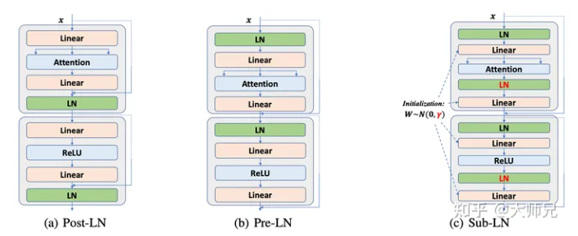
            - KOSMOS-2：基于自建图文对训练
                - **核心是 Grounded 的图像文本对数据集** ，即 Grounded Image-Text Pairs（GRIT）。为了实现 KOSMOS-2 的 Grounding 能力，论文基于COYO-700M 和 LAION-2B 构建了一个 Grounded 图像文本对数据集，并与 KOSMOS-1 中的多模态语料库相结合进行训练。整体数据集构建分为两步，首先生成名词-短语-边界框的数据对，得到基础的训练数据，而为了使得模型获得处理复杂语言描述的能力，论文又将短语扩展为复杂的句子，从而扩展了模型的处理能力。在经过两步构建之后，最终 GRIT 获得了大约 9100 万幅图像、1.15 亿个文本段落以及 1.37 亿个相关的边界数据框。基于此构建的 GRIT 数据集，KOSMOS-2 采用与 KOSMOS-1 相同的模型架构和训练目标对模型进行训练，值得注意的是，作者通过“超链接”的数据格式连接位置标记与相应的文本段落，整体训练策略与方式可以参考 KOSMOS-1。
            - KOSMOS-2.5：专注文本密集图像的机器阅读
                - 模型旨在进行文本密集图像的机器阅读。该模型在两个转录任务中表现出色：生成空间感知的文本块和以markdown格式生成结构化的文本输出。模型通过共享的Transformer架构、任务特定的提示和灵活的文本表示，实现这一目标。该模型是在大规模文本密集图像上预训练的，并可以通过监督微调来适应各种文本丰富的图像理解任务。KOSMOS-2.5 的模型架构由一个预训练的视觉编码器和一个与重采样器模块连接的语言解码器组成。采用基于 Vision Transformer (ViT) 的预训练视觉编码器。然后，进一步采用带有注意池机制的感知器重采样器模块来减少图像嵌入的大小。语言解码器建立在基于 Transformer 的解码器之上（类似于GPT的结构），以条件图像和文本上下文以进行下一个标记预测。 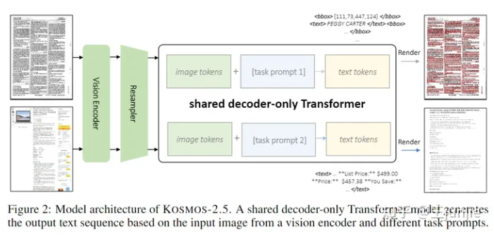
                - 对于空间感知文本块：IIT-CDIP：IIT-CDIP数据集是一个大规模的公共集合，包括扫描的文档图像。我们使用大约 27.6M个页面来训练我们的模型。arXiv 论文：约占 20.9M 页。从官方 arXiv 存储库下载了大量数据，由 PDF 和 LATEX 源文件组成（ PowerPoint幻灯片：从包含PowerPoint文档的各种网页中收集了6.2M页的语料库，大大增强了我们训练数据的多样性。通用PDF:此外，我们在网络上抓取各种开放域数字PDF文件，从而收集了一个包含大约155.2M页的大型语料库。Web截图：mC4网页的一个子集被抓取并呈现为包含近1亿个页面的截图。对于markdown格式的结构化文本:README：我们收集了2.9M个“README”。来自开源GitHub项目的md”文件，主要以markdown格式编写。DOCX：我们还从网上抓取的数百万个WORD文件中提取了1.1M个DOCX页面。LATEX：整个 arXiv 论文的一个子集用于提取 PDF 页面的映射及其从 LATEX 代码转换的相应标记信息，总共包含 370 万页。HTML：我们从前面提到的mC4子集中获得了6.3M个HTML文件，并将它们转换为markdown格式。使用fastText进行语言识别（阈值为0.5），从整个预训练数据集中过滤出非英语文档。利用MinHash来识别和删除冗余页面。 [https://info.arxiv.org/help/bulk_data/index.html）。]("https://link.zhihu.com/?target=https%3A//info.arxiv.org/help/bulk_data/index.html%25EF%25BC%2589%25E3%2580%2582") 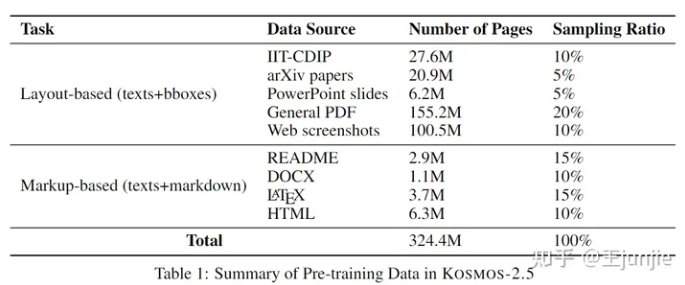
        - OFA:统一词表+seq2seq模式+多任务联合训练
            - 和同期工作Uni-Perceiver的思路非常类似，同等态度对待各种模态，并充分相信Transformer学习多模态的能力。但OFA进一步做了任务细分，并能够生成自然语言输出，即 **Uni-Perceiver是只有Encoder，OFA是Encoder-Decoder。**
            - **统一模态：** 统一图片、视频、文本的多模态输入形式，OFA将文本、图片以及其中的物体离散化到一个统一的词表中。具体做法是， **将文本用BPE转化为subwords，将图片简单切分成多个patch并使用image quantization转化为image code，抽取图片中的物体的标签和bounding box并将bounding box离散化为location tokens <x1, y1, x2, y2>。这一步数据的预处理还是需要不同的模型来进行。最后，统一词表是文本的subwords，图片的image code和物体的location tokens三者的并集。**
            - 在视觉处理方面，直接使用 ResNet 模块将输入卷积为隐藏尺寸的 P 个 patch 特征，然后使用图像量化方法量化到统一词表中。在处理语言信息方面，遵循GPT和BART的做法，将字节对编码（BPE）应用于给定的文本序列，将其转换为子词序列，然后嵌入它们到特征表示。
            - **统一结构：** OFA继续复用了在之前的大量工作中都证明能有效地兼容不同的模态的Encoder-Decoder的Transformer结构，并统一采用Seq2Seq生成式框架。具体而言，Encoder 包含 self-attention 和 FFN，为了稳定训练，对 self-attention head 增加了scaling，attention层以后加LN，并且每个 FFN 的第一层后加 LN。Decoder 包含 self-attention 和 cross-attention 和 FFN。对于位置信息，分别对文本和图像使用两个绝对位置嵌入。
            - **统一任务：** 为了统一不同任务，OFA对不同任务人工设计了8种任务指令。其中，对多模任务设计了5种指令（如上图中蓝色矩形），对视觉任务设计了2种指令（如上图中红色矩形），对语言任务设计了1中指令（如图中黄色矩形）。以image grounding任务为例，模型输入为足球比赛图片和指令’Which region does the text ‘Man in white shirt’ describe’，希望模型能生成正确的白衣球员的正确位置信息。 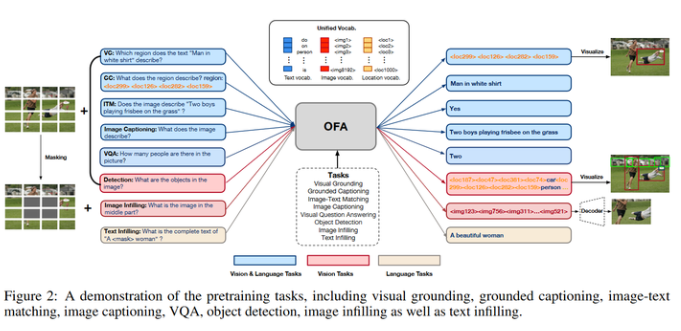
    - 对比训练
        - CLIP
            - CLIP是在跨模态训练无监督中的开创性工作，采用对比学习，让模型学习文本-图像对的匹配关系，图像使用vit结构编码、文本使用bert编码，实现视觉与语言多模态融合，使用了4亿对图文数据训练。 **训练阶段** ：给定一个Batch的（图像，文本）对，使用image-encoder将所有图像编码为一组图像表征{I_i}_{i=1,...,N}，使用text-encoder将所有文本编码为一组文本表征{T_i}_{i=1,...,N}，具有对应关系的{I_i,T_i}_{i=1,...,N}作为正样本，其他组合作为负样本，使用cosine作为相似度度量，最大化N个正样本对的相似度，最小化N^2-N个负样本的相似度。 **推理阶段** ： **采用了 Prompt Template 模式进行Zero-shot Transfer** , 比如来一张 ImageNet-1K 验证集的图片，作者把它喂入 CLIP 预训练好的 Image Encoder，得到特征 I ，接下来把所有类别的词汇 "cat", "dog" 等，做成一个 prompt："A photo of a {object}"，并将这个 prompt 喂入 CLIP 预训练好的 Text Encoder，依次得到特征{T_i}_{i=1,...,M}，最后看哪个的余弦相似度和 I 最高，就代表该图片是哪个类别的。 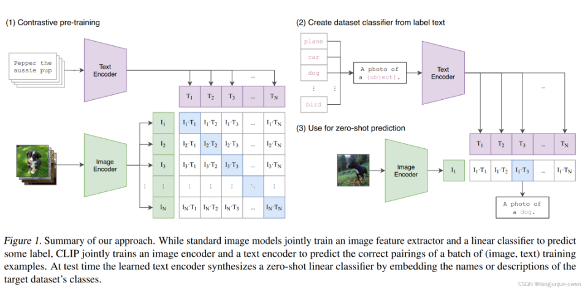
        - Florence：基于UniCL的图文对比学习
            - Florence通过在预训练阶段引入文本语义信息来辅助处理计算机视觉的任务，预训练完成后，在模型后面接一些自适应的模块，即可将Florence模型适配到各式各样的视觉下游任务中。Florence的图像编码器使用的是最先进的Swin Transformer，文本编码器则使用传统的Transformer编码器。预训练任务方面，Florence提出了一种新的多模态对比学习方法UniCL：不同于CLIP在进行跨模态对比时仅将Image-Text pair视作正例，UniCL首先提取出语义相似的图片，让他们共享相同的标签，再借鉴Supervised Contrastive Learning的思想，让具有相同标签的Image-Text pairs的所有图片和文本都互为正例（下图的蓝色方块），标签不同的才互为负例（下图的白色方块）。 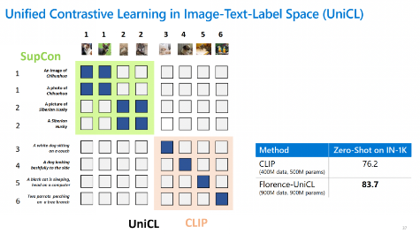
        - BLIP系列：基于ITC,ITM,LM三种任务进行训练
            - X-InstructBLIP
            - InstructBLIP
            - BLIP-Diffusion
            - BLIP:(ITC,ITM,LM)任务+CapFilt数据处理
                - 为了预训练具有理解和生成能力的统一视觉语言模型 *，* BLIP 引入了 ***编码器-解码器的多模态混合（MED）*** ，这是一种多任务模型，包含三个组件： ***单模态编码器*** ，分别对图像和文本进行编码。图像编码器是一个视觉Transformer, 文本编码器与 BERT 相同。[CLS] 标记附加到文本输入的开头以总结句子。 ***基于图像的文本编码器*** ，通过在文本编码器的每个Transformer块的自注意力层和前馈网络之间插入交叉注意力层来注入视觉信息。特定于任务的 [Encode] 标记被附加到文本中，并且 [Encode] 的输出嵌入用作图像-文本对的多模态表示。 ***基于图像的文本解码器*** ，用因果自注意力(masked self-attention)层替换文本编码器中的双向自注意力层。特殊的 [Decode] 标记用于表示序列的开始。 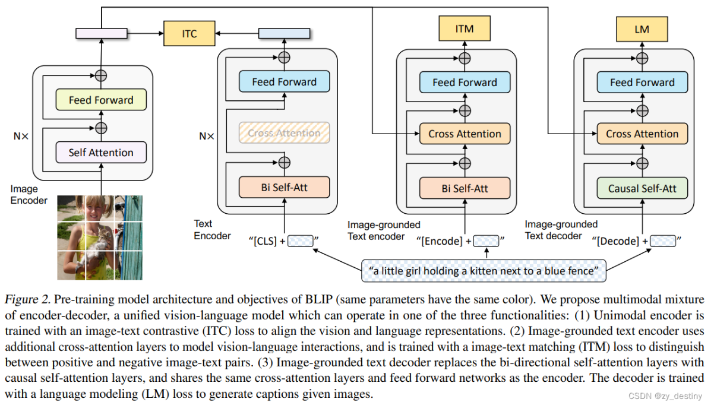
                - BLIP ***在预训练过程中联合优化了三个目标*** ，其中两个基于理解的目标（ITC、ITM）和一个基于生成的目标（LM）： **图像文本对比损失（ITC）** ,目的是通过鼓励正图像-文本对与负图像-文本对相比 *具有相似的表示来对齐视觉Transformer和文本Transformer的特征空间,采用标准的InfoNCE损失函数进行对比训练。* ***图像文本匹配损失（ITM）*** *,是一项二元分类任务，要求模型在给定多模态特征的情况下预测图像-文本对是正（匹配）还是负（不匹配）,采用交叉熵损失函数进行训练。* ***语言建模损失（LM）*** *激活基于图像的文本解码器，其目的是生成以图像为条件的文本描述。为了在利用多任务学习的同时实现高效的预训练，文本编码器和解码器必须共享除自注意力（self-attention, SA）层之外的所有参数。具体地，编码器使用双向自注意力为当前输入 token 构建表征，同时解码器使用因果自注意力预测接下来的 token。另外，嵌入层、交叉注意力（cross attention, CA）层和 FFN 在编码和解码任务之间功能类似，因此共享这些层可以提升训练效率并能从多任务学习中获益。*
                - 噪声数据处理(CapFilt): 为了解决网络收集到的大规模数据中存在图像文本不配对的这个问题，BLIP通过引入两个模块来引导字幕：字幕生成器和过滤器。字幕生成器 是一个基于图像的文本 *解码器* 。给定网络图像，我们使用字幕生成器生成合成字幕作为额外的训练样本。过滤器 是一个基于图像的文本 *编码器* 。它会删除与相应图像不匹配的嘈杂文本。 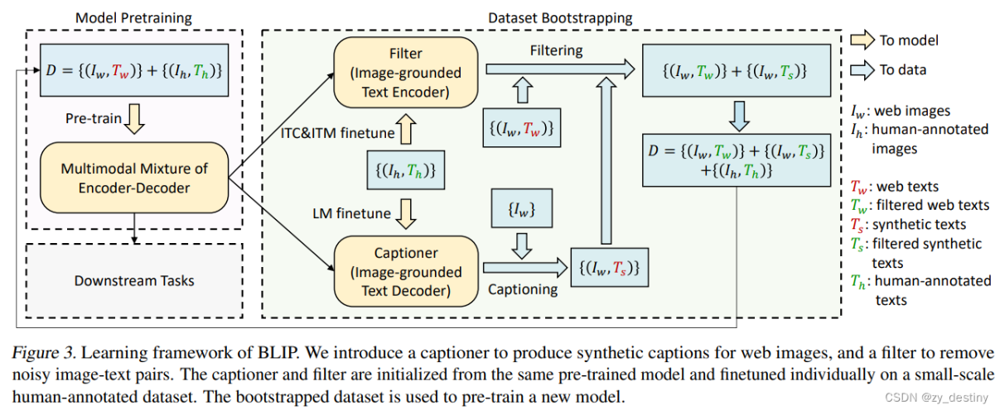
                - ITC与ITM任务相似？
                    - （1）首先ITM和ITC更新的参数不一样，ITC是只做了对比学习，更新的是ViT以及BERT里面self-attention的参数，没有cross-attention多模态融合的部分的参数，而ITM是可以更新这部分的参数的。
                    - （2）这里面取负样本并不是重复，因为在ITC里面，一个batch里面有batch_size个（image-caption）对，因此有正样本对，有负样本对，做正常的对比学习；ITM里面，我们是对（image-caption）融合之后的特征做二分类，来判断他们是否是正样本对，正常就只有配对的正样本对，为了构建负样本对，对于batch中每一个image(caption)随机难采样一个caption(image)【因此这里首先对于负样本的界定就不一样，ITC里面是batch中除了与自己配对的，剩下的都是负样本，而在ITM里面负样本是每个样本依据相似度随机采样的】，这样最终在ITC和ITM都有正负样本对。
                    - （3）总的来说，ITM和ITC更新模型不同部分的参数，ITC就是做最标准的对比学习，必须包括正负样本对，而ITM理论上可以不用找难负样本，但是为了增强模型的模态融合能力，作者在实现时候做了hard-negative-mining。
    - 交叉注意力
        - Flamingo：图像的感知重采样+门控制交叉注意力，数据：图文交织
            - Flamingo认为CLIP、Uni-Perceiver这些模型只是提供不同模态之间的相似性分数，因此它们只能解决有限的用例，例如分类，其中预先提供有限的结果集。Flamingo提出的视觉语言模型（VLM）只需通过一些输入/输出示例进行提示即可实现各种任务， **它将图像和视频理解任务形式化为以视觉输入为条件的文本预测问题** 。 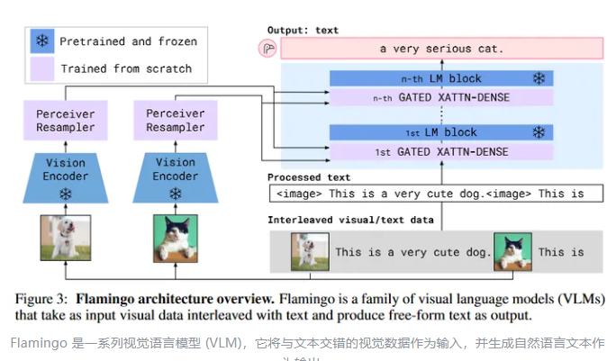
            - Vision Encoder：经过预训练后冻结的 NormalizerFree ResNet (NFNet) F6模型。训练方法依然是类CLIP的图像文本对对比学习，最终输出是展平为1D特征序列2D空间特征网格。如果是视频输入，则是3D时空特征网格展平为1D序列。Vision Encoder在 ALIGN 和 LTIP 数据集上进行了预训练。训练图像分辨率为288×288，联合嵌入空间大小为1376，批量大小为16,384，Adam优化器。它经过 120 万个参数更新步骤的训练，每个参数更新步骤由 512 个 TPUv4 芯片上的两个梯度计算步骤组成。在训练过程中，学习率从 0.001线性衰减到零。图像在训练期间应用了随机颜色增强和水平翻转。
            - 感知重采样器（Perceiver Resampler）：为了降低交叉注意力的计算复杂度，设计了 **感知重采样器** 从视觉编码器输出的大型特征图提取空时特征，并输出固定数量的视觉tokens。这些视觉tokens会在新初始化的交叉注意力层中与输入的文本特征相作用，共同调节语言大模型的输出。 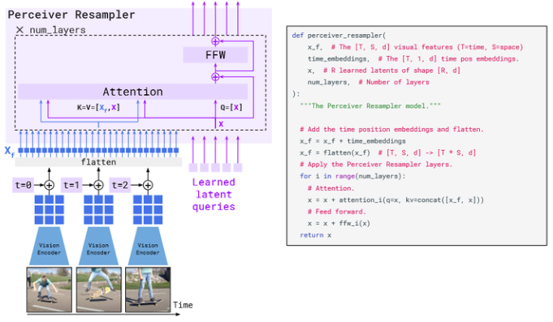
            - 门控交叉注意力（Gated XAttention）：交叉注意力的思想是使一个序列能够“关注”另一个序列。相比于自注意力的自己部分关注别的自己部分，交叉注意力在“使得两个不同来源的序列相互‘认识’”相当有效，因此多模态领域常常使用交叉注意力使得不同模块的表征统一到同一向量空间，即对齐。为了根据视觉输入调节 LM，Flamingo在现有的预训练层和冻结的 LM 层之间插入新的交叉注意力层。 **从视觉特征中获取K和V，从文本输入中获取Q，这使得图片特征才是关键信息源，文本输入只是作为prompt被对齐到视觉表示空间中** 。它们后面是密集的前馈层。这些层经过tanh门控和残差连接，以便 LM 在初始化时保持完整，从而提高稳定性和性能。 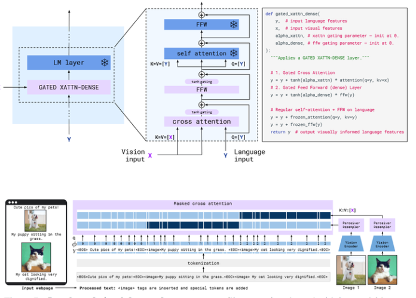
            - **数据集：在网上获取的图像文本交错样本** ，如网页、图像文本对和视频文本对. 多目标训练：给定视觉输入，最小化预期文本负对数似然概率的加权和。可以理解为训练方法是图文交错序列的Next token prediction。数据增强和预处理：文本、图片和视频均有特定的、经验性的预处理方法。Vision Encoder使用对比学习方法提前训练好，参数量435M，LM语言模型来自Chinchilla-70B，它们的权重都是冻结的。可训练的参数量有10B，其中Resampler参数占了194M。 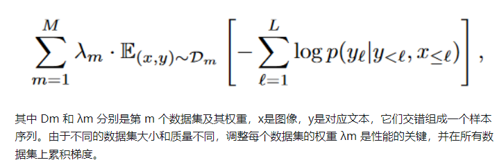
        - Qwen-VL：可训练query的单层cross-attention Adapter的三阶段训练，数据：图文对+图文交织+图文对
            - Qwen-VL模型的整体网络架构包括以下三个组件：1. **大型语言模型** （Large Language Model），作为Qwen-VL模型的基础组件，这个部分采用了一个大型语言模型，其初始权重来自于预训练的Qwen-7B模型。2. **视觉编码器** （Visual Encoder），觉编码器采用了Vision Transformer（ViT）架构，用于处理输入图像并生成一组图像特征。在训练和推理过程中，将输入图像调整到特定的分辨率，然后通过将图像分割成大小为14的图块来处理它们，生成图像特征。视觉编码器的架构和预训练权重来自于Openclip的ViT-bigG模型。 **位置感知的视觉-语言适配器** （Position-aware Vision-Language Adapter），为了缓解由于长图像特征序列而产生的效率问题，Qwen-VL引入了一个视觉-语言适配器，用于压缩图像特征。适配器包括一个单层的交叉注意力模块，随机初始化。此模块使用一组可训练的向量（嵌入）作为查询向量，使用来自视觉编码器的图像特征作为交叉注意力操作的键。这个机制将视觉特征序列压缩到固定长度的256。
            - Qwen-VL模型的训练过程，包括三个阶段：预训练的两个阶段和最后的SFT。Qwen-VL模型的 **第一个预训练阶段使用了一个大规模、弱标记的、通过网络爬取得到的图像文本对数据集** 。这个预训练数据集包括了来自公开资源和部分内部数据的图像文本对。为了保证数据质量，研究人员对数据集进行了清理，去除了其中的某些模式。在清理后，原始数据集中包含了50亿对图像文本对，而剩余的数据经过处理后仍然有14亿对，其中77.3%为英文文本，22.7%为中文文本。 **在第二个多任务预训练阶段，Qwen-VL模型采用了高质量和细粒度的视觉-语言（VL）标注数据，同时采用了更大的输入分辨率和图像-文本交织数据。** 第二个预训练阶段同时进行了以下七个任务的训练：图像描述（Captioning），视觉问答（VQA），定位任务（Grounding），参考定位和定位描述的双重任务（Ref Grounding 和 Grounded Cap.），光学字符识别（OCR），文本生成（Text Generation）。 **在监督微调阶段** ，Qwen-VL模型通过引入额外的指导微调数据来提升其交互和对话能力，从而生成了交互式的Qwen-VL-Chat模型。这些 **多模态的指导调整数据主要来自于图像描述或对话数据** ，这些数据可以通过LLM（Large Language Model）自我训练生成。然而，这些数据通常只涵盖了单一图像对话和推理，且仅限于对图像内容的理解。因此，作者们通过手动标注、模型生成和策略串联等方法构建了一组额外的对话数据，以将定位和多图像理解能力融入到Qwen-VL模型中。这样做的目的是确保模型可以有效地将这些能力传递到更广泛的语言和问题类型中，从而提升了模型在交互和对话方面的性能。在这个阶段，作者们将模型的视觉编码器冻结，仅优化语言模型和适配器模块，以保证模型的训练稳定和有效。具体地，Qwen-VL-Chat模型采用了全局批次大小为128的训练方式，使用了具有最大学习率1e-5、最小学习率1e-6和线性预热3000步的学习率调度。 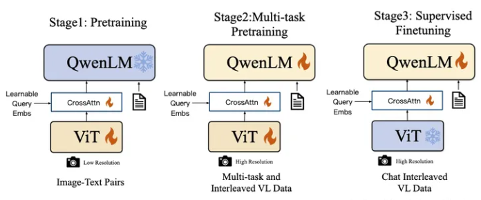
- 文生图模型
    - CogView
    - KOSMOS-G
    - DALL-E·2
    - Diffusion Transformer
    - GLIDE
    - Imagen
    - stable diffusion
    - DALL-E
    - SDEdit
- 混合多模态
    - Gemini
    - PandaGPT
    - Uni3D
    - Versatile Diffusion
- 文生视频
    - 产品
        - runway
        - sora
            - **主要特点** ：联合在视频和图片上训练一个文本条件扩散模型，这些视频和图片具有不同的持续时间、分辨率和宽高比，模型为一个transformer架构，它可以视频和图片的潜在编码时空块上进行操作。
            - **视觉预处理** ：patch 是一种高度可扩展且有效的表示方法，适用于训练不同类型的视频和图像的生成模型。首先将视频压缩成低维度潜在空间，然后将表示分解为时空块，从而将视频变成patch。 **视频压缩** ：首先训练一个网络来降低视觉数据的维度。这个网络以原始视频作为输入，并输出一个在时间和空间上都被压缩的潜在表示。Sora的生成模块在这个表示的基础上进行训练和视频生成。sora还训练了一个对应的解码器模型，将生成的潜在空间映射回像素空间。 **潜在时空patch** : 给定一个压缩的输入视频，首先提取一系列的时空patch充当 transformer 的 tocken，这个模式也可以应用到图片上因为图片是只有一帧的视频。基于patch的表示可以使我们能够在不同分辨率、持续时间、宽高比的视频和图片上训练。在推理时，我们可以通过将随机初始化的patch放在在一个大小合适的网格中来控制生成视频的大小。 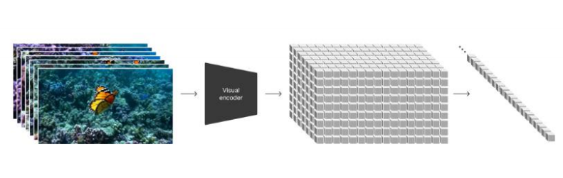
            - **训练原始大小的数据提供的好处** ：1. 采样的灵活性，可以采样宽屏1920x1080、竖屏1080x1920以及任何介于二者之间的内容，因此可以生成适应不同设备的宽高比，以原始方式生成不同的分辨率而无需先生成全分辨率。2. 良好的构图与组合，openai还训练过一个将所有训练视频裁剪为正方形的版本，但结果表明这种处理方式生成的视频会生成主体仅部分可见的视。 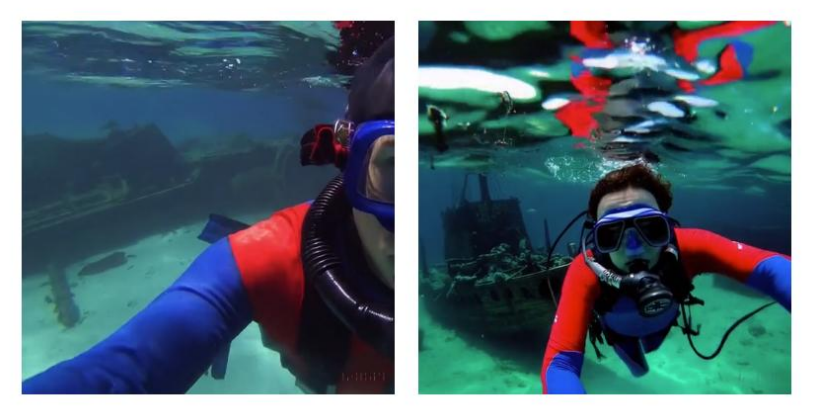
            - **标题文本预处理** ：训练文本到视频生成系统需要大量具有对应文本标题的视频。sora将 DALL·E 3 引入的重新标题技术应用到视频中,首先训练一个高度描述性的标题模型，然后使用它为训练集中的所有视频生成文本标题。研究发现，训练在高度描述性视频标题上可以提高文本的准确性以及视频的整体质量。
            - **prompt扩充预处理** ：类似于 DALL·E 3，sora还利用 GPT 将用户简短提示转换为更详细的长标题，然后将其发送给视频模型。这使得 Sora 能够生成高质量的视频，准确地遵循用户的提示。
            - **sora视频生成模型** ：Sora是一个diffusion-transfomer，它首先是一个diffusion模型，给定输入的初始噪声以及文本提示等条件，模型的训练目标是预测原始的“clean" patch。该diffusion模型基于transformer实现，sora发现diffusion-transformer可以有效地扩展到视频建模上。
            - **推理时使用图片和视频作为输入的prompt** :Sora 也可以使用已有的图像或视频作为输入的prompt，这种能力使得Sora 能够执行各种图像和视频编辑任务——创建完美循环的视频，给静态图像添加动画，将视频向前或向后延伸等等。基于这个能力，sora可以执行 **延长生成的视频、视频到视频编辑、连接视频、图像生成** 等任务。延长生成视频任务支持前向延长和后向延长，视频到视频编辑利用了diffusion模型已有的从文本提示编辑图像和视频的方法，例如SDEdit, 这种技术使得 Sora 能够在零样本情况下转换输入视频的风格和环境。连接视频使用 Sora 逐渐插值两个输入视频之间，从而在完全不同的主题和场景构图的视频之间创建无缝的过渡。图像生成是通过将高斯噪声的patch以一帧的时序（temporal）范围排列成空间网格来实现这一点,分辨率最高为2048x2048。
            - **sora的涌现能力** ：包括涌现出的模拟能力，长程连续性和对象永恒性、模型数字世界。 **涌现出的模拟能力** 是指，在大规模训练时，视频模型表现出许多有趣的新兴能力。这些能力使得 Sora 能够模拟来自物理世界的一些人、动物和环境的方面。这些属性是在没有任何明确的归纳偏见的情况下出现的，比如对 3D、物体等——它们纯粹是scale现象。3D 一致性，Sora 可以生成具有动态摄像机运动的视频。随着摄像机的移动和旋转，人物和场景元素在三维空间中保持一致的移动。 **长程连贯性和对象永恒性。** Sora 通常能够有效地模拟短期和长期依赖关系，但偶尔也会失败。例如在人、动物和物体被遮挡或离开画面时仍然保持其持久性。同样地，它可以在一个样本中生成同一个角色的多个镜头，并在整个视频中保持其外观。与世界进行交互。Sora 有时可以模拟一些简单方式影响世界状态的动作。例如，一个画家可以在画布上留下持续一段时间的新笔触，或者一个人可以吃掉一个汉堡并留下咬痕。 **模拟数字世界** ：Sora 还能够模拟人工过程，一个例子是视频游戏。Sora可以在Mincraft使用基本策略控制玩家，同时以高保真度渲染世界及其动态。这些能力可以通过提示 Sora 提到“Minecraft”的标题来零样本激发。
            - **效果** ：以下是给定固定种子和输入，随着训练持续进行的不同输出结果。 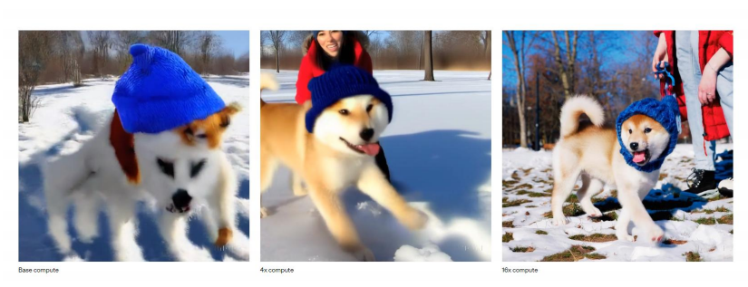
            - **缺陷** ：它并不能准确地模拟许多基本交互的物理特性，比如玻璃破碎。其他交互，比如吃食物，并不总是产生正确的物体状态变化，在长时间样本中发展的不一致性或对象的突然出现。
        - pika
        - Phenaki
    - 模型
        - VideoGPT
        - stable vedio
        - CogVideo
        - Video Diffusion Model
        - Imagen Video
        - **Lumiere**