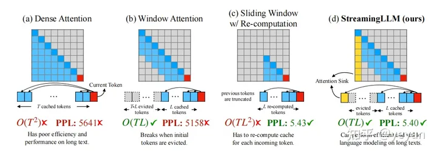

# 大模型上下文扩展技术
- 注意力机制改进
    - window attention
        - sliding window attention with re-computation
        - shift short attention
            -  
            - 设初始上下文长度为l,把微调时的长上下文分成若干组，每组长度为l，在执行self-attention中，按组进行窗口移动
        - streaming-LLM
            -  
            - window attention+保留初始token
    - log（n）注意力缩放
        - 在注意力计算公式中，QK^T上加入一个log_m n,其中m是训练时的长度，n为预测时的长度
- position encoding改进
    - Alibi
        - ALiBi不向单词embedding中添加位置embedding，而是根据token之间的距离给 attention score 加上一个预设好的偏置矩阵
        - 比如 相对位置差 1 就加上一个 -1 的偏置，两个 token 距离越远这个负数就越大，代表他们的相互贡献越低。
        - 由于注意力机制一般会有多个head，这里针对每一个head会乘上一个预设好的斜率项(Slope)
    - RoPE改进
        - Interpolation
            - Position Interpolation
            - 线性插值
        - Extrapolation
            - NTK感知缩放RoPE
            - dynamic缩放RoPE
            - consistent of Dynamically Scaled RoPE
        - 混合
            - Rectified RoPE
- 其他
    - **N** aive **B** ayes-based **C** ontext **E** xtension
        - 只需要修改一下解码函数中的logits构建方式
        - 即插即用、模型无关、无须微调、线性效率、实现简单
        - NBCE的一大缺点是无序性，即无法识别Context的输入顺序，这在续写故事等场景可能表现欠佳