# 大模型参数高效微调及扩展
- 上下文扩展
    - position encoding改进
        - RoPE改进
            -  [Interpolation]("https://zhuanlan.zhihu.com/p/670149880")
                - Position Interpolation：注意力分数 |m-n| 增大而下降的上界可能太宽松，从而导致在训练长度外注意力分数出现较大的波动，进而降低外推效果。 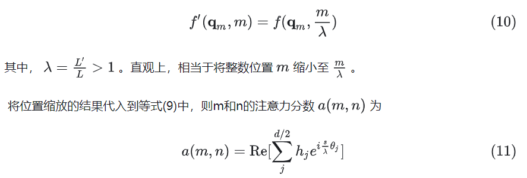
            - Extrapolation
                - 静态NTK感知缩放RoPE：基于NTK的视角认为，标准MLP神经网络并不能很好的学习高频的信号。将这个结论应用到RoPE中，也就意味着： **当** j **较小时，模型可能对插值的位置并没有很好的泛化能力** 。因此，当 j 较小时使用外推，随着 j 的增大逐步开始插值。也就是所谓的高频外推、低频内插。 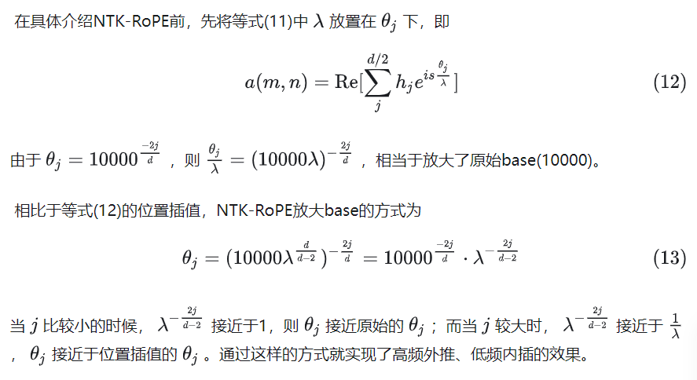
                - 动态NTK缩放RoPE：在静态NTK中，推理长度 L′ 是一个固定的值。但是，对于自回归语言模型来说，每次推理的序列长度都会增加。因此推理长度 L′ 并不是固定的值。若使用 \ lambda=L′/L ，当推理长度小于L 时，性能会有折扣；当推理长度大于 L′ ，模型效果可能会突然退化。解决办法是：在每次前向传播时，动态NTK使用的缩放因子为 \ lambda=max(1, *l′* /L) ，其中 *l′* 是当前序列的长度。这样就能动态的适应自回归模型。
                - consistent of Dynamically Scaled RoPE： 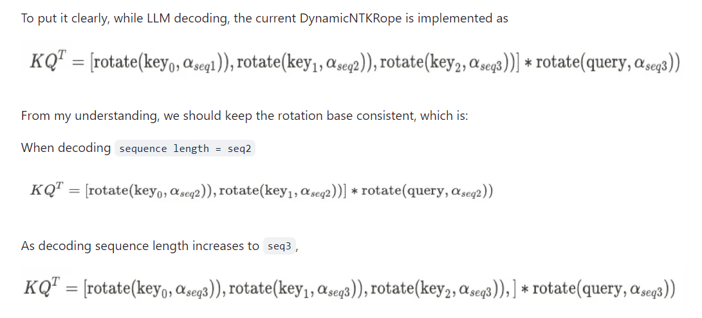
            - 混合
                - Rectified/Leakey Rectified RoPE：一种结合外推和内插的方法，即通过设定一个窗口w，在窗口内使用大小为1的位置间隔，在窗口外我们使用大小为1/k的位置间隔,只要w小于训练长度，那么通过控制k，我们就可以在精确保持了局域性的前提下，使得所有位置编码不超过训练长度，简单直接地结合了直接外推和位置内插。此外，当k-> \ infinity,不管输入长度是多少，它的位置编码范围都不超过w，所以这是一种有可能支持任意长度的Context的方案。k取有限值时称为Leaky ReRoPE, 无限值是称为ReRoPE。 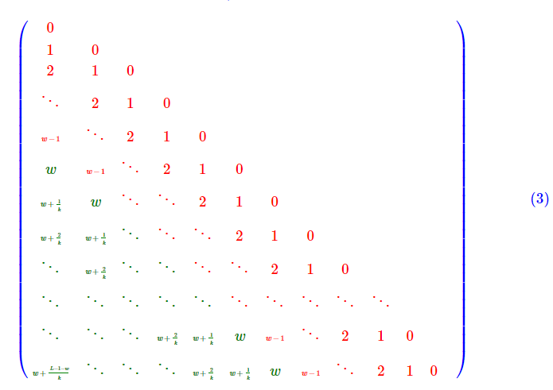
            - ROPE基本原理
                -  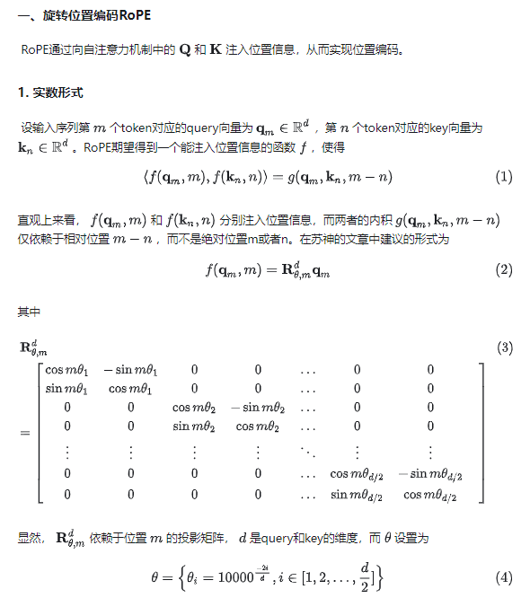
                -  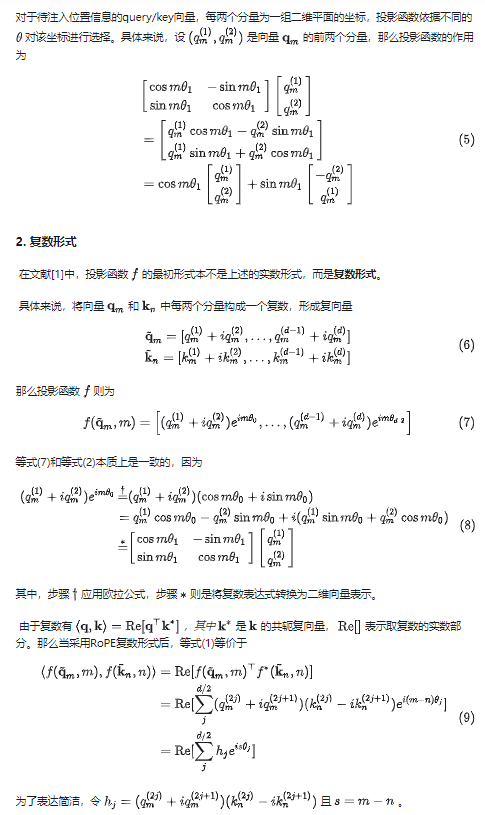
        - Alibi
            - ALiBi不向单词embedding中添加位置embedding，而是根据token之间的距离给 attention score 加上一个预设好的偏置矩阵。比如 相对位置差 1 就加上一个 -1 的偏置，两个 token 距离越远这个负数就越大，代表他们的相互贡献越低。由于注意力机制一般会有多个head，这里针对每一个head会乘上一个预设好的斜率项(Slope)。$m=2^{-8/n}$ 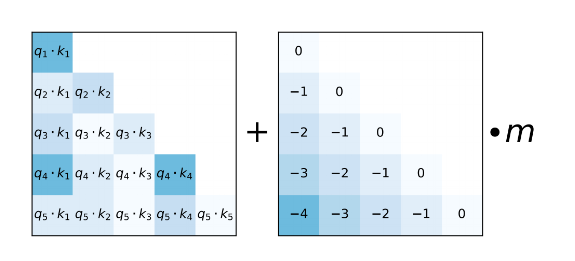
    - 注意力改进
        - window attention
            - sliding window attention with re-computation
            - shift short attention
                -  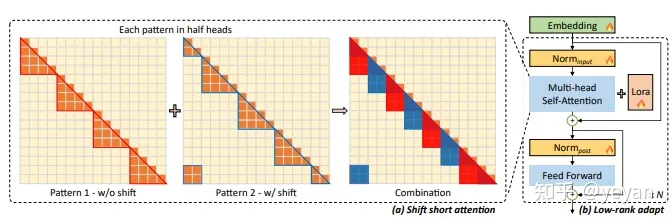
                - 设初始上下文长度为l,把微调时的长上下文分成若干组，每组长度等于l，在执行self-attention中，按组进行窗口移动
            - streaming-LLM
                -  
                - window attention+保留初始token
        - log（n）注意力缩放
            - 在注意力计算公式中，QK^T上加入一个$log_m n$,其中m是训练时的长度，n为预测时的长度
    - 其他
        - **N** aive **B** ayes-based **C** ontext **E** xtension
            - 只需要修改一下解码函数中的logits构建方式，即插即用、模型无关、无须微调、线性效率、实现简单，NBCE的一大缺点是无序性，即无法识别Context的输入顺序，这在续写故事等场景可能表现欠佳 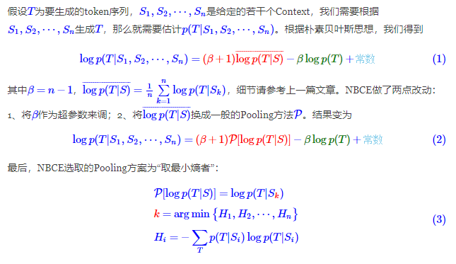
    - 参考文献
        -  [https://arxiv.org/pdf/2311.12351.pdf]("https://arxiv.org/pdf/2311.12351.pdf")
- PEFT
    - Prompt类
        - prompt tuning
            - 在输入层加一个embedding层
        - P-tuning
            - 在输入层加一个embedding和一个LSTM或MLP
        - prefix tuning
            - 在每一层加入一个embedding和一个MLP
        - P-tuning v2
            - 在每一层都加一个embedding层
    - Adapter类
        - Adapter Tuning
            - 针对每一个Transformer层，增加了两个Adapter结构(分别是多头注意力的投影之后和第二个feed-forward层之后)
        - Adapter Fusion
            - 在 Adapter 的基础上进行优化，通过将学习过程分为两阶段来提升下游任务表现：包括知识提取和知识组合。
            - 知识提取阶段：在不同任务下引入各自的Adapter模块，用于学习特定任务的信息。
            - 知识组合阶段：将预训练模型参数与特定于任务的Adapter参数固定，引入新参数（AdapterFusion）来学习组合多个Adapter中的知识，以提高模型在目标任务中的表现
        - Adapter Drop
            - 在不影响任务性能的情况下，对Adapter动态高效的移除，尽可能的减少模型的参数量，提高模型在反向传播（训练）和正向传播（推理）时的效率
    - Lora类
        - LoRA
            - 用两个低秩矩阵替代待更新的权重矩阵的增量
            - 在原始预训练语言模型（PLM）旁边增加一个旁路，做一个降维再升维的操作，来模拟所谓的内在秩。训练的时候固定PLM的参数，只训练降维矩阵A与升维矩阵B。模型的输入输出维度不变，输出时将BA与PLM的参数叠加。随机高斯分布初始化A，用0矩阵初始化B，保证训练的开始此旁路矩阵依然是0矩阵。通过SVD分解来找到原权重矩阵的内在秩。$\alpha$的作用等同于学习率。 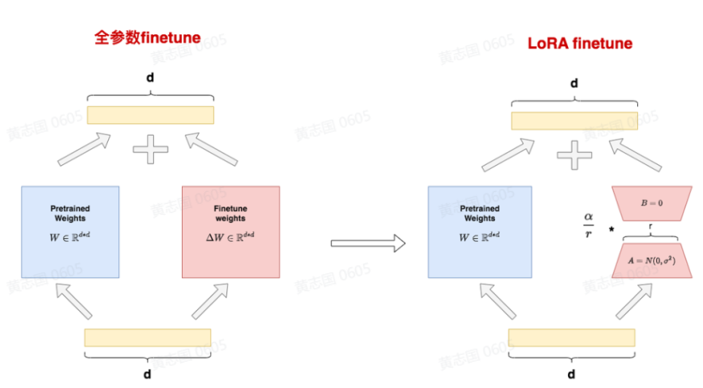
        - QLoRA
            - 三个优化点：1. 使用4 bit NormalFloat(NF4) 量化；2. 双量化，包含对普通参数的一次量化和对量化后的参数的再一次量化，可以进一步减小缓存占用；3. 引入了分页优化器，在显存不够时候，将保存的部分梯度转移到CPU上，以防止梯度检查点期间的内存峰值。
        - AdaLoRA
            - 用奇异值分解P \ Gamma Q代替AB，根据loss梯度评估对角线上值进行重要性评分，根据评分动态分配参数预算给权重矩阵
            - 1. AdaLoRA将关键的增量矩阵分配高秩以捕捉更精细和任务特定的信息，而将较不重要的矩阵的秩降低，以防止过拟合并节省计算预算。2. 以奇异值分解的形式对增量更新进行参数化，并根据重要性指标裁剪掉不重要的奇异值，同时保留奇异向量。3. 在训练损失中添加了额外的惩罚项，以规范奇异矩阵P和Q的正交性，从而避免SVD的大量计算并稳定训练。 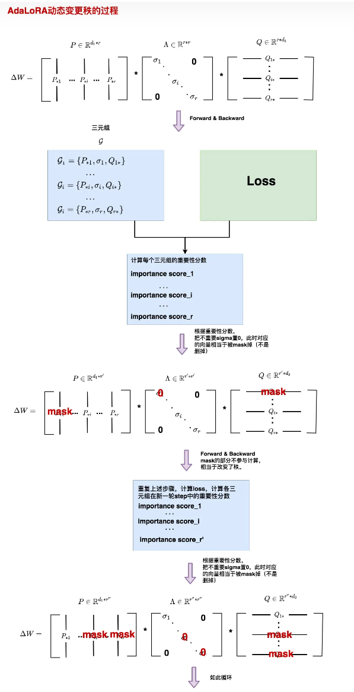
        - ReLoRA
            - ReLoRA主要用于解决多个LoRA叠加训练时秩不增的问题， **LoRA的微调精度受到式$rank(A+B)<=rank(A)+rank(B)$的限制，** 即我们用于加和更新的的矩阵的秩最多也只是 ***矩阵和的秩*** ，而非 **矩阵秩的和** ，这会导致我们用于更新的信息量存在上限，从而影响我们的训练效果。解决的办法是重新启动LoRA，这意味着我们在训练期间合并WA和WB并重置这些矩阵的值，我们可以增加更新的矩阵的秩。 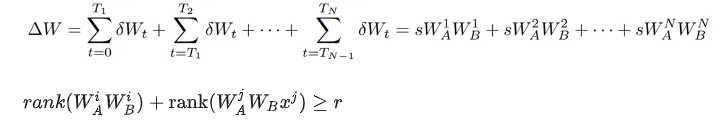
            - ReLoRA方法在技术上的实现模块主要有以下四个部分：锯齿余弦学习率曲线，warm-up热启动，adam模型重启，Merge-reinit矩阵秩的加权合并如图所示。 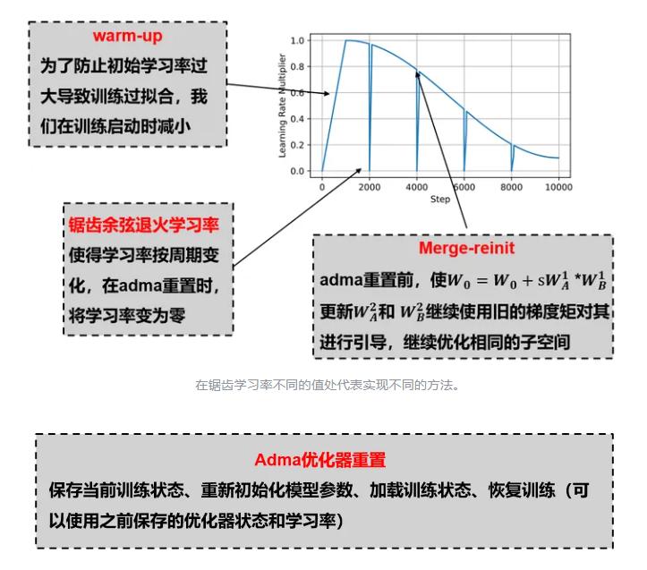
    - 其他
        - IA3
            - 引入3个可学习的向量$l_k,l_v,l_ff$来对激活进行缩放，方式是直接进行element-wise乘法，还额外引入了两个损失项:unlikelihood loss和length-normalized loss，前者用于加重不正确输出的惩罚，后者对所有输出的长度归一化对数概率应用一个标准的softmax cross-entropy损失。 
        - BitFit
            - 稀疏的微调方法，它训练时只更新bias的参数或者部分bias参数
    - 混合式
        - MAM Adapter
            - 用 FFN 层的并行Adapter和soft prompt的组合 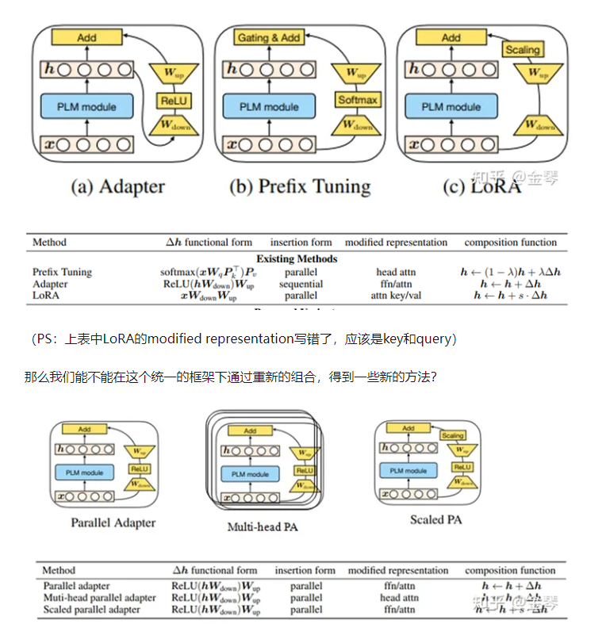
        - UniPELT
            - 使用三个线性层GP、GL、GA作为门控制单元，其中GP参数控制Prefix-tuning方法的开关，GL控制LoRA方法的开关，GA控制Adapter方法的开关 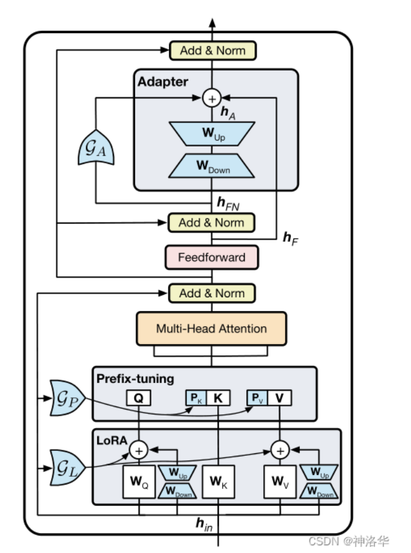