# 大模型应用技术原理
- RAG
    - 文档解析器
        - 目标：将非结构化的文档(pdf,word,ppt....)转换为结构化数据
        - 非结构文档分类
            - 高度结构化的文档：基于标记语言的文本，md,html,latex
            - 半结构化的文档:word等
            - 低结构化的文档：ppt,pdf等
        - 难点：OCR
            - 公式：Nougat
            - 表格:PaddleOCR,camelot,阿里读光
            - 文字:Rapid-OCR,PaddleOCR，easyorc, cnocr, mmocr,tesseract
    - 文本分割器
        - 基于规则的分割
            - CharacterTextSplitter，RecursiveCharacterTextSplitter等
        - 基于模型/算法的分割
            - damo/nlp_bert_document-segmentation_chinese-base，NLTKTextSplitter，SpacyTextSplitter
        - 针对高度结构化的非结构文本的分割器
            - MarkdownTextSplitter，PythonCodeTextSplitter，HTMLHeaderTextSplitter,LatexTextSplitter...
        - 面向token的分割
            - SentenceTransformersTokenTextSplitter
    - ：是否加入了Instruction，对称语义(qq)vs非对称语义(qa) [Embedding模型]("https://huggingface.co/spaces/mteb/leaderboard")
        - 对称 query:qestion, text:text
            - sentence-T5
                - T5-encoder+mean pooling
                - 无标注对比学习+有标注对比学习的两阶段训练
        - 非对称:query:text
            - GTR
                - 与sentence-T5结构相同
                - 将finetune的数据集从NLI换成检索相关的，并且利用百度的rocketqa来获得hard negative
                - 对比学习改成双向对比学习（每个batch里有两个对比学习损失，第一个损失是以query为中心去构建正负样本，第二个损失是以positive document为中心去构建正负样本）
            - stella-v2
                - 无instruction的非对称训练
                - 带有hard negative样本的对比学习训练
                -  [https://huggingface.co/infgrad/stella-large-zh-v2]("https://huggingface.co/infgrad/stella-large-zh-v2")
            - piccolo
                - 无instruction的非对称训练
                - 采用了无监督二元组对比学习预训练+hard negative三元组对比精调的两阶段的训练方式
                -  [https://huggingface.co/sensenova/piccolo-base-zh]("https://huggingface.co/sensenova/piccolo-base-zh")
        - 混合
            - Instructor
                - 1. 以GTR为基底模型，经过进一步的“instruction tuning”得到
                - 2. 将模型输入改成Task Instuction+[X]([X]代表具体的文本输入)
            - m3e
                - 无instruction的混合训练
                - 朴素的对比训练，包含大规模对称和非对称语义数据训练
                -  [https://github.com/wangyuxinwhy/uniem]("https://github.com/wangyuxinwhy/uniem")
            - gte
                - 基于非对称文本进行预训练，基于对称+非对称文本进行监督训练
                - 无instruction的混合训练
                -  [https://huggingface.co/thenlper/gte-large-zh]("https://huggingface.co/thenlper/gte-large-zh")
            - bge
                - 可选instruction的混合训练
                - 基于RetroMAE进行预训练，基于对比训练进行二次监督训练
                -  [https://github.com/FlagOpen/FlagEmbedding]("https://github.com/FlagOpen/FlagEmbedding")
    -  [向量数据库]("https://www.jianshu.com/p/43cc19426113")
        - 选型标准
            - 开源vs.闭源vs. 源码可见
            - 客户端/SDK语言:python,rust,go,...
            - 托管方式
                - self-hosted/on-premise
                    - redis,pgvector,milvus
                - managed/cloud-native
                    - zilliz,pinecone
                - embeded+cloud-native
                    - chroma,lanceDB
                - self-hosted+cloud-native
                    - vald,drant,weaviate,vspa,elasticsearch
            -  [索引方法]("https://zhuanlan.zhihu.com/p/415320221?utm_id=0")
                - 算法
                    - Flat
                    - Tree-based:KD-Tree, Trinary Projection Trees, Annoy
                    - IVF-based:IVF,IVMF
                    - Hashing-based:LSH,Spherical Hashing,Spectral Hashing
                    - Graph-based:NSW,NSG,HNSW,DiskANN
                        -  [HNSW]("https://zhuanlan.zhihu.com/p/379372268")
                            -  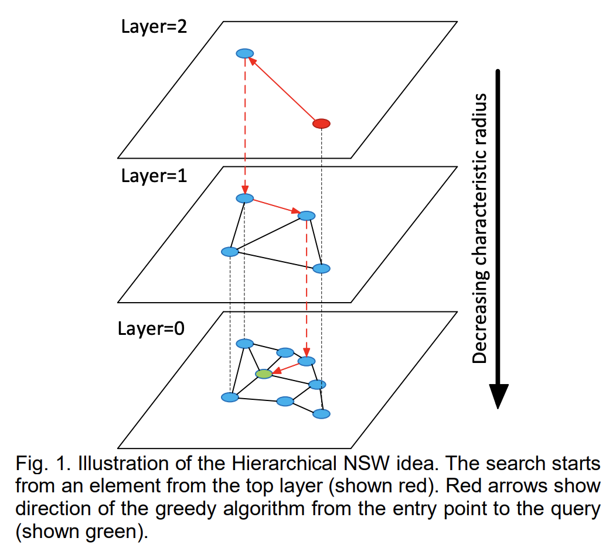
                            - 分层的可导航小世界（Hierarchical Navigable Small World，HNSW）是一种基于图的数据结构，它将节点划分成不同层级，贪婪地遍历来自上层的元素，直到达到局部最小值，然后切换到下一层，以上一层中的局部最小值作为新元素重新开始遍历，直到遍历完最低一层。它的基本思想是:跳表+NSW
                            - 跳表 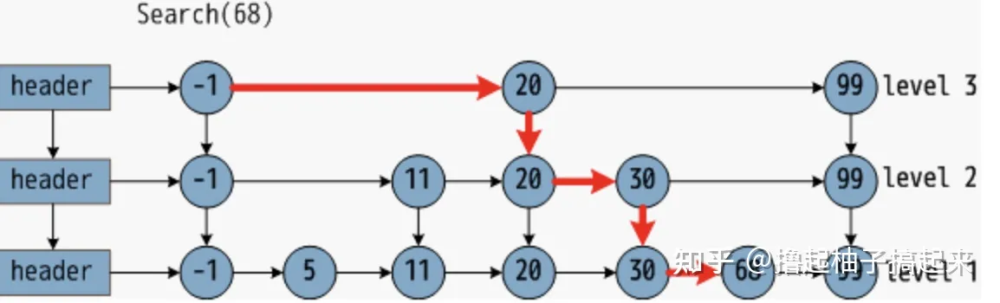
                        - NSW
                            - 核心思想：可导航小世界（Navigable Small World，NSW）将候选集合  构建成可导航小世界图，利用基于贪婪搜索的kNN算法从图中查找与查询点距离最近的k个顶点。
                            - 近似Delonay图：向图中逐个插入点，对于每个新插入点，使用近似kNN搜索（approximate kNN search）算法从图中找到与其最近f个点集合，该集合中所有点与插入点连接。通过上述方式构建的是近似Delonay图，与标准Delonay图相比， **随着越来越多的点被插入到图中，初期构建的短距离边会慢慢变成长距离边，形成可导航的小世界，从而在查找时减少跳数加快查找速度。**
                            - 德劳内（Delaunay）三角剖分算法，这个算法可以达成如下要求：1，图中每个点都有“友点”。2，相近的点都互为“友点”。3，图中所有连接（线段）的数量最少。Delaunay图有个缺点，它没有高速公路机制，也就是说所有的图节点都只会跟自己相近的点建立连接，如果需要抵达一个距离较远的点，则时间复杂度较高。而不管是构建图索引的时候，还是在线检索的时候，都需要进行临近搜索，直接采用Delaunay图就会导致离线索引构建以及在线serving的时间复杂度不理想。
                            - SW:在网络中，任选两个节点，连通这两个节点的最少边数，定义为这两个节点的路径长度，网络中所有节点对的路径长度的 ，定义为网络的特征路径长度，小世界网络的定义即特征路径长度与节点数的对数呈正相关。 [平均值]("https://baike.baidu.com/item/%E5%B9%B3%E5%9D%87%E5%80%BC/8353298?fromModule=lemma_inlink")
                        - Vamana(DiskANN)
                            -  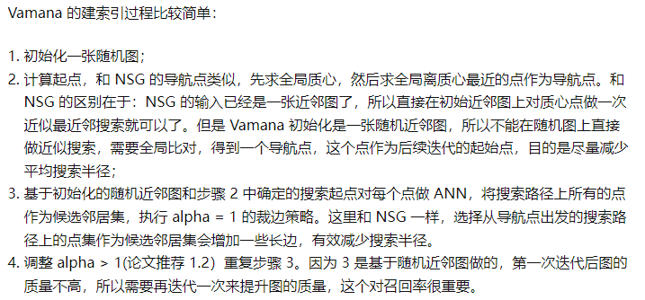
                            -  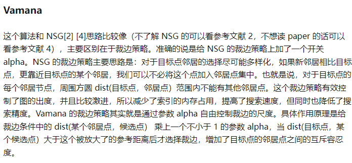
                - 量化
                    - PQ（Product Quantization）
                        - PQ 将特征空间分解为多个低维子空间的笛卡尔乘积，然后单独地对每一个子空间进行量化
                    - SQ（Scalar Quantization）
                        - SQ是将每一个维度量化成指定位数的一个数
        - 主流方案
            - professional
                - weaviate
                    - 1. 文档丰富，容易上手;2. 提供混合索引;3. 支持自托管+云原生;4.支持python,js,ts,go,java等客户端;5. 支持HNSW,HNSW-PQ,DisANN等索引
                - pinecone
                    - 1. 完全云原生，非常容易上手;2. 自建复合索引;3. 支持向量+关键词混合召回;4. 易于集成，灵活可扩展。 **缺点** ：收费，只支持云原生。
                - faiss
                    - 1.来自 Meta AI（原 Facebook Research）的开源项目;2.同时支持cpu和GPU两种设备;3. 支持C++,python, go等客户端;4. 支持常见的索引方式，如IVF,HNSW,支持PQ量化;5. in-memory运行;6. self-hosted。 **缺点** ：不能处理大规模数据
                - milvus
                    - 特点：1. 通过代理、负载均衡器、消息代理、Kafka和Kubernetes的组合实现了高度可扩展性，这使得整个系统变得非常复杂和资源密集;2. 截至2023年，它是唯一一个提供可工作的DiskANN实现的主要供应商;3. 支持在向量相似度检索过程中进行标量字段过滤，实现混合查询;4. 采用存储与计算分离的架构设计;5. 提供python,juava,go,node.js等语言SDK,也提供milvus lite等in-momery运行;6. 提供了图形界面客户端。 **缺点** ：更新频繁，数据备份时只能同一集群备份，权限控制较差。
            - traiditional：ES,redis,pgvector
    - 检索
        - 向量检索: 基于faiss, milvus,weaviate,chroma等向量数据库
        - 关键字检索:基于文本检索引擎ElasticSearch,OpenSearch和BM25算法
        - 图数据库检索：ne4j,nebula等图数据库
        - 关系数据库检索：pgsql,oracle等关系数据库
        - 搜索引擎：bing, duckduckgo, metaphor
    - 通用的RAG增强
        - Embedding模型微调
            - 训练模式:非对称训练。大量数据的全量微调，少量数据的Adapter微调，LM-Cocktail:一种把不同模型暴力合并的方案
            - 开源方案：sentence-transformers,uniem,flag-embedding
        - Rerank模型
            - 基本原理：基于cross-encoder训练，接受一组文本对，生成得分.Cross-Encoder的理论出发点为：拼接后的句子之间语义还有交互，能最大限度的利用语句之间的语义信息，效果比单独编码句子后再进行相似度比较要好得多
            - 模型：Cohere,bge-reranker
        - 混合检索
            - 进行多路召回(如bm25的关键词+向量检索)，然后对召回的结果进行重排
        - Router
            - 使用前置的推理性能强大LLM作为Router，来识别用户意图，组织召回路径。对大模型的推理能力要求较高：要求大模型明确知道自己不知道的问题,对prompt的质量要求较高
        - LLM的RAG增强微调
            - Self-RAG
                - 框架
                    - 自反思检索增强生成（Self-RAG, Self-Reflective Retrieval-Augmented Generation）。这是一个新框架，它不仅可以根据需要自适应地检索段落（即：模型可以判断是否有必要进行检索增强），还引入了名为反思令牌（reflection tokens）的特殊令牌，使LM在推理阶段可控。
                    -  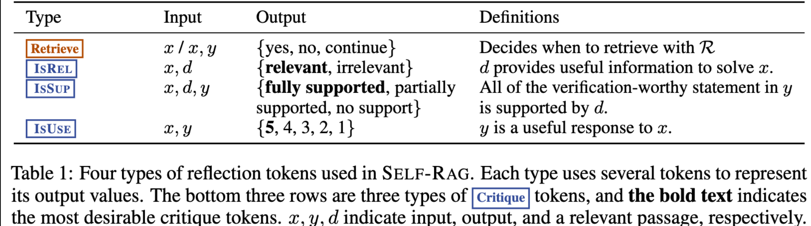
                    -  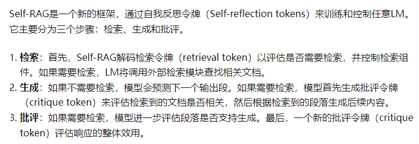
                - 训练
                    - 首先，训练评论家，使用检索器检索到的段落以及反思令牌增强指令-输出数据，然后，使用标准的下一个 token 预测目标来训练生成器 LM，以学习生成 自然延续(continuations)以及特殊 tokens (用来检索或批评其自己的生成内容).
                - 推理
                    - 它可以适应性地使用检索令牌进行检索，因此模型可以自发判断是不是有必要进行检索。它引入了多种细粒度的批评令牌，这些令牌用于评估生成内容的各个方面的质量。在生成过程中，作者使用期望的批评令牌概率的线性插值进行segment级的beam search，以在每一个时间步骤中确定最佳的K个续写方案
            - Atlas
                - Atlas是一个预训练的检索增强语言模型，只需要使用非常少的训练样本就能够学习和处理知识密集型任务。使用的检索模块是Contriever，使用的预训练语言模型为T5。在训练过程中，作者使用了ADist，EMDR^2，PDist和LOOP四个训练目标对检索器和语言模型进行联合训练。同时，作者也使用了无监督的方式进行联合训练，包括Prefix language modeling，Masked language modeling和Title to section generation。
            - Chain-of-Note
                - CON的核心思想是为检索到的文档生成连续阅读笔记，使其能够彻底评估它们与给定问题的相关性，并将这些信息整合以生成最终答案。方式是利用ChatGPT创建了CON的训练数据，然后在模型上进行训练。CoN的种类：1. 语言模型根据检索到的信息生成最终答案；2. 检索到的文档虽然没有直接回答query，但提供了上下文，使得语言模型能够将这些信息与其固有知识结合起来，从而推导出答案；3. 语言模型遇到不相关文档并缺乏回应所需知识的情况，能够承认自己的“无知”
    - 检索流程优化的RAG增强
        - query-based
            - query transforming
                - 子问题分解,长prompt压缩，生成补充问题以实现用户问题的提纯
            - stepback-prompt
                - 将StepBack-prompt方法集成到RAG过程中，即给出step-back示例，让LLM生成stepback问题，对stepback问题和原始问题分别进行搜索和重排，然后令LLM进行编排
            - RAG-Fusion
                - 主要思想：根据用户的query生成多个用户查询，基于多个查询进行检索，对搜索结果进行重排，利用RRF和自定义向量得分来获得全面、准确的结果。 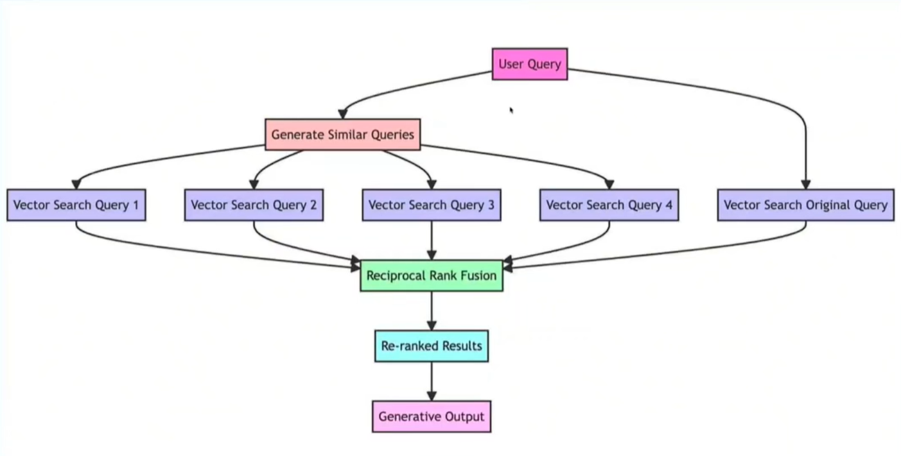
            - 记忆模块
                - 利用LLM自身的记忆能力来指导检索。原则是找到与当前输入最相似的记忆。例如，Self-mem迭代地使用一个检索增强生成器来创建一个无限的记忆池，结合“原始问题”和“对偶问题”。
        - corpus-based
            - meta-data/self-query
                - 在被检索数据中加入诸如标题，页码，日期等信息
            - 父子块关联（auto-merging retriever）
                - 在知识分割的时候，同时分割成小块（子块）与大块（父块），小块用来做嵌入与索引，确保语义检索更精确；大块通过小块关联获得，即若与query相关的子块足够多，则返回父块，确保包含更多的上下文信息。
            - 文本块假设问题/摘要生成
                - 通过对分割后的知识块做进一步处理，如生成假设问题，提取摘要等，使得在嵌入时生成更多的向量，从而能够包含更丰富的语义信息，使其能够在检索时更容易被捕获，提高知识块被召回的精度。适合对称语义嵌入模型
            - classification step
                - 使用文档相关的元数据来对用户的意图领域进行分类
            - 上下文压缩
                - 对检索到的文本块，根据query的上下文用一个LLM进行压缩，然后对压缩后的文本块进行重排
            - sentence window retirever
                - 将文档分割为句子级，检索时同时返回相邻的若干文本块。comment：似乎适合句子级的textsplitter和对称的embedding模型
        - prompt-flow optimization
            - output parser
                - 要求输出易于解析的answer并使用pydantic等预先校验
            - medprompt
                - 先搜索相关知识，再基于知识生成思维链，再多次调整答案的表述方式，取频率最高的答案作为最终答案（似乎原生用于选择题任务）
    - 表格检索（ ） [面向表格数据的大模型推理综述 (qq.com)]("https://mp.weixin.qq.com/s/RH2JHT8zfT7kENdMudPBdA")
        - 方法0：大模型更擅长水平推理而不是垂直推理，在1000个样本上评估ChatGPT时，ChatGPT提供了92.3%的正确行号和42.2%的正确列。因此将表格拉齐为一个序列可以增强模型的表现。缺点：只针对规整的表格有效。
        - 方法1：先进行表格抽取，定义multi-vector retriever,针对表格进行单独检索。实践中表现最好，劣势是表格抽取工具往往对特殊表格表现不佳。 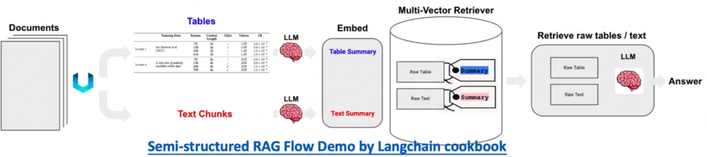
        - 方法2：按文档的页进行整段文档分片，然后构建一个专注于表的检索器。即使用 LLM 扫描每个页面并summary该页面内的所有表格。 然后对这些summary进行索引以进行检索，并使用多向量检索器存储包含该表的原始页面文本。 最后，我们将检索到的表块与原始文本块集成在一起，将不同检索器的排名合并为一个统一的排名。
        - 方法3（Table-tuning）：表调优（Table-tuning）可以在预训练的LLM上运行，也可以在指令调优的LLM上运行，数据集中的每个样本都是一个带有指令、表和响应的三元组。方法的主要贡献在于提出了指令增强、表级增强、标签级增强/响应级增强三级增强方案。其他类似方案：TableLLM, TableGPT, TableLlama, HELLaMA。 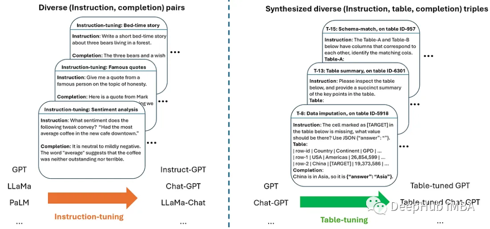
        - 方法4 NL2X：把表格抽取并存储起来，利用NL2SQL的代码生成能力生成查询语言，如python,sql，执行查询操作。 **ReAcTable**
        - 方法5 Agent：把表格抽取并存储起来，预先写好LLM可调用的工具，AgentLLM只需生成调用工具的代码。StructGPT，API
    - 检索 [多模态]("https://www.zhihu.com/question/628651389/answer/3321989558")
        - 方法1：对文本和表格生成summary，然后应用多模态embedding模型把文本/表格summary、原始图片转化成embedding存入多向量检索器。对话时，根据query召回原始文本/表格/图像。然后将其喂给多模态LLM生成应答结果。
        - 方法2：首先应用多模态大模型（GPT4-V、LLaVA、FUYU-8b）生成图片summary。然后对文本/表格/图片summary进行向量化存入多向量检索器中。当不具备生成应答的多模态大模型时，可根据query召回原始文本/表格+图片summary。
        - 方法3：首先应用多模态大模型（GPT4-V、LLaVA、FUYU-8b）生成图片summary。然后对文本/表格/图片summary进行向量化存入多向量检索器中。对话时，根据query召回原始文本/表格/图片。构造完整Prompt，访问多模态大模型生成应答结果。
    - RAG评估
        -  [RAGAs]("https://baoyu.io/translations/rag/evaluating-rag-applications-with-ragas")
            - RAGAs有四个评估指标：1.上下文精准度context_relevancy：衡量检索出的上下文中有用信息与无用信息的比率。该指标通过分析question和contexts 来计算。2.上下文召回率context_recall：用来评估是否检索到了解答问题所需的全部相关信息。这一指标依据ground_truth（此为框架中唯一基于人工标注的真实数据的指标）和contexts进行计算。3.真实性faithfulness：用于衡量生成答案的事实准确度。它通过对比给定上下文中正确的陈述与生成答案中总陈述的数量来计算。这一指标结合了question、contexts和answer。4.答案相关度answer_relevancy：评估生成答案与问题的关联程度。
        - trulens
            - answer relevance：衡量最终的 Response 回答对 Query 提问的相关度。如果该得分低，反应出了可能答不对题； context relevance：衡量召回的 Context 能够支持 Query 的程度。如果该得分低，反应出了召回了太多与Query 问题无关的内容； groundedness：衡量 LLM 的 Response 遵从召回的 Context 的程度。如果该得分低，反应出了 LLM 的回答不遵从召回的知识，那么回答出现幻觉的可能就越大。整个过程中并不需要 ground-truth 的参与 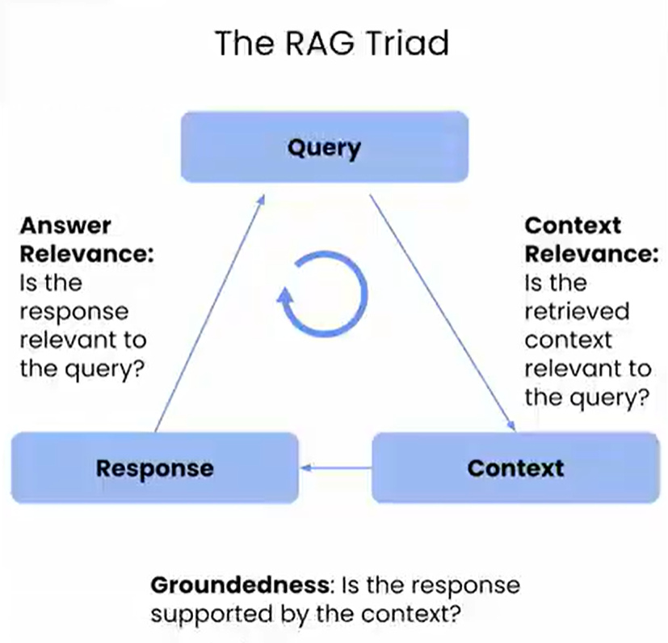
        - Llama-Index,Phoenix, DeepEval, LangSmith, OpenaAI Evals
    - RAG的新模式
        - 模块添加或替换策略
            - 维持检索-阅读的结构，同时引入额外的模块来增强特定功能。例如，RRR[Ma et al., 2023a] 提出了重写-检索-阅读过程，使用LLM性能作为强化学习中重写器模块的奖励。这允许重写器调整检索查询，提高阅读器的下游任务性能。类似地，可以在Generate-Read[Yu et al., 2022]方法中选择性地替换模块，其中LLM生成模块替换了检索模块。Recite-Read [Sun et al., 2022] 将外部检索转换为从模型权重中检索，让LLM先记住任务相关信息，再生成输出，以处理知识密集型自然语言处理任务。
        - 模块间流程调整
            - 强调增强语言模型与检索模型之间的互动。DSP[Khattab et al., 2022] 引入了展示-搜索-预测框架，将上下文学习系统视为显式程序而不是终端任务提示，以解决知识密集型任务。ITER-RETGEN [Shao et al., 2023] 利用生成内容指导检索，迭代执行“检索增强生成”和“生成增强检索”，形成检索-阅读-检索-阅读的流程。
- Agent
    - 基本组件
        - Planning
            - 定义：主要作用是对任务进行解析，将任务分解成多个步骤
            - 方案1：CoT,ToT,GoT
            - 方案2：LLM+P
                - 通过借助一个外部的经典Planner来进行一个更加长序列的整体规划。这种方法利用规划域定义语言（Planning Domain Definition Language, PDDL）作为中间接口来描述规划问题。整个使用过程，首先LLM将问题翻译成“问题PDDL”，接着请求经典Planner根据现有的“领域PDDL”生成一个PDDL Plan，最后将PDDL计划翻译回自然语言（LLM做的）。根本上讲，Planning Step是外包给外部工具的，当然也有一个前提：需要有特定领域的PDDL和合适的Planner。
        - Relection and refinement
            - Relfexion
                - (Shinn & Labash 2023)是一个让Agent具备动态记忆和自我反思能力以提高推理能力的框架。Reflexion采用标准的RL设置，其中奖励模型提供简单的二进制奖励，而Action Space则采用ReAct中的设置，即在特定任务的行动空间中加入语言，以实现复杂的推理步骤。在每一个Action *at* 之后，Agent会计算一个启发式函数 *ht* ，并根据自我反思的结果决定是否重置环境以开始一个新的循环。
                - 启发式函数判断何时整个循环轨迹是低效的或者何时因为包含了幻觉需要停止。低效规划指的是耗时过长却未成功的循环轨迹。幻觉是指在环境中遇到一连串相同的行动，而这些行动会导致相同的观察结果。
                - 自我反思过程通过给LLM一个two-shot例子创造，每个例子都是一对（失败的轨迹、在计划中指导进一步变化的理想反思）。接着，reflections将会被添加到Agent的工作记忆中作为查询LLM的上下文，最多三个。
                -  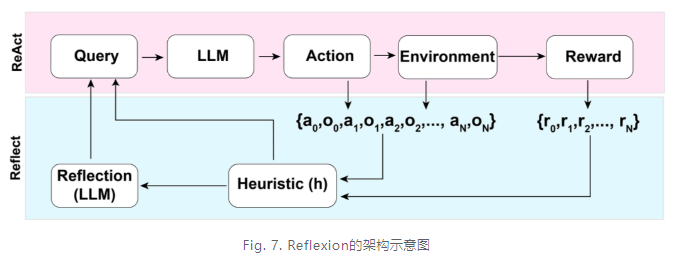
            - ReAct
                - (Yao et al. 2023)即Reason+Act通过将Action Space扩展为特定任务的离散动作和语言空间的组合，在LLM内部整合了推理（Reasoning）和行动（Action）。前者使LLM能够与环境交互（例如，使用Wikipedia Search的 API），后者通过提示词使得LLM用自然语言生成整体的推理过程。
                -  
        - Memory
            - sensory memory
                - **感官记忆：** 这是记忆的最早期阶段，在接受了原始刺激后保留的感官信息（视觉、听觉等）印象的能力。在LLM中，感官记忆作为对原始输入（包括文本、图像或其他模态）的学习嵌入表示
            - short-term memory
                - **短时记忆** （STM)或 **工作记忆** ：它存储了我们当前意识到的信息，以及执行复杂认知任务（如学习和推理）所需的信息。短期记忆被认为有大约7个项目的容量，并能够持续20-30秒。在LLM中，短期记忆作为上下文学习。它是短暂且有限的，因为它受到了transformer结构的上下文窗口长度的限制
            - long-term memory
                - **长时记忆** （LTM）：长时记忆可以将信息存储很长时间，从几天到几十年不等，存储容量基本上是无限的。长时记忆分为两种：显性记忆和隐性记忆。在LLM中，长期记忆作为Agent在查询时可以关注的外部向量存储，可以通过快速检索来进行访问
                    - 显性/陈述性记忆：对事实和事件的记忆，指那些可以有意识地回忆起的记忆，包括外显记忆（事件和经历）和语义记忆（事实和概括）。
                    - 隐形/程序性记忆：这种记忆是无意识的，设计自动执行的技能和例行程序，如骑车、在键盘上打字。
        - Tools
            - 定义：为可被Agent调用的工具，一般以函数或API的形式
            - Tool Use框架
                -  [MRKL]("https://baijiahao.baidu.com/s?id=1769292625858344326&wfr=spider&for=pc")
                    - "模块化推理、知识和语言 "（Modular Reasoning,Knowledge and Language)的简称，是一种用于自主代理的神经符号架构。 MRKL 系统包含一系列 "专家 "模块，而通用 LLM 则充当路由器，将查询路由到最合适的专家模块。这些模块可以是神经模块（如深度学习模型），也可以是符号模块（如数学计算器、货币转换器、天气 API）。
                -  [HuggingGPT]("https://zhuanlan.zhihu.com/p/619896296")
                    - (Shen et al. 2023)是一个使用 ChatGPT 作为任务规划器的框架，用于根据模型描述选择 HuggingFace 平台中可用的模型，并根据执行结果总结响应。包括四个阶段：
                        - （1）任务规划(Task planning)：LLM 充当大脑，将用户请求解析为多个任务。每个任务都有四个相关属性：任务类型、ID、依赖关系和参数。他们使用少量的示例来指导 LLM 进行任务解析和规划。
                        - （2）模型选择(Model selection):LLM 将任务分配给专家模型，其中的要求是一个多选题。LLM 会收到一份可供选择的模型列表。由于上下文长度有限，因此需要进行基于任务类型的过滤。
                        - （3）任务执行(Task execution):专家模型执行特定任务并记录结果。
                        - （4）返回结果(Response generation)：LLM 接收执行结果，并向用户提供汇总结果。
            - Tool Use微调
                -  [TALM]("https://www.shangyexinzhi.com/article/8660784.html")
                    - 工具增强型语言模型Tool Augmented Language Models; Parisi et al. 2022）首先，训练语言模型根据问题输出需要使用的工具和工具相关的参数。然后，根据模型的输出相同相应的外部工具并返回相关结果。最后，训练模型根据问题和外部工具返回的结果，输出最终的答案。
                    - 为了能够解决样例不足的问题，作者提出了self-play技术。首先，使用一个较小的数据集合D训练得到一个TALM，然后针对数据集中的每一个样例，尝试使用不同的工具来解决这个问题。如果TALM能够正确的解决这个问题，那么就把这条数据及其相关的工具加入到数据集合D中，不断对训练集进行扩充，以得到一个大规模的数据集。
                -  [Toolformer]("https://zhuanlan.zhihu.com/p/610886298")
                    - Toolformer的主要工作在于 **基于LLM构造增强数据集，并让模型进行微调训练** 。增强数据集呢主要涉及三个操作：采样、执行、过滤。
                        - 采样：从数据集的原始文本中利用上下文学习（ **in-context learning** ）采样出潜在的API调用操作及其在原始文本中的位置，基于采样概率利用预先设定的阈值来缓解采样位置错误的问题
                        - 执行：即执行API，获取执行结果
                        - 过滤：调用的结果有三种，没有调用，调用但未使用执行结果，调用且使用执行结果，基于此可构造正负样本集，进行LLM的微调
        - Action
            -  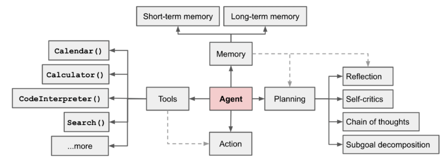
    - LLM的Agent对齐微调
        -  [Chain of Hindsight]("https://zhuanlan.zhihu.com/p/623762302")
            - 出发点：之前的工作通过从人类反馈中学习理解和遵循指令，取得了显著的成功。然而，这些方法要么是建立在人类注释者所青睐的手工挑选的模型生成上，使得它们在数据利用方面效率低下，并且在一般情况下具有挑战性；要么是依赖于强化学习，而强化学习往往受到不完美的奖励函数的影响，并且依赖于极具挑战性的优化。
            - 主要思想：受人类如何从以语言形式呈现的大量反馈中学习的启发。我们将所有类型的反馈转换为句子，然后用来微调模型，使我们能够利用语言模型的语言理解能力。我们将模型的条件放在与反馈配对的模型生成序列上。通过这样做，模型被训练为根据反馈生成输出，同时学习识别和纠正负面属性或错误。
            -  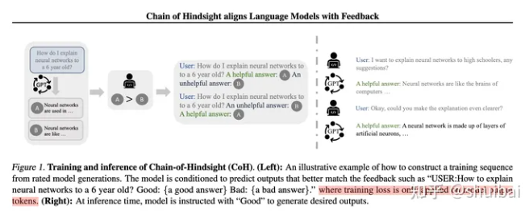
        - Algorithm Distillation
            - (AD; Laskin et al. 2023）将根据历史执行记录学习能够提高Agent能力理念应用于强化学习任务中的跨周期轨迹，算法被封装在一个长历史条件策略中。考虑到Agent会与环境多次交互，并且每个周期内Agent都会变得更好，AD将这些学习历史连接起来并将其喂到模型里。因此，我们应该期待下一次预测的行动会比之前的试验取得更好的结果。目标是AD学习RL算法的过程，而不是训练特定任务的策略本身。
            - 论文假设，任何能生成一组学习历史记录的算法，都可以通过对action克隆提炼出一个神经网络。历史数据由一组源策略生成，每个策略都针对特定任务进行过训练。在训练阶段，每次运行RL时，都会随机抽取一个任务。并使用多集历史数据的子序列进行训练从而使学习到的策略与任务无关。
            - 实际上，模型的上下文窗口长度是有限的，所以每一小节应该足够短，以构建更多的历史小节。需要2-4个小节的多节上下文来学习一个接近最优的上下文内强化学习算法。上下文内的强化学习的出现需要足够长的上下文内容。
            -  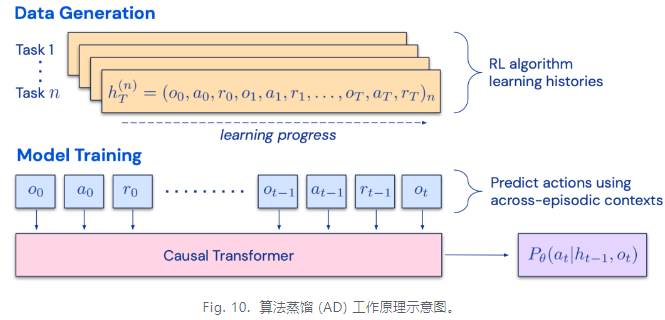
    - 评估
        - API-Bank
        - AgentBench
    - 参考资料
        -  [https://mp.weixin.qq.com/s/_HnE8wiJo54TFRamkxzkFA]("https://mp.weixin.qq.com/s/_HnE8wiJo54TFRamkxzkFA")
        -  [https://www.shangyexinzhi.com/article/8660784.html]("https://www.shangyexinzhi.com/article/8660784.html")
- Prompt Engineering
    - **Chain of Thought**
        - Let’s Think step by step
    - **Self-Consistency**
        - Few-shot + {question} 用几个相似的具有推导步骤的例子
    - **Auto-CoT**
        - Few-shot + {question} +Chain of Thought相似的具有推导步骤的例子+{问题}+给出具体思考过程。
    - **Generation Knowledge**
        - 以事实+知识的方式组织样例，再最后提问，要求给出解释和答案
    - **Automatic Prompt Engineer**
        - Let's work this out in a step by step way to be sure we have the right answer
    - **OPRO**
        - “Take a deep breath and think step by step.”
        - Optimization by PROmpting (OPRO)总体架构：最开始输入meta-prompt，这个初始的meta-prompt基本上只是对优化任务进行了描述(也会有few-shot example)。输入后LLM便会生成一个solution，这个solution由objective function评估并打分。(solution, score)组合成一对添加到meta-prompt中，如此完成一个循环。多次循环后取分数最高的solution作为优化结果。
        - meta-prompt分为两部分，问题描述和优化轨迹，问题描述就是用自然语言描述想要优化的问题，比如“generate a new instruction that achieves a higher accuracy”。而优化轨迹（Optimization trajectory）则是指之前提到的(solution, score)对，即之前生成的解决方案和对应的分数，可以看作优化的“日志”。但是要注意这个轨迹不是按 排的，而是按照打分升序排的。因为之前的研究也发现，越靠后的样例对输出的影响越大，所以把分数高的排在后面有利于LLM向其学习。 [时间顺序]("https://so.csdn.net/so/search?q=%E6%97%B6%E9%97%B4%E9%A1%BA%E5%BA%8F&spm=1001.2101.3001.7020")
    - **Tree of Thought**
        - f“给定当前的推理状态：‘{state_text}’，生成{k}条连贯的思想来实现推理过程：”
        - f“鉴于当前的推理状态：‘{state_text}’，根据其实现 {initial_prompt} 的潜力悲观地将其值评估为 0 到 1 之间的浮点数”
        - 利用树的遍历算法（BFS, DFS, MC,BF,A*），搜索最佳答案。
    - **Graph of Thought**
        - **出发点** ：人类的思维在解决问题时，不是只会链式思维或者尝试不同的链（TOT）,而是在脑中构建一个复杂的思维网络。人类在思考时会沿着一个链式的推理，回溯，再尝试一个新的方向，并把之前的链的优点保留，缺点剔除，与当前探索的链的方向结合生成一个新的解决方案
        - 创新点是将大模型生成的信息建模为一个图，节点是 “LLM的思想“，边是这些思想的依赖关系。这种方法能够将任意 LLM 思想，组合，提取出这个网络的思想本质。
    -  [MedPrompt]("https://mp.weixin.qq.com/s/aDvk_fJwcOAIwp0zCSaG5Q")
        - 出发点： **通过更加精巧的Prompt技术来解锁大模型的能力以获得近似微调的效果。** 这个Prompt方法实际上是一种结合了训练数据的few-shot方法。简单来说，在prompt中加入few-shot案例，可以大幅提高模型的性能。但是传统技术上都是直接使用固定的few-shot案例，这显然是低效的。解决的办法是 **让模型自动搜索领域知识，然后生成few-shot样例再为用户提供答案** 。具体来说，就是为GPT-4准备垂直(医学)领域的预训练数据，在GPT-4回答用户领域问题之前， **先通过检索的方法从训练数据中找到近似的问答结果，然后构造few-shot案例** ，嵌入用户的输入中，再让模型回答问题。方法：主要包含三个步骤，1. dynamic few-shot, 2. self-generated chain of thought, 3. choice shuffling ensemble。动态少样本选择是根据query样本选择k个训练样本，使其与测试样本语义最相似，构成少样本展示。自生成思维链就是结合前面的动态选择训练数据，使用GPT-4来自主生成每道题目的详细思维展示，作为Prompt（提示）给GPT-4使用，这样在动态few-shot选择的时候可以获得更加高质量的prompt模板。选项洗牌集成主要解决大模型生成不稳定的问题，核心在于通过改变问题中的选项顺序，然后观察模型对不同顺序下选择的一致性，以此来减少模型对某些选项的偏好。集成部分主要是指将模型在不同选项顺序情况下生成的多个答案进行汇总和分析。
    - LLMLingua(提示压缩) [LLMLingua]("https://mp.weixin.qq.com/s/k4d45Qc1eANBcdNa9CokaQ")
        - **出发点** ：1. 自然语言本质上是冗余的，并且 **LLM 可以有效地从被压缩文本中还原源文本** 。2. 类似于 **Selective-Context** 方法，首先使用小型语言模型计算原始提示中每个词汇单元（如句子、短语或 token）的自身信息，然后删除较少信息的内容来压缩提示。然而，它不仅 **忽视了被压缩内容之间的相互依赖关系，还忽略了目标 LLM 与用于提示压缩的较小语言模型之间的对应关系** 。3. 困惑度被用作衡量提示信息复杂度的标准。 **较低困惑度的 token** 在语言模型的预测中贡献的不确定性较小，因此可能被认为是 **相对冗余的信息，在压缩中被删除也不太影响语义信息** 。LLMLingua 框架旨在通过更精细地控制压缩过程，确保在 **减小提示长度的同时有效保留原始提示信息** 。 **组件** ：1. **压缩比例控制器** ：其主要作用是动态地为提示中的不同部分分配不同的压缩比例，同时在高度压缩的情况下保持语义的完整性。第一点是，给示例动态分配更小的压缩比例（即保留比例越小），给指令和问题更大的压缩比例，以更好地实现信息保留。第二点是引入了句子级的丢弃，特别是在存在多个冗余示例的情况下，还可以执行示例级的控制，以满足压缩的需求。2. **迭代提示** ：在压缩提示的过程中迭代处理每个 token，更细粒度地压缩提示内容，以更准确地保留关键的上下文信息。包括提示分段、计算困惑度、迭代压缩、概率估计与过滤等步骤。3. **对齐方法** ：用于解决小型语言模型与黑盒大型语言模型之间存在的概率分布差距。包括对小LM模型的微调、用小LM进行概率分布估计、基于生成的分布进行对齐处理，使小型 LM 生成的提示分布更加接近 LLM 的提示分布三步。
    -  [CogTree]("https://mp.weixin.qq.com/s/jGOv5FQ15tFywwgDpO1EOg")
        - 思路：面向轻量化大模型的复杂任务推理，使用较小规模的模型（7B），构建双系统生成推理树。基于人类的认知理论，通过两个系统来模仿人类产生认知的过程。直觉系统（Generation）利用上下文将复杂的问题分解为子问题，并生成对查询的响应。反思系统（Scores）评估直觉系统产生的结果，并选择最有可能的解决方案，为下一轮提供指导。反思系统采用两种方法来验证结果：中间过程的验证和整个推理链的验证。具体实现是：采用基于提示的方法并将其视为分类问题，模型输出三个类别之一：确定、不可能或可能
        - 训练：直觉系统的目标是生成答案，使用监督微调 SFT 精调模型，直觉系统通过利用上下文示例将查询（即复杂问题）分解为子问题。在自回归期间，只对生成的文本计算损失。反思系统的目标是打分。由于人类的决策行为源于对各种选择的比较分析，因此采用对比学习方法来增强模型区分不同状态的能力，即最大化正样本和负样本在样本空间中的距离来学习正样本和负样本的表示。对比学习中负采样也非常重要，需要生成更具挑战的负样本。