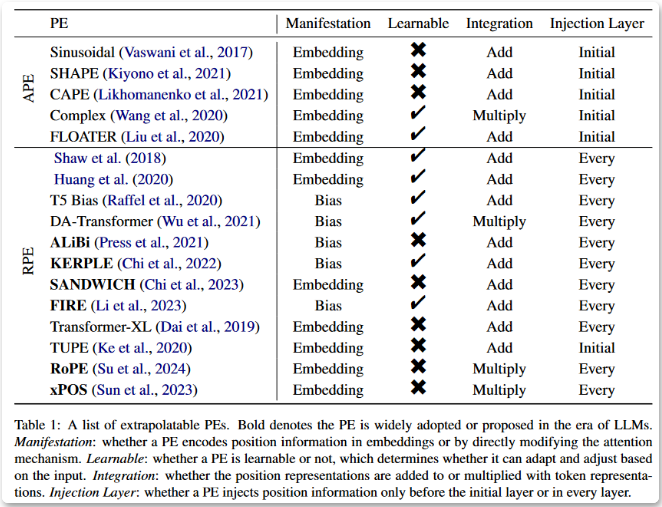
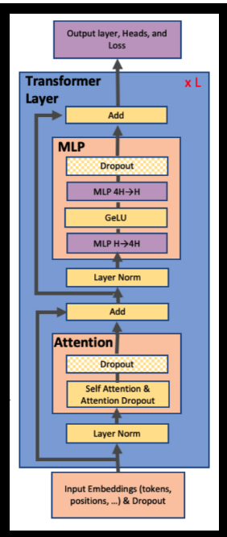
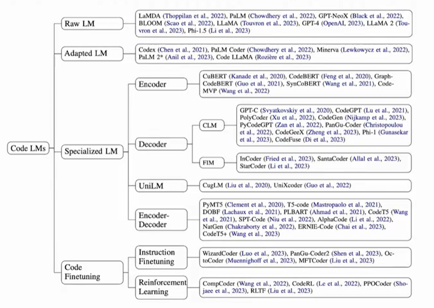
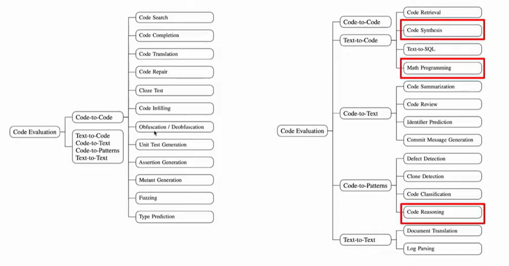

# 大模型技术栈
- 第一部分：算法与原理
    - 第一章 概览与前置任务
        - tokenizer训练
            - tokenizer原理与算法:BPE，ByteBPE, wordpiece,unilm,sentence-piece
            - tokenizer训练：sentence-piece
        - position encoding方案
            - Alibi
            - RoPE
            -  [综述：利用位置编码实现长度外推 (qq.com)]("https://mp.weixin.qq.com/s/h6Ug2ttJSN5W2qmAC8Id5A") 
        - 注意力机制与transformer架构
            - 典型的自注意力机制
                -  
            - 其他注意力机制
                - Mamba,H3,Hyena,RetNet,RWKV,Linear attention, Sparse attention
            - 典型的transformer架构
                - decoder-only
                - encoder-only
                - encoder-decoder
    - 第二章 训练
        - 预训练
            - lm训练配置
                - 正则化方法
                - 激活函数
                - 优化器
        - SFT训练
        - 强化学习
            - Police-Based
            - Value-Based
            - Actor-Critic
        - RLHF训练
        - 其他指令对齐训练
        - 分布式并行训练技术
            - 模型并行
                - tensor parellelism
                - 序列并行
                - pipeline parellelism
                    - GPipe,1F1B, interleaved 1F1B
            - 数据并行
                - DP,DDP,FSDP,ZeRO
        - MoE
        - PEFT训练
            - Adapter类
            - Prompt类
            - LoRA类
        - 上下文扩展技术
            - window attention
            - 注意力缩放
            - streaming-llm
            - RoPE改进
            - Alibi
    - 第三章 推理
        - 压缩
            - 剪枝
            - 量化
                - 校准量化
                    - GPTQ
                    - AWQ
                    - SmoothQuant
                    - SpQR
                - 非校准量化
                    - LLM.int8
                    - ZeroQuant
        - 显存优化技术
            - pagedattention
            - quantized kv cache
            - mqa/gqa
            - flash-attention
            - flash-attention-v2
            - flash-attention-decoding
        - 调度优化技术
            - dynamic batching
            - async serving
            - continuous/interative-level batching
            - sarathi/fastgen
        - 请求优化技术
            - 网络通信优化
            - 响应模式优化
        - 采样及解码加速
            - speculative decoding
            - specinfer
            - medusa
            - blockwise parallel decoding
            - SOT-parallel decoding
        - 推理中的模型并行策略
            - TP,PP
        - 算子融合及其他优化:no padding, 高性能算子...
    - 第四章 应用
        - RAG
            - RAG的基本组件
                - DocLoader
                - TextSplitter
                - 向量数据库
                    - 索引：NSW,NSG,HNSW,DiskAnn,LSH,IVF
                - embedding模型
            - RAG增强训练
                - self-rag
                - Chain-of-Note
            - RAG优化
                - NL2Cypher
                - NL2SQL
                - 文本检索
                - embedding训练
                - reranker
        - Agent
            - Agent基本组件
                - Planning
                - Reflection
                - Memory
                - Tool Use
            - Agent对齐微调
                - Toolformer
                - TALM
                - Chain of Hindsight
                - Algorthm Distillation
            - Agent框架
                - ReAct
                - Relfexion
        - Prompt Engineering
            - CoT,ToT,GoT
- 第二部分：框架
    - 训练框架
        - deepspeed
        - megatron-lm
        - colossal-ai
        - trlx,deepspeed-chat,colossal-chat
    - 推理服务框架
        - FastChat
        - llama-cpp
        - LMDeploy
    - 推理加速框架
        - vllm
        - text-generation-inference
        - lit-llama
        - lightllm
        - TensorRT-LLM(原FasterTransformer)
        - fastllm
        - inferllm
        - openPPL-LLM
        - deepspeed-fastgen
        - exllama
    - 压缩框架
        - bitsandbytes
        - auto-gptq
        - auto-awq
    - embedding训练框架
        - sentence-transformer
        - FlagEmbedding
    - 向量数据库 [向量数据库对比]("https://www.jianshu.com/p/43cc19426113")
        - faiss
        - pgvector
        - milvus
        - pinecone
        - weaviate
        - LanceDB
        - Chroma
    - 应用框架
        - Auto-GPT
        - langchain
        - llama-index
        - quivr
        - XAgent
        - MetaGPT
        - Autogen
            - AutoGen 是一个支持使用多个代理来开发 LLM 应用程序的框架，这些代理可以相互对话来解决任务。 AutoGen 代理是可定制的、可对话的，并且无缝地允许人类参与。 他们可以采用LLM、人力投入和工具组合的各种模式运作。
        - chameleon
            - Chameleon的核心在于通过LLM规划器生成自然语言程序，找到最佳工具组合，以达到精确推理的目的。该框架在科学问答任务和表格数学推理任务上表现卓越，特别是在表格数学推理任务上，准确率达到了惊人的98.78%。其工具箱支持LLM模型、视觉模型、网络搜索引擎、Python函数以及基于规则的模块，实现了多种工具之间的自然语言通信。相较于现有工作，Chameleon模型允许以类似自然语言的方式生成不同工具的调用组合，无需复杂的程序设计，增加了用户友好性。
    - python前端
        - streamlit
        - gradio
- 第三部分：开源模型
    - Embedding模型
        - m3e
        - GTE
        - Sentence-T5
        - Instructor
        - bge
        - gte
    - 大语言模型
        - chatglm
        - Baichuan
        - Qwen
        - Mistra
        - Llama
        - InternLM
        - Yi
        - deepseek
        - skywork
    - 多模态模型
        - BLIP
        - BLIP2
        - CLIP
        - LLaVA
        - CogGLM
        - InstructBLIP
    - 代码大模型
        - code-llama
        - deepseek coder
        - wizardcoder
        - codefuse
        - 综述
            -  
            -  