# 大模型推理优化策略
- 7.1 显存优化
    - Qunatized KV Cache
    - MQA/GQA
        - 核心思想是减少kv-cache的数量，以少量kv-cache对应多个query 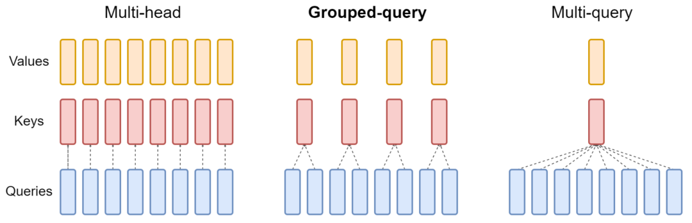
        -  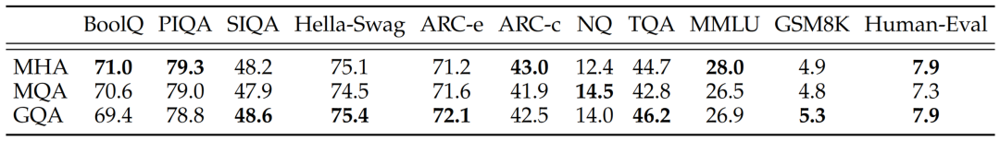
    -  [PagedAttention]("https://zhuanlan.zhihu.com/p/638468472")
        - KV cache，其具有以下特点:1. 显存占用大，14b级别的模型，每个token需要约0.7M-1M的显存；2. 动态变化：KV 缓存的大小取决于序列长度，这是高度可变和不可预测的。因此，这对有效管理 KV cache 挑战较大。该研究发现，由于碎片化和过度保留，现有系统浪费了 60% - 80% 的显存。
        - 为了解决这个问题，该研究引入了 PagedAttention，这是一种受操作系统中虚拟内存和分页经典思想启发的注意力算法。与传统的注意力算法不同，PagedAttention 允许在非连续的内存空间中存储连续的 key 和 value 。具体来说，PagedAttention 将每个序列的 KV cache 划分为块，每个块包含固定数量 token 的键和值。在注意力计算期间，PagedAttention 内核可以有效地识别和获取这些块。因为块在内存中不需要连续，因而可以用一种更加灵活的方式管理 key 和 value ，就像在操作系统的虚拟内存中一样：可以将块视为页面，将 token 视为字节，将序列视为进程。序列的连续逻辑块通过块表映射到非连续物理块中。物理块在生成新 token 时按需分配。在 PagedAttention 中，内存浪费只会发生在序列的最后一个块中。这使得在实践中可以实现接近最佳的内存使用，仅浪费不到 4%。
        - PagedAttention 还有另一个关键优势 —— 高效的内存共享。例如在并行采样中，多个输出序列是由同一个 prompt 生成的。在这种情况下，prompt 的计算和内存可以在输出序列中共享。PagedAttention 自然地通过其块表格来启动内存共享。与进程共享物理页面的方式类似，PagedAttention 中的不同序列可以通过将它们的逻辑块映射到同一个物理块的方式来共享块。为了确保安全共享，PagedAttention 会对物理块的引用计数进行跟踪，并实现写时复制（Copy-on-Write）机制。PageAttention 的内存共享大大减少了复杂采样算法的内存开销，例如并行采样和集束搜索的内存使用量降低了 55%。这可以转化为高达 2.2 倍的吞吐量提升。
        - vllm的其他优化：continuous batching,CUDA kernel优化
    -  [FlashAttention]("https://zhuanlan.zhihu.com/p/638468472")
        - 解释1：记I为模型的计算强度I，单位FLOP/byte代表模型进行单位byte数据交互可实现的操作数,则I*带宽beta即模型的计算性能，单位为FLOP/s。令I_max=计算平台算力/计算平台带宽，当模型的计算强度I小于平台的理论计算强度I_max，模型的计算能力P即I*beta,当模型的计算强度大于I_max,则模型的计算性能P等于平台的算力。故若模型的计算强度小，则瓶颈在带宽，若模型的计算强度大，则瓶颈在算力。为提高计算性能，需提高计算强度，即每bytes数据交互的操作数。
        - 解释2：记N=每次操作要求的FLOP,单位FLOP/OP；pi=平台的算力，单位FLOP/s;beta=内存带宽，单位byte/s；P=实际实现计算速度，单位为FLOP/s；优化目标为O=P/N每秒钟实现的运算次数，单位为OP/s.由于N固定，故优化目标转而为P，P=min{beta_r*I_max=beta_r*pi/beta,pi}，故优化目标转而为beta，即改变内存访问策略，实现beta最大化。
        - 出发点：注意力操作中，S和P的计算空间复杂度都是O(N^2),此外,scale,mask,softmax,dropout都是带宽约束操作。 
        - 思路：输入数据K、Q、V是存储在HBM上的，中间结果S、A都不需要存储到HBM上。 **通过这种方式，FlashAttention可以将内存开销降低到线性级别，并实现了2-4倍的加速，同时避免了对中间结果的频繁读写，从而提高了计算效率。** 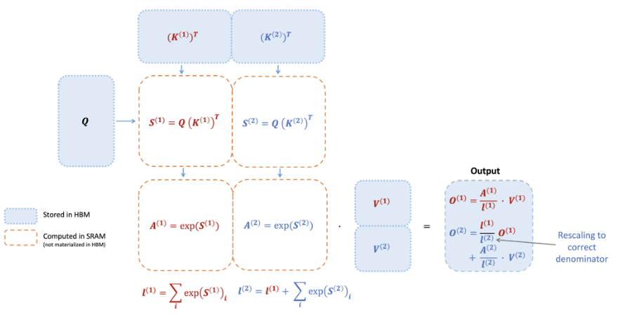
        - 方法：O(N^2)空间复杂度的矩阵计算对HBM的读写是主要的内存瓶颈，因此主要优化点是：1. 在不访问整个输入的情况下计算softmax;2. 不为反向传播存储大的中间attention矩阵。FlashAttention提出两种方法来分步解决上述问题：tiling,recomputation。 **tiling** - 注意力计算被重新构造，将输入分割成块，并通过在输入块上进行多次传递来递增地执行softmax操作。 **recomputation** - 存储来自前向的 softmax 归一化因子，以便在反向中快速重新计算芯片上的 attention，这比从HBM读取中间矩阵的标准注意力方法更快。由于重新计算，这虽然导致FLOPS增加，但是由于大量减少HBM访问，FlashAttention运行速度更快。该算法背后的主要思想是分割输入，将它们从慢速HBM加载到快速SRAM，然后计算这些块的 attention 输出。在将每个块的输出相加之前，将其按正确的归一化因子进行缩放，从而得到正确的结果。 **kernel融合** ：tiling分块计算使得我们可以用一个CUDA kernel来执行注意力的所有操作。从HBM中加载输入数据，在SRAM中执行所有的计算操作（矩阵乘法，mask，softmax，dropout，矩阵乘法），再将计算结果写回到HBM中。通过kernel融合将多个操作融合为一个操作，避免了反复地从HBM中读写数据。基于以上思路，flash-attention天然 **在batch和heads两个维度上进行了并行化** ：使用一个thread block来处理一个attention head，总共需要thread block的数量等于batch size × number of heads。每个block被调到到一个SM上运行（SM可以调度多个thread block），当线程块数目较大时（例如80个），该调度方法能高效利用GPU上接近全部的计算资源。 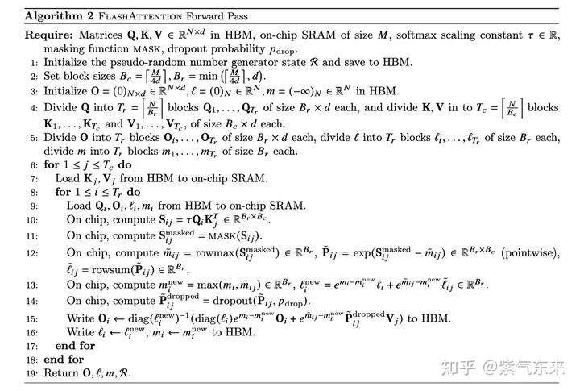
            -  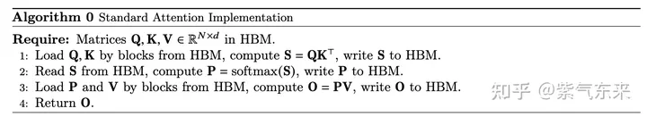
            -  
            - 此处P=A/l 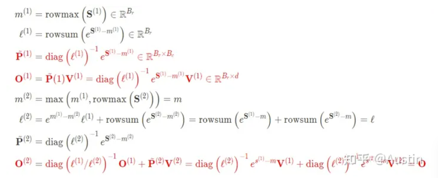
    - FlashAttentionv2
        - 出发点：FlashAttention利用了GPU内存的非对称层次结构，将内存消耗降至线性（而非二次方），并相较于优化基线实现了2到4倍的运行速度提升，然而，该技术的速度依然没有达到优化矩阵乘法（GEMM）操作的速度，前向传播的计算吞吐量仅达到理论最大浮点运算速率(FLOPs/s)的30-50%，而反向传播只能达到25-35%。这种低效率是由于GPU上不同线程块之间的负载分配不佳，导致低占用率或不必要的共享内存读/写。
        - 方法：(1)调整算法，减少中间缩放的次数。通常实现Softmax算子为了数值稳定性（因为指数增长太快，数值会过大甚至溢出），会减去最大值，这样带来的代价就是要对token遍历3次。而如果不保存中间最大值和指数和而只保留对数指数和，可以减少非矩阵乘法操作的浮点计算次数；(2)序列长度维度的并行。v1在batch_size和num_heads维度使用了并行化，但在处理长序列输入时，由于内存限制，通常会减小batch size和head数量，这样并行化程度就降低了。因此，FlashAttention-2还在序列长度这一维度上进行并行化，显著提升了计算速度。而序列并行要求我们交换循环的层次，FlashAttention-v2将Q移到外循环，将KV移到内循环，从而分块计算的注意力值矩阵块只存储在SRAM上，避免了在HBM上的频繁读写。(b*s*d->b*s*k*m)。(3)在每个线程块内部，分散warps之间的工作负载，减少通过共享内存的通信。v1使用是split-K策略，这种策略会使所有warp将中间结果写入共享内存进行同步，然后将中间结果相加，这些共享内存读取会拖慢前向传播的计算。v2使用的是split-Q策略，这样在每个warp计算QK^ \ top后，结果只需要对应的V分片即可得到O的对应分片，而无需进行warps间的通信，减少了中间共享内存读写。 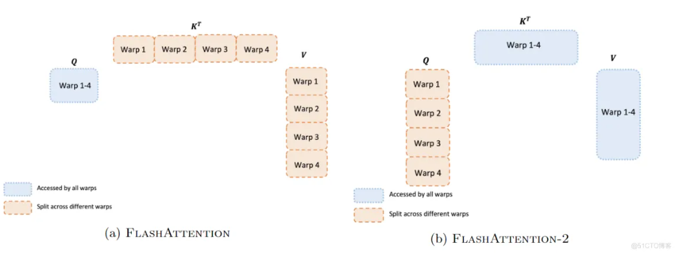
            - 此处e^{S-m}即为A 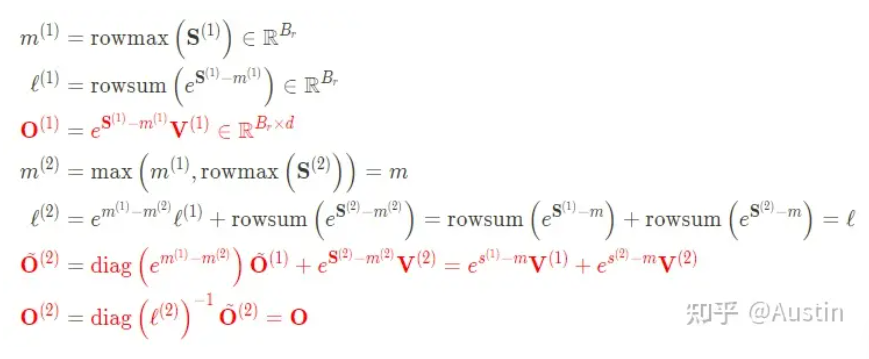
            - ？每个token的计算都需要加载K,V,O，得到S，故M大小的SRAM容纳的最大token数为[M/4d]，取该数与d间的最小值作为K、V的token上限数。 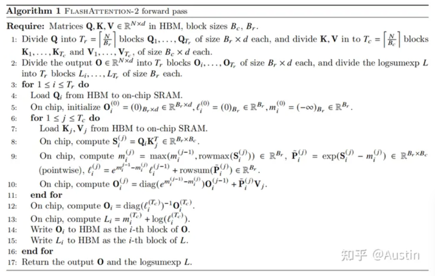
        - 结果：在前向传播中可以达到理论最大吞吐量的73%，反向传播中则可达到63%。当用于端到端训练GPT风格的模型时，每个A100 GPU的训练速度可以达到225 TFLOPs/s。
        - 细节1：GPU由计算元素（如浮点运算单元）和内存层次结构组成。现代GPU中通常包含专门的单元来加速低精度（如FP16/BF16）的矩阵乘法运算，例如Nvidia GPU上的Tensor Core。内存层次结构包括高带宽存储器（ HBM上的存储都属于DRAM ）和静态随机存取存储器（GPU上所有的on-chip  memory都是SRAM）。以A100 GPU为例，它拥有40-80GB的高带宽存储（HBM），带宽达到1.5-2.0TB/s，以及每个流式多处理器108个中的192KB芯片上SRAM，其带宽估计约为19TB/s。Nvidia的A100 GPU具有最大理论吞吐量达到312 TFLOPs/s（每秒万亿次浮点运算）的FP16/BF16格式矩阵乘法性能，然而对于非矩阵乘法的FP32格式计算，这一数字仅为19.5 TFLOPs/s。
        - 细节2：GPU有大量的threads用于执行操作（an operation，也称为a kernel）。这些thread组成了thread block，接着这些blocks被调度在SMs上运行。在每个thread block中，threads被组成了warps（32个threads为一组）。一个warp内的threads可以通过快速shuffle指令进行通信或者合作执行矩阵乘法。在每个thread block内部，warps可以通过读取/写入共享内存进行通信。每 **个kernel从HBM加载数据到寄存器和SRAM中，进行计算，最后将结果写回HBM中。**
    - Flash- : kv序列长度方向的并行 [Decoding]("https://zhuanlan.zhihu.com/p/661411140")
        - 出发点：FlashAttention优化不适合直接应用于推理过程。因为在训练过程中，FlashAttention对batch size和query length进行了并行化加速。 **而在推理过程中，query length通常为1，这意味着如果batch size小于GPU上的SM数量（例如A100上有108个SMs），那么整个计算过程只使用了GPU的一小部分！** 特别是当上下文较长时，通常会减小batch size来适应GPU内存。例如batch size = 1时，FlashAttention对GPU利用率小于1%！
        - FlashAttention对batch size和query length进行了并行化加速， **Flash-Decoding在此基础上增加了一个新的并行化维度：keys/values的序列长度** 。即使batch size很小，但只要上下文足够长，它就可以充分利用GPU。与FlashAttention类似，Flash-Decoding几乎不用额外存储大量数据到全局内存中，从而减少了内存开销。
        - Flash Decoding主要包含以下三个步骤:1将keys和values分成较小的block;2 **使用FlashAttention并行计算query与每个block的注意力（这是和FlashAttention最大的区别）** 。对于每个block的每行（因为一行是一个特征维度），Flash Decoding会额外记录attention values的log-sum-exp（标量值，用于第3步进行rescale）;3 对所有output blocks进行reduction得到最终的output，需要用log-sum-exp值来重新调整每个块的贡献。第1步中的数据分块不涉及GPU操作（因为不需要在物理上分开），只需要对第2步和第3步执行单独的kernels。虽然最终的reduction操作会引入一些额外的计算，但在总体上，Flash-Decoding通过增加并行化的方式取得了更高的效率。 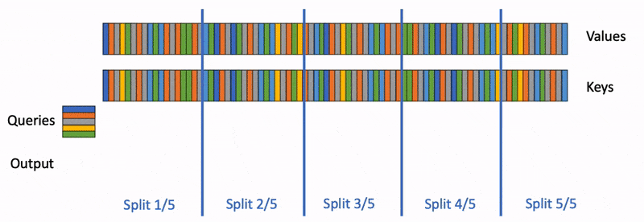
    - SparQ Attention：基于稀疏注意力思想减少kv的数量
        - 出发点：1. 注意力机制中的softmax函数输出主要由少数分量主导，大部分分量接近于0。因此，只需从内存中获取具有最高注意力分数的tokens的key和value对，就可以在不影响任务性能的情况下显著减少内存传输。2. 通过稀疏化查询向量q，仅保留r个最大幅度分量，可以有效预测具有最大注意力分数的索引，而无需获取完整的K矩阵。步骤：1. 找到输入查询向量q中r个最大分量的索引，并仅沿着这些索引获取key缓存K。使用切片查询和键来计算近似注意力分数。2. 在近似注意力分数中找到前k个位置，并获取相应的完整key和value向量。使用前k个键和值计算注意力块的输出。3. 用近似注意力分数估计分配给前k个位置的总分数α。根据近似分数权重，使用该总分数在前k个位置的注意力输出和平均值向量之间进行插值。
    - :distributed paged attention [DistAttention]("https://arxiv.org/pdf/2401.02669.pdf")
        - DistAttention:1. 将kv-cache分割为小块，类似于PagedAttention；2. 利用分布式数据中心的所有CPU和GPU资源 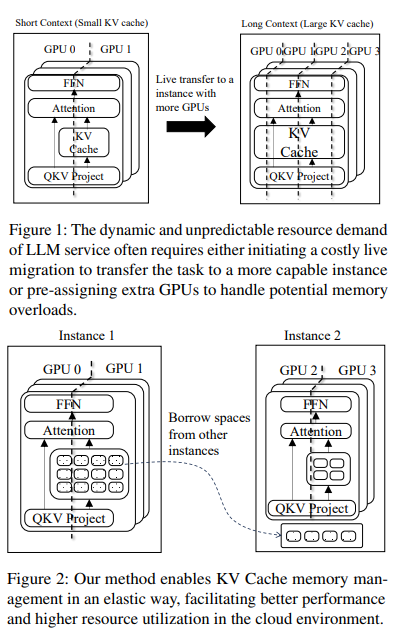
        - DistKV-LLM: 1. 基于DistAttention进行KV-cache管理；2. 引进了新的协议来管理不同的LLM服务实例。
    - 参考文献
        -  [推理优化]("https://zhuanlan.zhihu.com/p/656485997") [推理优化]("https://zhuanlan.zhihu.com/p/656485997")
        -  [https://yaofu.notion.site/Towards-100x-Speedup-Full-Stack-Transformer-Inference-Optimization-43124c3688e14cffaf2f1d6cbdf26c6c#e714ac1cfb1f439c83369b2533efcebe]("https://yaofu.notion.site/Towards-100x-Speedup-Full-Stack-Transformer-Inference-Optimization-43124c3688e14cffaf2f1d6cbdf26c6c#e714ac1cfb1f439c83369b2533efcebe")
- 7.2 算子融合
- 7.3 高性能算子
- 7.4 调度优化
    - Dynamic Batching(Nvidia-triton, request-level)
        - 静态batching批次大小固定不变，无法随计算资源负载动态变化，导致 GPU 资源利用率低
        - 通过维护一个作业队列实现,在 batch 维度动态插入新序列，缺点是需要对输入数据进行填充以使其长度一致，或者需要暂停系统来等待构建更大的批次
    - Async Servering
        - Tokenize / Detokenize 过程在 CPU 上执行，期间 GPU 处于空闲状态
        - 多线程异步,流水线 overlap 实现降低时延
    - continuous/iterative-level//in-flight batching
        - 问题：Batching就是将一段时间内到达的用户请求合并到一起，提交到GPU中执行，从而提高系统的吞吐量。然而，与传统的 DNN Model 在推理时只要正向执行一遍不同，基于 Transformer 的 Generative Model 在推理时是迭代式的（Iterative)，每个请求都需要迭代式执行多次，每次生成部分结果（一个 Token)，且每个请求的迭代次数可能是不同的（例如迭代直到模型生成一个 End-Of-Sequence Token）。因此将现有的 Batching 方式应用在 Generative Model 时，可能导致有的请求已经迭代结束了，但是还需要和同Batch中没有迭代结束的请求继续一起执行。这个问题的核心在于，传统的 Batching 技术是以 Request 为粒度的，将多个 Request 绑定在一起提交给执行引擎，多个 Request 同时开始同时结束。因此需要一个新的 Batching 的方式，这也是本项工作核心的 Insight：使用更细粒度的，Iteration-level Batching，在每个 Iteration 中将不同的 Request 合并到一起。
        - 思想：由 batch 粒度的调度细化为 step 级别的调度,在时间轴方向动态插入新序列。方法都来源于Orca，Orca 的第一点核心技术就是 Iteration-level scheduling，用于解决上述 request-level scheduling 的 early-finish 的问题。Orca在调度任务时，每次只向 Execution Engine 提交一次 Iteration 的计算，而非完成整个 Request，这样 Orca 就可以在每个Iteration都动态选择Batching的Request，从而避免early-finish的请求等待其他请求的结束。Iteration-level batching 面临新的挑战：并非所有的请求都能在任意Iteration被Batching到一起。典型的问题就是Batching的Input需要有相同Shape（例如相同的 sequence length）为了解决这个问题，Orca 提出了第二点核心技术： Selective batching。这个技术的Insight是：Transformer Layer里并非所有的算子都需要Batching的Input有相同的Shape，如下图所示，Add,Linear,GeLU等算子在计算时可以将一个Batch进行Flatten，这样不同 Sequence Length 的Input也可以Batch到一起进行计算；而对于其他必须有相同Shape才能Batching的算子（例如Attention），则对不同的输入进行单独的计算。 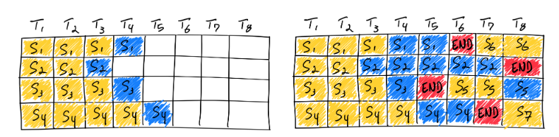
        - 实现：调度器会维护两个队列，分别为 Running 队列和 Waiting 队列，队列中的序列状态可以在 Running 和 Waiting 之间转换。在自回归迭代生成每个 token 后，调度器均会检查所有序列的状态。一旦序列结束，调度器就将该序列由 Running 队列移除并标记为已完成，同时从 Waiting 队列中按 FCFS (First Come First Service) 策略取出一个序列添加至 Running 队列。缺点：Iteration-Level scheduling只考虑生成阶段的优化，不考虑prefill阶段的优化。因为预填充阶段需要计算，并且与生成阶段的计算模式不同，所以不能轻易地与token生成进行批处理。目前，连续批处理框架通过超参数管理等待预填充请求和等待序列结束标记的比例。 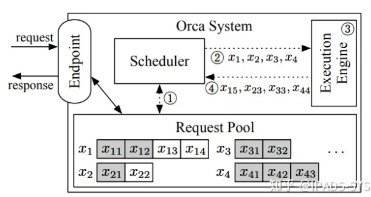
    - Dynamic SplitFuse/sarathi
        - 思路：对prompt和生成的token进行动态分解和融合，保证模型的向前传播大小一致，避免了长prompt占用过多资源的问题； *vLLM 在一个前向传递中要么生成令牌，要么处理提示；令牌生成抢占提示处理。Orca 在生成过程中以完整长度处理提示。*
        - 实现： 对长prompt进行分块，通过多次前传逐步处理，最后一次与生成的token融合;对短prompt，则进行填充以精确满足目标token数量
        - comment: FastGen=vllm+Dynamic SplitFuse。splitfuse的描述与sarathi的原理十分相像，但fastgen的blog没有谈及具体细节。sarathi的思想与interleaved 1F1B几乎一致，即将一个batch的多个prompt分割成均匀的chunk,属于不同prompt的chunk交叠排列，然后执行流水线并行推理，每个prompt的prefill完成后立即进入生成阶段，后续的prompt预填充与生成交叠执行，从而减少bubble的时间。 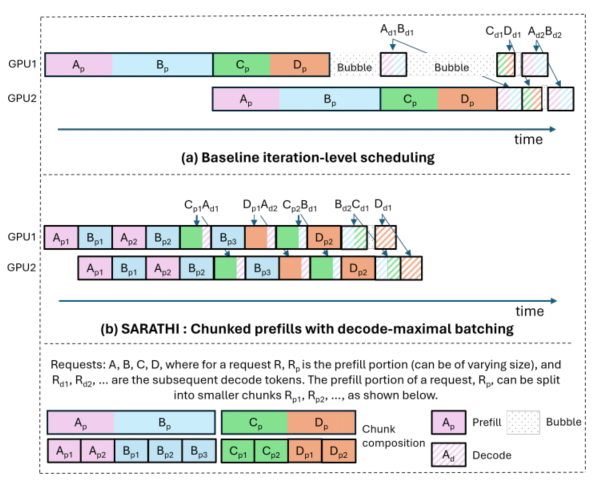
- 7.5 量化
    - 分类学
        - QAT vs. PTQ
            - **量化感知训练** （Quantization Aware Training, QAT）：在模型训练过程中加入伪量化算子，通过训练时统计输入输出的数据范围可以提升量化后模型的精度，适用于对模型精度要求较高的场景；其量化目标无缝地集成到模型的训练过程中。这种方法使LLM在训练过程中适应低精度表示，增强其处理由量化引起的精度损失的能力。这种适应旨在量化过程之后保持更高性能。有文献会针对微调阶段单独定义QAF。部分文献将其称为在线量化
            - **训练后量化** （Post Training Quantization, PTQ）：在LLM训练完成后对其参数进行量化，只需要少量校准数据，适用于追求高易用性和缺乏训练资源的场景。主要目标是减少LLM的存储和计算复杂性，而无需对LLM架构进行修改或进行重新训练。PTQ的主要优势在于其简单性和高效性。但PTQ可能会在量化过程中引入一定程度的精度损失。部分文献称为离线量化，但部分文献的在线vs.离线是指量化的出发点是否是已经量化好的checkpoint
        - 对称量化vs非对称量化
            - 原点是否为0，即公式中z是否为0，其中s为量化数值间隔 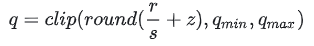
        - 线性量化vs非线性量化
            - 数据范围是否均衡
        - 动态量化vs静态量化
            - 静态量化的模型在使用前有“calibrate”的过程（校准缩放因子），量化模型的缩放因子会根据输入数据的分布进行调整；动态量化仅将模型中特定算子的 **权重** 从FP32/16类型映射成 INT4/8/16 类型，bias和激活在推理过程中动态量化。但是对于不同的输入值来说，其缩放因子是 **动态计算** 的
        - Weights量化vsActivation量化
            - per-token量化为activation量化，激活每个token对应的tensor共享量化系数，也可以对整个activation进行量化，即activation的per-tensor量化；Weight量化即对权重进行量化，根据量化的粒度可细分为per-layer/tensor, per-group, per-channel 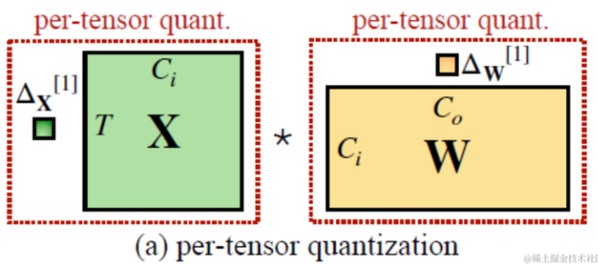
        - per-layer/tensor vs. per group vs. per channel
            - **per-tensor/layer quantization** : 对一整个tensor设置简单的量化集合
            - **per-channel quantization** : 对权重的每个输出通道设置一个量化集合{但实际中feature 还是整个 tensor 共用一个 scale 和 zeropoint，但每个 kernel 会单独统计一个 scale 和 zeropoint,注意是每个 kernel，而不是 kernel 的每个 channel} 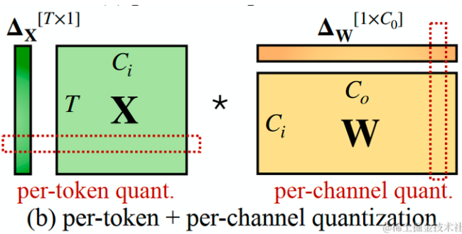
            - **group-wise quantization** : 把多个channel合在一起用一组量化系数
        - 几种主流的weight+activation量化方法 
        - 执行weight+activation量化策略的原因：1. 混合精度计算的链条更长，时间损耗大；2. activation量化可以和normalization融合；3 输出格式的选择更多样 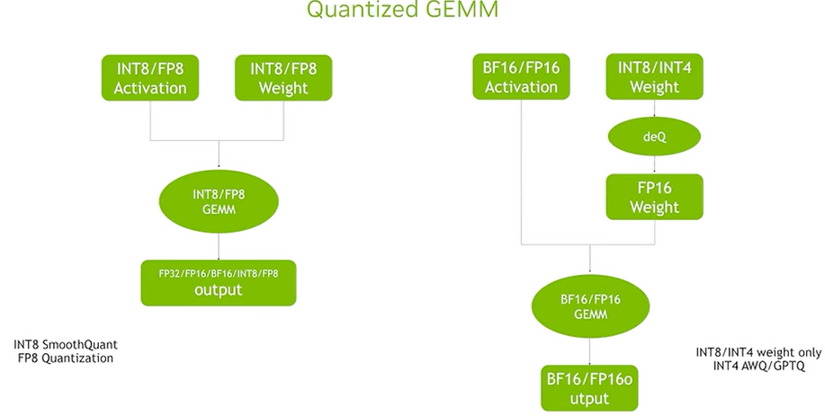
    - 主流算法
        - OBC（OPTIMAL BRAIN COMPRESSION ）
            - OBD(Optimal Brain Damage)
                - 利用二阶导数信息度量模型参数的显著性，剪掉影响小的参数降低模型复杂度提高泛化能力
                -  
            - OBS（Optimal Brain Surgeon ）
                - OBD粗暴的只考虑海森矩阵对角线元素。OBS考虑海森矩阵全局信息，由此也获得参数相互之间的影响。
            - OBC（OPTIMAL BRAIN COMPRESSION ）
                - OBS对整个神经网络进行剪枝，OBC对神经网络模型分层剪枝或者量化 
            - ExactOBS
                - 参数更新和代价评估不需要使用整个海森矩阵，仅使用和剪枝参数所在行相关的 d_col\time d_col大小的海森矩阵。
        - GPTQ
            - 1.是对OBC的改进;2. 取消了贪心算法，采用固定位置优化;3. 分组量化，并行加速。 
        - SmoothQuant
            - 主要思想：1. 当模型规模更大时，单个token的值变化范围较大，难以量化，相比之下 weight 的变化范围较小，即 weight 较易量化，而 activation 较难量化；2. SmoothQuant 核心思想是引入一个超参，减小激活值的变化范围，增大权重的变化范围，从而均衡两者的量化难度；3. 得到smooth变换之后的 activation 和 weight 矩阵，可以再采用 per-token 或 per-tensor 的量化方式。 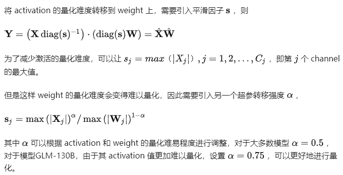
        - AWQ
            - 1. AWQ是在smoothquant的基础上提出来的（但是一种weight-only量化）；2. AWQ依据是输入X以及这个参数本身W的绝对大小把s分成两个值S_x和S_w，用二者的加权乘积作为s，我们需要W越大则s越小，X越大则s越大。 
            - AutoAWQ的实现逻辑
                - 1. 每个模型(models/auto.py的类)都是BaseAWQForCausalLM(models/base.py)的子类，BaseAWQForCausalLM定义了quantize方法，该方法会调用AwqQuantizer类，AwqQuantizer类定义了quantize，pseudo_quantize_tensor, pseudo_dequantize_tensor,init_quant等公有方法，定义了_apply_quant(针对moduel执行一个伪量化), _search_best_scale（）,_compute_best_scale(基于校准集a,FP16权重w,计算量化损失，并基于此计算每个channel的scale因子),_search_best_clip（基于a,计算一组线性层的clip）,_compute_best_clip（基于w,a计算最大值作为clip）,_get_input_feat,_sanitize_kwargs（删除层前向过程中不支持的参数）等私有方法。   其中， init_quant用于准备模型的各个module,模型的 layer_kwargs,校准样本inputs；pseudo_quantize_tensor即执行一次标准非对称、均匀、per-group量化；quantize先获取待量化的层，过滤不需要量化的层，获取input_feat,计算scale_list,针对每个module应用scale_list,计算clip_list,针对每个module应用clip_list，针对每个层调用_apply_quant,_apply_quant调用pseudo_quantize_tensor执行一次非对称、均匀、per-group量化，clip_list，scale_list保留到每个量化后的层中。2. BaseAWQForCausalLM方法定义了from_quantized方法，该方法会调用_load_quantized_modules将所有的待量化的nn.Linear替换为WQLinear，包括WQLinear_GEMM,WQLinear_GEMV，然后调用WQLinear的from_linear方法初始化WQLinear类。3. WQLinear初始化时会register_buffer qweight, qzeros, scales, bias等，forward会调用awq_ext库的gemm_forward_cuda方法执行计算，awq_ext是由C++写的算子库，该算子库会在执行时进行反量化和GEMM或GEMV计算。
        - SpQR
            - 核心思想：参数的对模型的重要程度，存在极强的不均衡性。1%的参数，可能主导的量化过程中损失的性能，假如我们在量化中保护这1%的参数，就能极大程度保护模型的性能不受影响
            - 实现： 对于每一层，它使用一个小的输入数据集X，用来计算单个参数w_ij被量化前后造成的的误差s_ij. 有了s_ij之后再取top 1%的参数认为它们是重要参数进行保护。在挑选出参数之后，SqQR使用一个稀疏矩阵来单独保存这些参数，令这些重要参数的精度仍为fp16。SpQR在实验中还观察到重要参数往往以行或者列聚集，因此提出使用更小的group_size比如8或16，而非GPTQ中常用的128
        - LLM.int8
            - 采用混合精度分解的量化方法：将包含了Emergent Features的几个维度从矩阵中分离出来，对其做高精度的矩阵乘法；其余部分进行量化 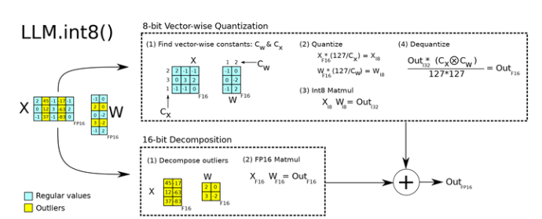
        - ZeroQuant
            - 1. 对权重使用分组量化，对激活使用token量化；2. 开发了高度优化的推理后端，消除了量化/反量化运算符昂贵的计算成本，在现代GPU硬件上实现INT8 Tensor内核的延迟加速；3. 提出了一种用于INT4/INT8混合精度量化的新的逐层知识蒸馏方法（LKD），其中神经网络通过蒸馏逐层量化，迭代最小，甚至不访问原始训练数据
- 7.6 模型并行
    - tensor paralellism加速+降显存
        - tensor-wise parallelism
            - MLP切分
                - 对第一个线性层按列切分，对第二个线性层按行切分
                -  
                -  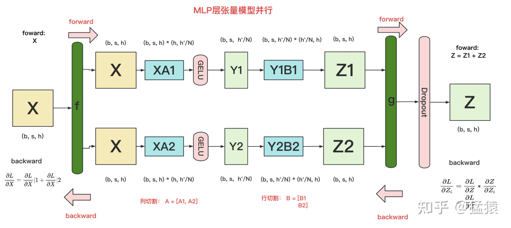
                -  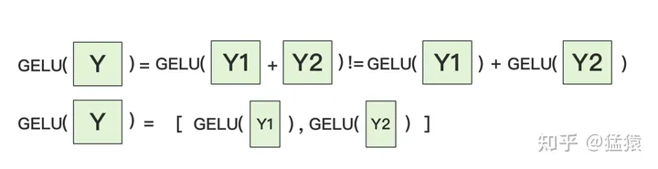
            - self-attention切分
                - attention的多头计算天然适合tensor并行，因为每个头上都可以独立计算最后再将结果concat起来，从而 **可以把每个头的参数放到一块GPU上**
                - 对线性层， **按照“行切割”** 。切割的方式和MLP层基本一致，其forward与backward原理也一致
            - 输入层Embedding切分
                - 对positional embedding来说，max_s本身不会太长，因此每个GPU上都拷贝一份，对显存的压力也不会太大
                - 将word embedding拆分到不同GPU上，每块GPU维护一分部词表。当输入X去GPU上查找时，能找到的词，就正常返回词向量，找到不到就把词向量中的全部全素都置0。按此方式查找完毕后，每块GPU上的数据做一次AllReduce，就能得到最终的输入。
                -  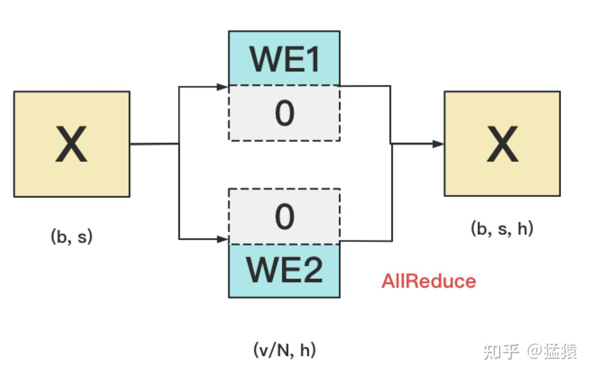
            - 输出层Embedding切分
                - **输入层和输出层共用一个word embeding**
                - **当模型的输入层到输入层都在一块GPU上时（即流水线并行深度=1），我们不必担心这点（实践中大部分用Megatron做并行的项目也是这么做的）。但若模型输入层和输出层在不同的GPU上时，我们就要保证在权重更新前，两块GPU上的word embedding梯度做了一次AllReduce** 。
                -  
            - cross-entroy
                -  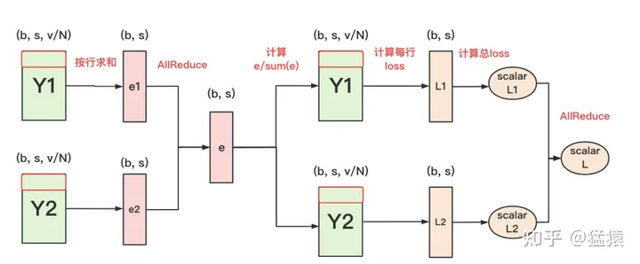
                -  
    - pipeline paralellism减少显存
        - GPipe [罗西的思考]("https://blog.csdn.net/weixin_47364682?type=blog")
            - **（google）思路** ：将mini-batch分为若干个micro-batch，像 allreduce 一样，计算完一些就传给下个节点，最后同步更新参数；将被训练的这些层划分为多个阶段，每个阶段包含模型之中一组连续的层；GPipe使用现有的技术，如梯度累积来优化内存效率，通过丢弃前向传播和后向传播之间的activation存储来交换内存，在后向传递需要activation时再重新计算它们。 **劣势** ：过多流水线刷新导致空闲时间的增加；如果m很小，Gpipe可能会由于重新计算开销和频繁的管道刷新而降低硬件效率，所以 m 一般都设置的较大，于是需要缓存 m 份 activation导致内存增加。原因是每个micro-batch前向计算的中间结果activation都要被其后向计算所使用，即便使用了Checkpointing 技术，前向计算的 activation 也需要等到对应的后向计算完成之后才能释放。令micro-batch的数目为m,pipe的阶段为p,则空泡的比例为(p-1)/(p-1+m) 
        - 1F1B/PipeDream
            - **（microsoft）思路** ：1F1B努力减少每个 activation 的保存时间，即这就需要每个 micro-batch 数据尽可能早的完成后向计算，从而让每个 activation 尽可能早释放。 **方法** ：每个 GPU 以交替的方式执行每个 micro-batch 的正向和反向过程，使得 activation 的缓存数量只跟阶段（stage）数相关，从而进一步节省显存。 **步骤** ：在训练开始的启动阶段（图上的Startup State），输入的stage的先读入足够多micro-batch的数据，以保证pipeline在稳定阶段时，各个设备上都有相应的工作在处理。一旦输出阶段完成第一个小批次的前向传播（就是Machine 4 第一个蓝色1），它就对 同一个小批次 执行后向传播（就是Machine 4 的第一个绿色 1），然后开始交替执行后续小批次的前向传播和后向传播（就是 Machine 4 的 2前，2后，3前，3后…），当反向传播过程开始传播到管道中的早期阶段时（就是Work 3 ~ Work 1），每个阶段开始在 不同小批次 的正向和反向过程之间交替进行。权重问题： 同一个micro-batch在不同stage做同样操作（同样做前向操作，或者同样做后向传播）使用的参数版本不一致 。如对于 minibatch 5 在 worker 1 上的前向计算部分（蓝色5），他的前向逻辑在 minibatch 1 的后向计算以后执行。但是 minibatch 5 在 worker 2 上的前向计算部分（蓝色5），是在 “minibatch 1, minibatch 2” 的后向计算结束后才执行。为解决这两个问题，PipeDream 分别采用了 weight stashing 和 Vertical Sync 两种技术。 **Weight stashing :** 为权重维护多个版本，每个active micro-batch都有一个版本。每个stage 都用最新版本的权重进行前向计算，处理输入的micro-batch。计算前向传播之后，会将这份参数保存下来用于同一个micro-batch的后向计算。 Weight stashing确保在一个阶段内，相同版本的模型参数被用于给定小批量的向前和向后传播，但是不能保证跨阶段间，一个给定的小批次使用模型参数的一致性 。 **Vertical Sync :** 每个micro-batch进入pipeline时都使用输入stage最新版本的参数，并且参数的版本号会伴随该micro-batch数据整个生命周期， 在各个阶段都是用同一个版本的参数（而不是Weight stashing那样都使用最新版本的参数），从而实现了stage间的参数一致性 。 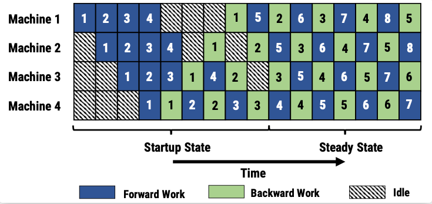
            - PipeDream-2BW 在流水线之中维护了两个版本的模型权重，“2BW” 是 双缓冲权重（double-buffered weights）”，PipeDream-2BW 会为每个微批次生成一个新的模型版本K（K>d），但是因为有些剩余后向传递仍然依赖于旧版本模型，所以新的模型版本无法立即取代旧版本，但是由于只保存了两个版本，所以极大降低了内存占用。 
            - PipeDream-flush 则在 PipeDream-2BW 之上添加了一个全局同步的流水线更新刷新操作， 通过限制仅保留进行中（in-flight）微批次的激活来保持较低的内存占用 。思路类似 GPipe。这种方法通过牺牲吞吐量的能力部分下降的代价来减少了内存占用（即只维护一个版本的模型权重）。 
            - (Megatron-LM ) interleaved 1F1B:1F1B 并不能减少 bubble time， **为了进一步减少 bubble time，Megatron-LM 又提出了 interleaved 1F1B 模式** 。也就是将原本每个 GPU 负责若干个连续层的计算变成负责若干个不连续层的计算，即负责的数量不变，但顺序变了，从而每个stage负责的计算更少，stage的数目变多，从而 bubble time 也变少,但这种方式要求micro-batch 的数量是流水线阶段（Stage）的整数倍，且增加了额外的通信量。bubble时间占比从(n-1)/(n-1+m)优化为(n-1)/(n-1+km)，k为每个计算设备上的stage数。 
- 7.7 网络通信优化
    -  [网络通信]("https://article.juejin.cn/post/7226374741064892453")
        - rpc
        - grpc
        - http
    -  [响应模式]("https://blog.csdn.net/weixin_44999716/article/details/128436984")
        - SSE
        - 轮询
        - 长轮询comet
        - WebSocket
- 7.8 GPU通信优化
- 7.9 采样/解码
    - speculative decoding=draft model + reject sampling+parallel verfication
        - 记$M_p,M_q$分别为target模型和draft模型，给定prompt，首先基于代理模型生成$ \ gamma$个token,记录每个token的概率值$q$，然后并行调用target模型$M_p \ gamma$次计算draft模型采样的token的概率$p$,根据$p/q$针对每个token进行拒绝采样确定接受的token数，若接受的token数小于$ \ gamma$，则根据p,q分布差值的归一化进行采样得到n+1个token。缺点：串行的$ \ gamma$次小模型自回归+并行的$ \ gamma$次大模型自回归生成$n<= \ gamma$个token，最坏的情况n=1，虽然提高了生成速度但大幅增加了计算压力和显存占用。此外这种方式严重依赖小模型生成的分布是否与大模型一致。    注意下图中的norm是归一化并不是正态分布。 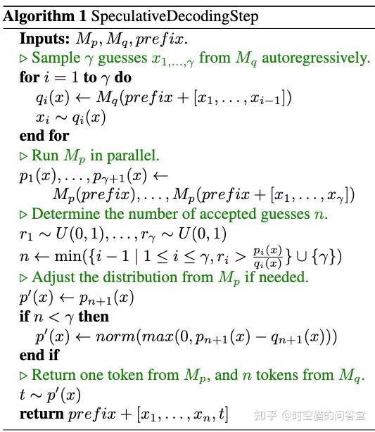
    - Blockwise *Parallel*  *Decoding=multi-draft model +top-1 sampling+ parallel verification* [Blockwise Parallel Decoding]("https://zhuanlan.zhihu.com/p/658298728")
        - 出发点：贪心解码需要m步来产生长度为m的输出，因为每次进行一个token生成的计算，却要搬运全部的模型参数和激活张量，这使解码过程严重受限于内存带宽。语言模型都是预测下一个token，如果我们有k-1个 **辅助模型** ，每个模型可以根据输入序列跳跃地预测后2到k个位置的某个token。那么，辅助模型和原始模型可以独立运行，从而并行生成后k个token。blockwise decoding的三个阶段，分别是Predict、Verify和Accept阶段，预测即使用原模型+k-1个辅助模型进行k个位置token的预测，然后使用原模型并行地验证这k个位置，即将其组成batch，实现合适的attention mask，一次性获得这个k个位置的词表概率，贪心地选择概率最大的token作为验证结果。Accept阶段，如果验证结果的token和Predict阶段预测的token相同则保留。如果不同，则后面的token预测都错误。 **在理想情况下** （每次接受K个预测结果）可以把生成长度m的序列所需要的解码次数降低为2m/k。作者们进一步优化这个算法，在Verify时顺便做了下一个token的预测。如下图所示，原始模型验证时同时预测后k个token。这样Predict和Verify阶段可以合并，验证同时也获得了后k个token的候选。这使得除了第一次迭代，每次迭代只需调用一次模型forward，而不是两次，从而将解码所需的模型调用次数减半。进一步将模型调用次数从2m/k减少到m/k + 1。实现：我们并不需要真的构造出k-1个辅助模型， **只需对原始模型略作改造，就可以让他具备预测后k个token的能力** 。如下图所示，在原始模型decoder和最后一个projection layer前面插入一个FFN层，它的输入是(batch_size, sequence_length, d_model)，输出是(batch_size, sequence_length, k* d_model)，然后在decoder输出和这k个project layer的输入分给进行残差连接，这k个project layer的输出就是k个不同位置token的logits。改造后的模型还需要使用训练数据进行训练。作者论文声称：由于训练时的内存限制，我们无法使用对应于k个project layer输出的k个交叉熵损失的平均值作为loss。相反，我们为每个minibatch随机均匀选择其中的一个layer输出作为loss。训练则可以是fronzen, finetuning,distillation的任何一种。 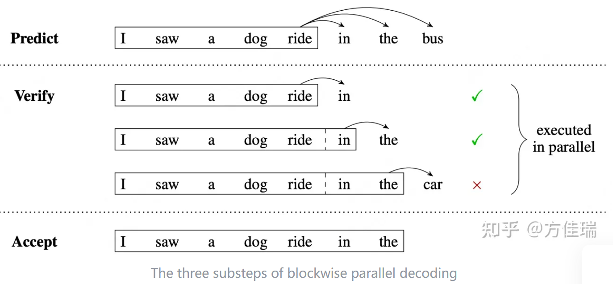
    - SpecInfer=Speculative decoding+token tree verification(top-k sampling + parallel verfication)
        - **SpecInfer采用了两项关键技术来提高解码速度：Speculative Inference和Token Tree Verification. Speculative Inference：** 采用一批small speculative models（SSMs），并行预测多个候选SSM可以是原始LLM的蒸馏、量化、剪枝版本（甚至是可供检索的知识库如LLMA、用户的自定义函数），由于SSM的参数规模通常会小2-3个数量级，能力有限，SpecInfer引入了“collective boost-tuning”技术，基于adaptive boosting的思想，对SSM进行微调，让SSM与原始LLM更好地对齐，提升预测准确率，降低Verification的成本。 **Token Tree Verification** ：将SSMs预测的多个候选merge为一个新的token tree，采用原始LLM做并行验证。为了做到高效地并行验证，SpecInfer引入了“Tree-based Parallel Decoding”机制；为了适配通用的随机采样方式，SpecInfer引入了“multi-step speculative sampling”算法。Token Tree Verification使用了topolgy-aware masking的方式来一次性计算整个token-tree的attention,一次性计算整一棵树，在一个kernel里面完成,开销更小；（2）一些sequence其实有共同的prefix，计算一整棵树，相当于复用这些prefix的KV cache减少了I/O开销。
    - Medusa=multi-decoding head + tree attention + typical acceptance(threshold)
        - 原理：通过为Transformer大模型添加 **n个解码头** （decoding heads），每个头都是一个单层前馈网络，从而Medusa让大模型一次性并行生成n个词分布，而不是逐个生成，如果在n个词分布中选取top-k，则可以得分n组top-k个词，如果对这n组top-k做笛卡尔积可大幅提高候选词的准确率，medusa提出结合 **tree attention** ，以并行方式验证这些词，从而实现推理加速。具体来说就是将每个头的top-k个词作为节点，每个头作为树的一层，每条直到叶子节点的路径构成一组待验证的预测，在这棵树内，Attention Mask需要新的设计，该Mask只限制对一个token的前面token的注意力。同时，要为相应地为position embedding设置正确的位置索引。以上方式仍然受制于greedy search的解码能力，为此medusa提出了 **typical acceptance** ，使之支持top-k、top-p方式的采样方法。其出发点在于：在实际使用中，我们经常为控制模型的创造性而改变采样温度，使得投机采样中的draft模型与target模型的分布不一致，从而top-p采样可能会拒绝draft模型生成，从而导致并行解码长度很短。作者从truncation sampling工作中汲取灵感，旨在选择原始模型可能接受的候选项。根据原始模型的预测概率设定一个阈值，如果候选项超过了这个阈值，就会被接受。作者采取hard threshold和entropy-dependent threshold的最小值来决定是否像在truncation sampling中那样接受一个候选token。这确保了在解码过程中选择有意义的token和合理的延续。作者总是使用Greedy Decoding接受第一个token，确保每一步至少生成一个token。最终的输出则是通过acceptance test的最长序列。特点：使用Medusa并不需要重新训练整个大模型，而是冻结大模型而只训练解码头。 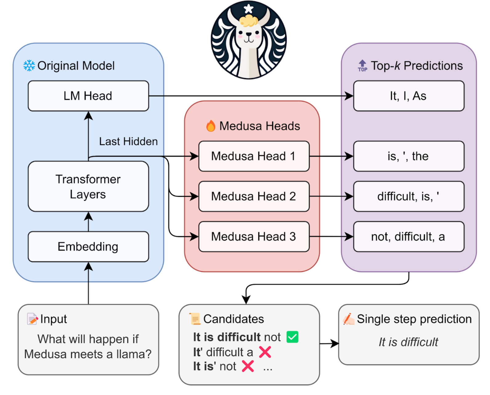
    - LLMA=reuse+parallel verification
        - **出发点** ： **retrieval-augmented generation：** New Bing 等检索应用在响应用户输入的内容时，会先返回一些与用户输入相关的信息，然后用语言模型总结检索出的信息，再回答用户输入的内容。在这种场景中，模型的输出往往包含大量检索结果中的文本片段。 **cache-assisted generation：** 大规模部署语言模型的过程中，历史的输入输出会被缓存。在处理新的输入时，检索应用会在缓存中寻找相似的输入。因此，模型的输出往往和缓存中对应的输出有很大的相似性。 **multi-turn conversations：** 在使用 ChatGPT 等应用时，用户往往会根据模型的输出反复提出修改要求。在这种多轮对话的场景下，模型的多次输出往往只有少量的变化，重复度较高。基于以上观察，微软提出了LLMA（LLM Accelerator），本质是“Inference with Reference”。LLMA的核心操作是：1). 在每个解码step，选取当前已生成内容的部分后缀（ k 个token），与参考文本进行匹配，若命中，则将参考文本的部分后续片段（ k个token）拷贝至当前已生成内容的末端；2). 并行调用目标模型，检验新增token的合法性；3). 保留所有合法token直至遇到第一个不合法token。基于以上方式，目标模型的每一次并行调用，至少可以产生1个新的token，至多则可以产生 k+1 个新的token。 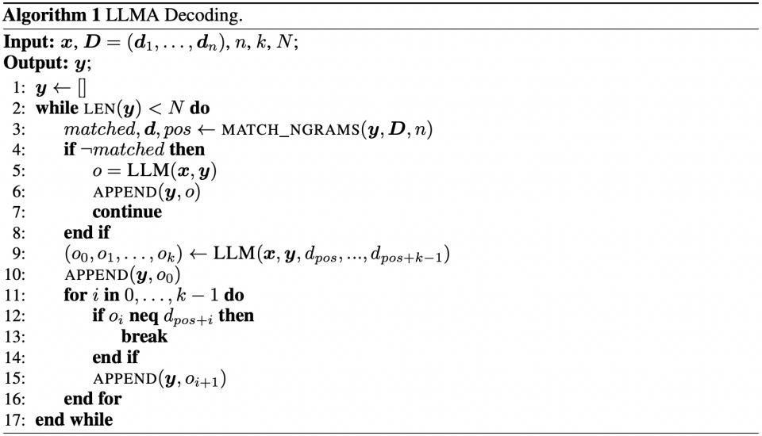
    - =n-gram+Jacobi iteration+parallel verification [Lookahead Decoding]("https://lmsys.org/blog/2023-11-21-lookahead-decoding/")
        - 出发点： **Jacobi decoding** : 首先随机指定一组m个初始解y，根据自回归方程和初始解更新y,重复以上过程直至达到迭代停止条件。Jacobi decoding可以保证在m步内得到m个变量。与自回归解码相比，每个Jacobi decoding步骤在所需的计算量要大，因为它需要对 >1 个token进行 LLM 前向计算，但由于 GPU 的并行处理特性，这通常不会导致速度变慢。虽然Jacobi可以通过许多步骤解码多个token，但在序列中精确定位这些token常常会出错. **Lookahead** 通过并行生成N-grams的能力克服了Jacobi decoding的缺陷，在Jacobi decoding中，某个位置的每个新token都根据之前迭代的历史值进行解码, 因此Jacobi解码的过程中会在每个位置产生一组历史token轨迹，从而构成很多n-grams，例如，回溯3个迭代轮次，就会构成一组每个位置的3-grams。Lookahead decoding会在迭代中缓存这些n-grams，在执行Jacobi decoding的同时，并行验证缓存中的n-grams。接受一个N-grams使得我们一次推进N个token。 **方法** ：为了提高该过程的效率，每个Lookahead decoding步骤被分为两个并行分支：lookahead分支和verification分支。lookahead分支维护一个固定大小的2维窗口，以根据雅可比迭代轨迹生成 n-gram。 同时，verification分支选择并验证有希望的 n-gram 。 **Lookahead分支** ：Lookahead 分支旨在生成新的n-gram。该分支使用由两个参数定义的二维窗口进行操作，窗口大小W和N-gram的大小N，前者代表我们希望前向生成token数，后者代表我们回溯的迭代数。注意到当N=2时，Lookahead decoding退化为Jacobi decoding。 **Verification分支** ：在验证分支中， *我们识别第一个 token 与最后一个输入 token 匹配的 n-gram* ，这一步是通过简单的字符串匹配来确定的。一旦识别，这些 *n -gram将被添加到当前输入token后，并通过 LLM 正向传递对其进行验证* 。对验证分支中考虑的候选 n -gram的数量设置上限（=W）以控制计算成本。 **Lookahead and Verify In the Same Step:** 由于 LLM 解码主要受内存带宽限制，因此我们可以在同一步骤中合并前瞻和验证分支，利用 GPU 的并行处理能力来隐藏开销。 这是通过设计一个如图 5 所示的特殊注意掩码来实现的，该掩码遵循两个规则： (1) 前瞻分支中的标记无法看到验证分支中的标记，反之亦然。 (2) 每个标记只能看到它前面的标记和它自己，就像causal mask。
        - 蓝色的0代表当前t时刻的token, 橘、绿、红依次代表t-3、t-2、t-1时刻由Jaccobi迭代生成的，数字代表相对当前token的位置，在每个时刻t,我们利用前N-1步轨迹，执行Jaccobi迭代生成 window size=5个位置的token，从而得到多组同一位置的N-gram,例如在当前输入token位置的蓝0-绿1-红2。在验证时，首先通过字符串匹配识别出第一个token与最后一个 input token匹配的 n-gram,将识别到的n-gram添加当前输入后，并通过 LLM 正向传递对其进行验证，从而一次生成N个token 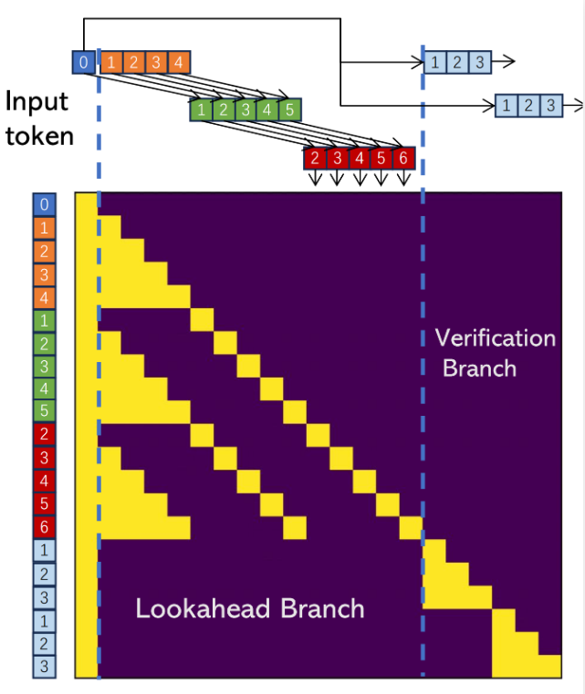
        - Jaccobi decoding: 从一组随机采样解开始，迭代求解右边的方程组，m元方程组至多m次可求得精确解。 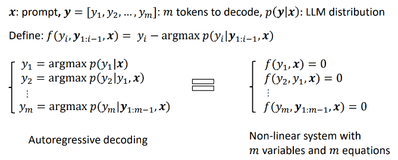
    - =embedding + simplified tree verification + multi-run speculative sampling [EAGLE]("https://mp.weixin.qq.com/s/6aPILg7hb95hTt1aRy-SxA")
        - **出发点** ：在投机采样中，草稿模型的任务是基于当前词序列预测下一个词。使用一个参数数量显著更少的模型完成这个任务极具挑战性，通常会产生次优结果。此外，标准投机采样方法中的草稿模型独立预测下一个词而不利用原始 LLM 提取的丰富语义信息，导致潜在的效率低下。 **原理** ：EAGLE 利用原始 LLM 提取的上下文特征（即模型第二顶层输出的特征向量）。EAGLE 建立在以下第一性原理之上：特征向量序列是可压缩的，所以根据前面的特征向量预测后续特征向量比较容易。EAGLE 训练了一个轻量级插件，称为自回归头（Auto-regression Head），与词嵌入层一起，基于当前特征序列从原始模型的第二顶层预测下一个特征。然后使用原始 LLM 的冻结分类头来预测下一个词。特征比词序列包含更多信息，使得回归特征的任务比预测词的任务简单得多。总之，EAGLE 在特征层面上进行外推，使用一个小型自回归头，然后利用冻结的分类头生成预测的词序列。为了确保生成文本分布的一致性，EAGLE 随后验证预测的树状结构。这个验证过程可以使用一次前向传播完成。EAGLE 创建了一个 **更稀疏的树结构** 。这种稀疏的树结构防止形成无意义的序列，将计算资源集中在更合理的词组合上。 **多轮投机采样** ：标准投机采样方法在进行 “猜词” 的过程中保持了分布的一致性。为了适应树状猜词场景，EAGLE 将这种方法扩展成了多轮递归形式。在树状生成过程中，EAGLE 记录了每个抽样词对应的概率。通过多轮投机采样，EAGLE 确保最终生成的每个词的分布与原始 LLM 的分布保持一致。 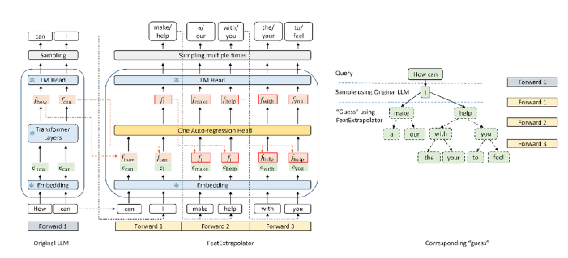
        -  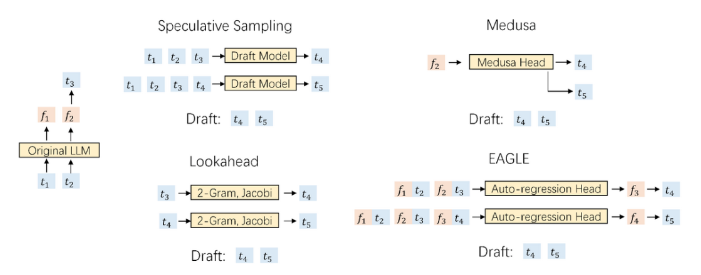
    - SoT =Prompt-based Parallel Decoding
        - 该方法受到人类思考和写作过程的启发，通过精心制作的 **骨架模板** ，引导LLMs首先生成答案的骨架，这种缩写表达抓住了预期答案的核心元素,然后利用点扩展提示模板，执行API调用或批量解码阐述骨架的每个片段，以并行完成每个骨架点的内容。SoT不仅可以显著提高速度（在11个不同的LLMs中最高可达2.39倍），而且还可以在多个问题类别上提高答案质量，包括多样性和相关性。SoT是首次尝试以数据为中心的优化方法，揭示了推动LLMs更像人类思考以提高答案质量的潜力。
    - prompt-lookup-decoding~ prompt bsed LLMA
        - 将投机采样中的小模型直接替换为了 **内容查找函数** ，通过在提示中使用简单的字符串匹配来生成候选标记序列
- 参考资料
    -  [最佳实践]("https://mp.weixin.qq.com/s/nJLrE9Dzj1mmTeQDiqNdzA")
    -  [LLM推理加速]("https://zhuanlan.zhihu.com/p/654942557")