# 知识图谱-note
- 知识表示
    - 符号表示
        - Directed-Labeled Graph是最简单、最接近自然语言和人脑认知的数据模型，包含RDF和Property Graph两种。
        - OWL
            - 定义：OWL是RDF的扩展，在RDF-Schema之上增加了class, subclass, property,subproperty,....
            - 表达构建：1. 等价性声明，2.声明属性的传递性，3.声明两个属性互反，4. 声明属性的函数性，5. 声明属性的对称性；6. 声明属性的局部约束：全称限定；存在限定；基数限定；9. 声明相交的类。
            - OWL的语言家族：OWL1, OWL2 + RL,EL,QL,DL
        - Ontology
        - RDF
            - Resource Description Framework用一个RDP三元组(Subject, Predicate, Object)来编码一条statement, statement就是一个简单的逻辑表达式，或对现实世界的描述。
        - Property Graph
            - 特点：属性图是图数据库Neo4J实现的图结构表示模型,在工业界有广泛应用属性图的优点是表达方式非常灵活,例如,它允许为边增加属性,非常便于表示多元关系属性图的存储充分利用图的结构进行优化，因而在查询计算方面具有较高优势属性图的缺点是缺乏工业标准规范的支持,由于不关注更深层的语义表达,也不支持符号逻辑推理
            - 定义：在属性图的术语中，属性图是由 顶点(Vertex边(Edge),标签(Label),关系类型还有属性(Property)组成的有向图；顶点也称为 节点(Node),边也称为 关系(Relationship)；在属性图中，节点和关系是最重要的实体。节点上包含属性,属性可以以任何键值形式存在；关系连接节点,每个关系都有拥有一个方向、一个标签、一个开始节点和结束节点。关系的方向的标签使得属性图具有语义化特征；和节点一样,关系也可以有属性,即边属性,可以通过在关系上增加属性给图算法提供有关边的元信息，如创建时间等,此外还可以通过边属性为边增加权重和特性等其他额外语义
    - 向量表示
        - 基于上下文的共现频率：CBoW,Skip-gram->TranE：h+r=t; 基于线性变化假设->DistMult... 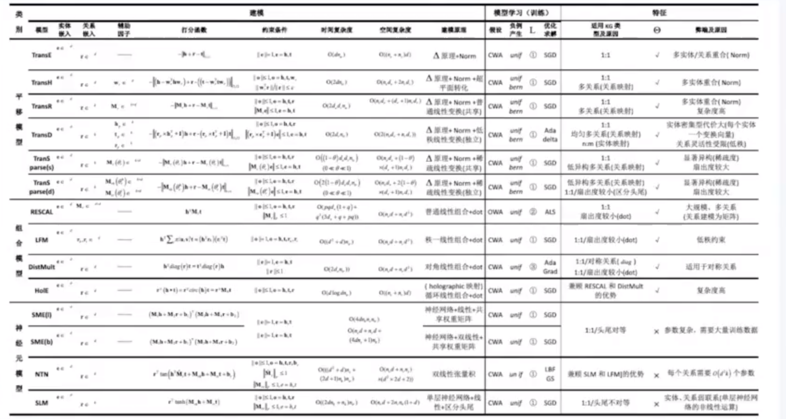
    - 传统表示方法
        - 一阶谓词逻辑First-Order Logic(Horn Logic等，描述逻辑Description Logic),语言网络Semantic Net, 产生式规则Production Rule, 框架系统Framework,, 逻辑程序Logic Programming
- 知识存储
    - 基于原生图
        - 关系型数据库的局限
            - 1. 关系模型将语义关联关系隐藏在外键结构中,无显示表达并带来关联查询与计算的复杂性；2. 数据来源多样性带来大量离群数据(Outlier Data)导致数据集的宏观结构愈发复杂和不规整,对于包含大量离群数据的场景,关系模型将造成大量表连接、稀疏行和非空处理；3， 互联网的开放世界假设要求数据模型满足高动态和去中心化的扩增数据的能力,关系模型对表结构的范式要求限制了Schema层的动态性
        - NoSQL数据库的局限
            - 1. 关系在NoSOL数据库中也不是First-ClassCitizen,在处理数据关联也需要使用类似于外键的Foreign Aggregates；2. Foreign Aggregates不能处理自反关系,例如,查询“whoisfriends with Bob?”时,需要暴力计算,即扫描所有实体数据集;3. Foreign Aggregates也不负责维护Link的有效性,在处理多跳关系时效率也很低下
        - 图数据库的优势
            - 丰富的关系语义表达与关联推理能力：在需要更加深入的研究数据之间的关系时，需要更加丰富的关系语义的表达能力,除了前述Reflesive和多跳关系、还包括传递关系Transitive、对称关系(非对称关系)Symmetric、反关系(Inverse)、函数关系(Functional)；除了关联查询能力,深层次的关系建模还将提供关联推理的能力,属性图数据库如Neo4J提供了关系模型的关联查询能力,AllegroGraph等RDF图数据库提供了更多的关联推理能力
            - 关系是一等公民：关系被显示描述，利用图的结构特征建索引，基本思想是将图表示为邻接列表 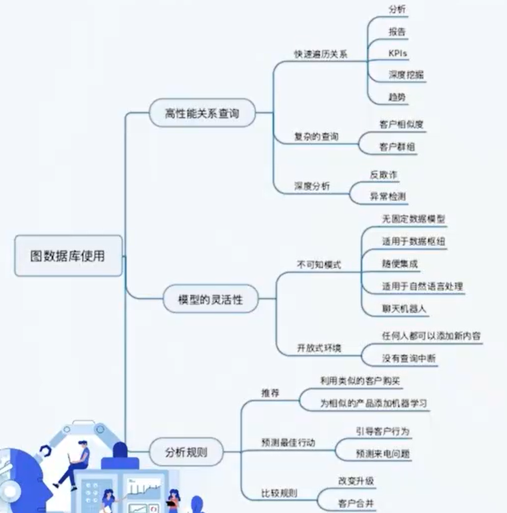
            - **自然表达** :图是十分自然的描述事物关系的方式,更接近于人脑对客观事物的记忆方式； **易于扩展** :图模型更加易于适应变化,例如在图中，临希望获取历史订单，只需新增边即可； **复杂关联表达** :图模型易于表达复杂关联逻辑的查询例如在推荐系统中,希望表达复杂的推荐逻辑； **跨领域图建模与查询** ：利用图谱将不同领域的数据进行关联要求模型能按需扩展查询语句能表示跨多个领域的关联逻辑
        - 图数据库的分类
            - 属性图
                - 定义：在属性图的术语中,属性图是由 顶点(Vertex),边(Edge),标签(Label),关系类型还有属性(Property)组成的有向图在属性图中,节点和关系是最重要的实体。节点上包含属性,属性可以以任何键值形式存在。如Neo4J
            - RDF
                - Resource Description Framework用一个RDP三元组(Subject, Predicate, Object)来编码一条statement, statement就是一个简单的逻辑表达式，或对现实世界的描述。
            - 区别
                - 属性图适合重性能和结构分析的场景，RDF适合知识表示和建模，表示复杂的关联关系，且有知识推理的要求 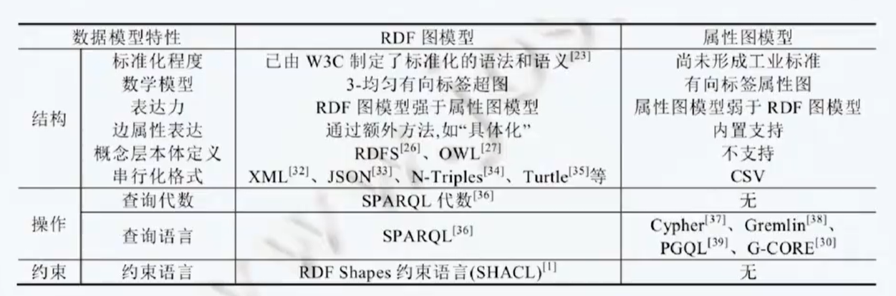
        - 图查询语言
            - Cypher of neo4j,SparQL of W3C, Gremlin of Apache TinkerPop。 **SparQL、Cypher是描述性(声明式)语言，Gremlin是过程式语言，过程式查询语言需要严格根据图的结构定义查询语言，描述性查询语言重在刻画本身查询的语义，通常需要再进行翻译** 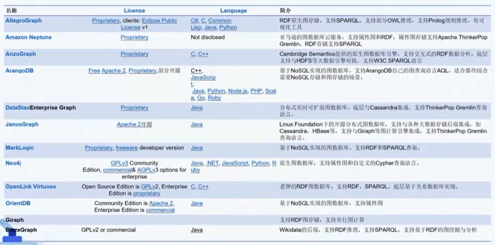
            -  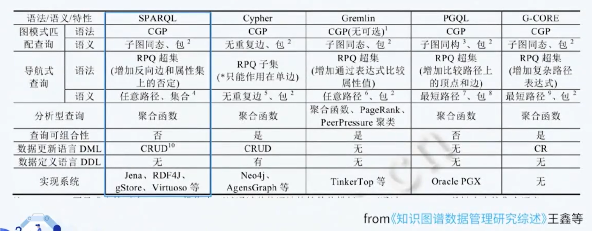
        - 图数据库构建原理
            - Neo4J的实现
                - 概览 
                - 节点存储文件
                    - 节点存储于独立的“节点存储文件”,每个节点的存储空间固定，如14字节，便于直接通过ID编号计算获得访问地址，基于这种格式,节点查询成本为O(1),而非O(N)；每个节点首字节标明是否inUse,接下来四个字节存储该节点的第一个关系边的ID,再接下来四个字节存储该节点的第一个属性ID,再接下来4个字节存储该节点的第一个LabelID；节点的属性数据(如姓名、年龄等)是分开存储的,节点只存储其第一个属性的ID,这样的设计是为了保证节点遍历的高效性 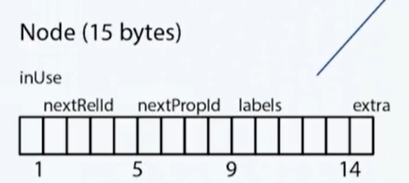
                - 关系边存储文件
                    - 关系边存储于独立的“关系存储文件”,每个关系边的存储空间固定,如34字节和节点一样,这种设计便于直接通过ID编号计算获得关系边的访问地址；每个节点首字节标明是否inUse,接下来四个字节存储该关系边的头节点ID,再接下来四个字节存储该关系边的尾节点ID,再接下来4个字节存储关系边类型ID.再下面存储头节点和尾节点的上一个关系边ID,以及头尾节点的下一个关系边ID 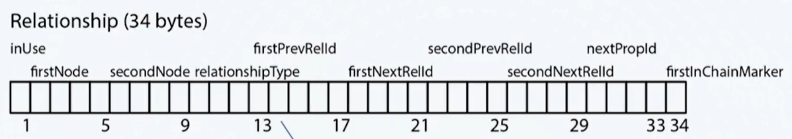
                - 属性存储文件：内联与动态存储
                    - 图数据库中存在大量属性，这些属性的检索与图遍历的计算是分开的,这是为了让节点之间的图遍历能不受大量属性数据的影响；节点和关系的存储记录都包含指向它们的第一个属性ID的指针,属性记录也是固定大小,便于之间通过ID计算获得存储位置；每个属性记录包含多个属性块,以及属性链中下一个属性的ID每个属性记录包含属性类型以及属性索引文件,属性索引文件存储属性名称；对于每一个属性值,记录包含一个指向动态存储记录的指针(大属性值)或内联值(小属性值) 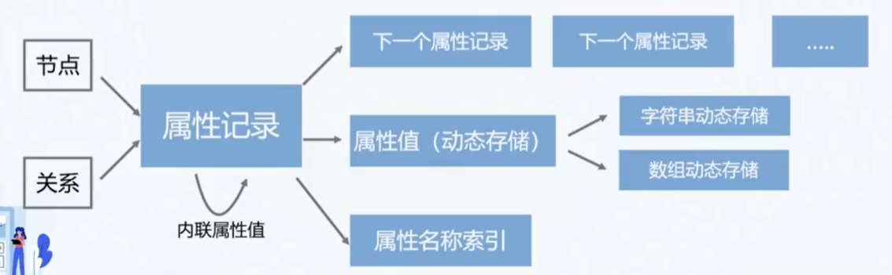
        - 图数据库管理系统的比较
            -  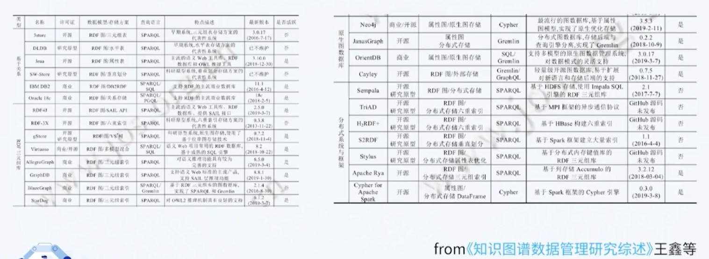
    - 基于关系数据库
        - Triple: 简单高效，查询时包含过多self-join操作
            - 图上的查询语言：SPARQL->RDF
        - Property Tables:仍然基于传统关系数据库实现,典型的如Jena[Wilkinsonetal, 2003],FlexTable[Wang et al, 2010],DB2-RDF[Bornea et al, 2013]等实现基本思想是以实体类型为中心,把属于同一个实体类型的属性组织为一个表,即属性表进行存储。优点:Join减少了,本质上接近于关系数据库,可重用RDBMS功能缺点:很多空值,对Subiect聚类比较复杂、不易处理多值属性
        - binary table: 二元表也称为垂直划分表,也是基于关系数据库实现的三元组存储方式基本思想是对三元组按属性分组,为每个属性在关系数据库中建立一个包含(subject、Object)两列的表。由于一个知识图谱中属性数量是有限的,表的总体数量是可控的。优点是没有空值、也不需要聚类、对于Subiect-Subiect-Join操作性能好缺点是Insert性能损耗高、并且Subject-Object Join性能差
        - Exhaustive Indexing:性能最好的存储方式,典型的实现包括RDF-3X,Hexastore等.这种方法也仅维护一张包含(Subject,Predicate,Object)的三列表,但增加了多个方面的优化手段.第一个优化手段是建立Mapping Table,即将所有的字符串首先映射到唯一的数字ID,这将大大压缩存储空间。进一步建立六种索引: SPO,SOP,PSO,POS,OPS,SP,即分别建立Subject-Predicate-Object; Subject-Object-Predicate;Predicate-Subject-Obiect等六个方面的全索引,显然多种形式的索引覆盖了多个维度的图查询需求。同时三元组基于字符串排序,并利用clustered B+tree树来组织索引以进一步优化索引检索的效率。
- 知识抽取
    - 知识抽取的任务
        - 实体抽取与分类
            - 实体识别与分类任务：从文本中识别实体边界及其类型
            - 实体识别的常用方法
                - 基于模版和规则：准确，但人工成本高，难以维护，且可能冲突
                - 基于序列标注的方法：确定标签体系，选择模型，定义特征，模型训练。中文的实体识别面临一些特有的问题，例如:中文没有自然分词、用字变化多简化表达现象严重等等。
                    - 标签体系：如IOB，IO体系
                    - 模型：HMM等
                        - CRF
                            -  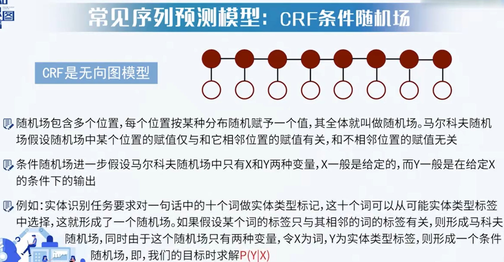
                            -  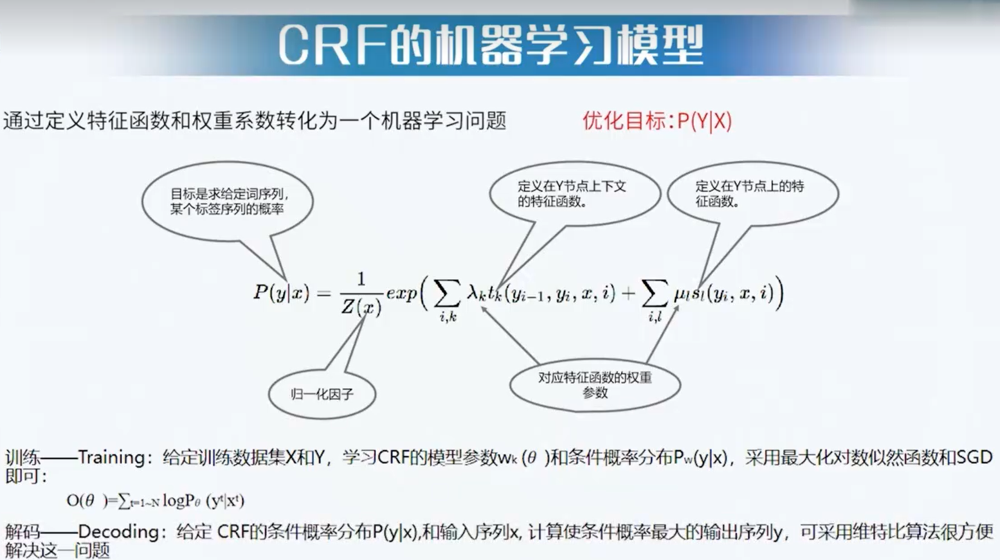
                        - HMM
                            -  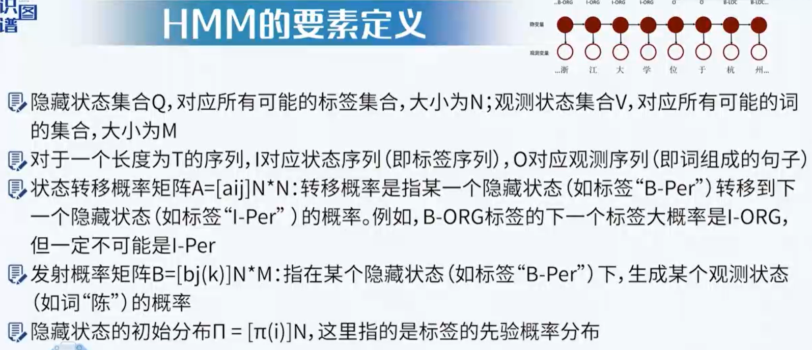
                            - 其中A为转移概率矩阵，B为发射概率矩阵，II为先验概率 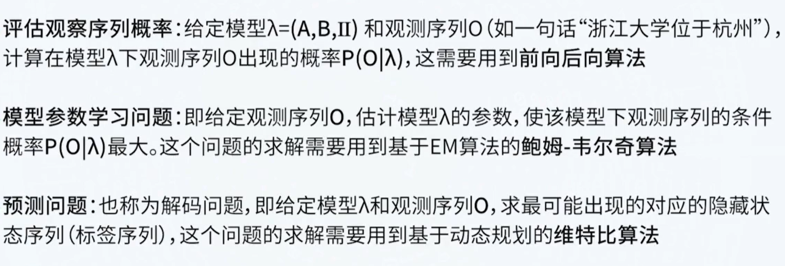
                            -  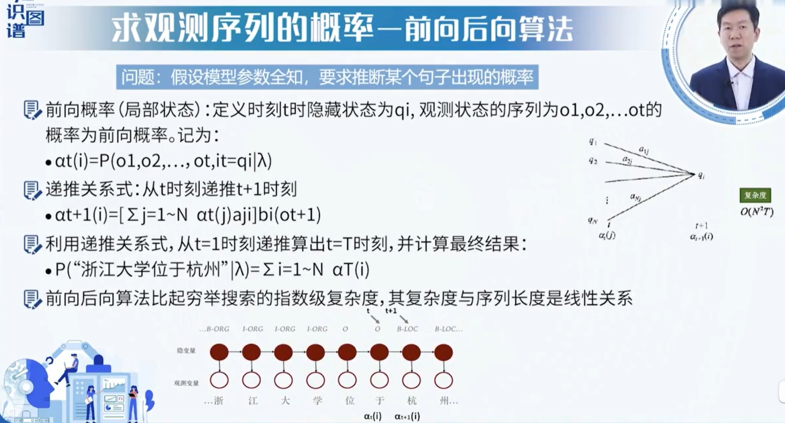
                            -  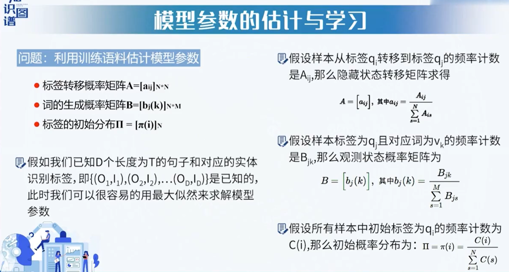
                            -  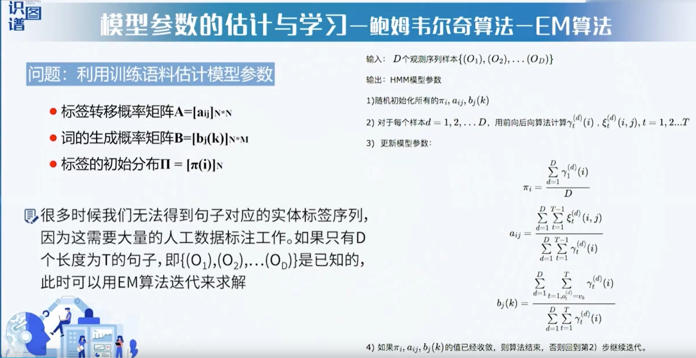
                            -  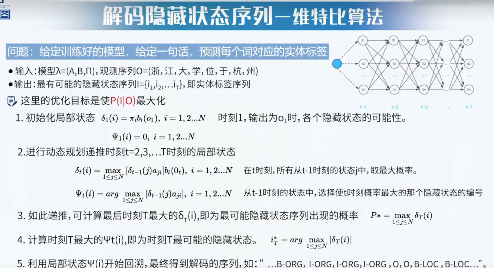
                        - 深度学习
                            - 流程： 输入的分布式表示->上下文编码->标签解码
                            - 组合：BILSTM+CRF,预训练模型...
                            - 解码策略：mlp+softmax, CRF, RNN, Pointer Network
                    - 定义特征
                        - 词本身的特征，如词性依存关系，边界特征（边界词概览）；前后缀特征，如姓名，地名；字本身的特征，如是否数字，是否字符。
            - 实体识别的问题
                - 实体识别仍面临着标签分布不平衡,实体嵌套等问题,制约了现实应用;
        - 关系抽取
            - 分类
                - 按领域：封闭域抽取vs.开放域抽取；按模型：特征工程,核函数，图模型，深度学习；按框架：人工模板，监督学习，远程监督，Bootstrap,无监督；拓展：多元关系，跨句推理，实体联合抽取，对抗学习，强化学习
            - 基于模版的方法：基于触发词匹配的关系抽取，基于依存句法匹配的关系抽取（1.对句子进行分词、词性标注、命名实体识别、依存分析等处理2.根据句子依存语法树结构上匹配规则,每匹配一条规则就生成一个三元组3.根据扩展规则对抽取到的三元组进行扩展4.对三元组实体和触发词进一步处理抽取出关系），
            - 基于监督学习的关系抽取（at-least-one假设）：预先定义好关系的类别，人工标注一些数据，设计特征表示，选择一个分类方法(SVM、NN等)，评估结果
                - 特征设计 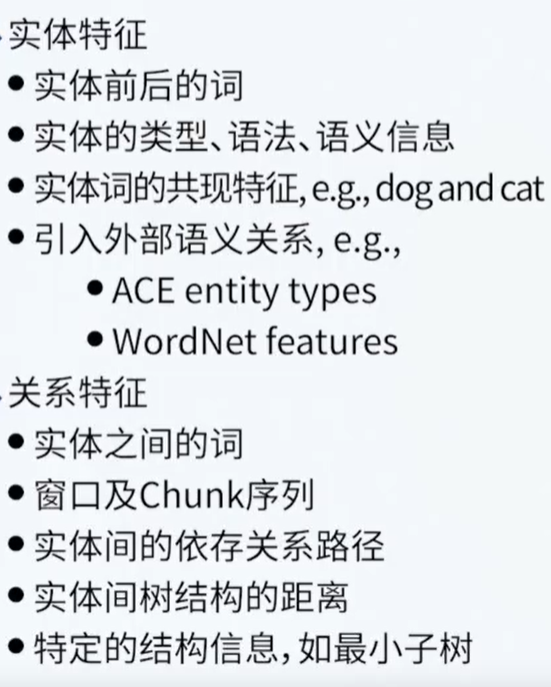
            - 基于核函数的方法：基于核函数的方法能够从字符串或句法树中自动抽取大量特征,但这类方法始终是在衡量两段文本在子串或子树上的相似度,并没有从语义的层面对两者做深入比较；通常都需要做词性标注和句法分析,用于特征抽取或核函数计算,这是典型的pipeline做法,会把前序模块产生的错误传导到后续的关系抽取任务,并被不断放大 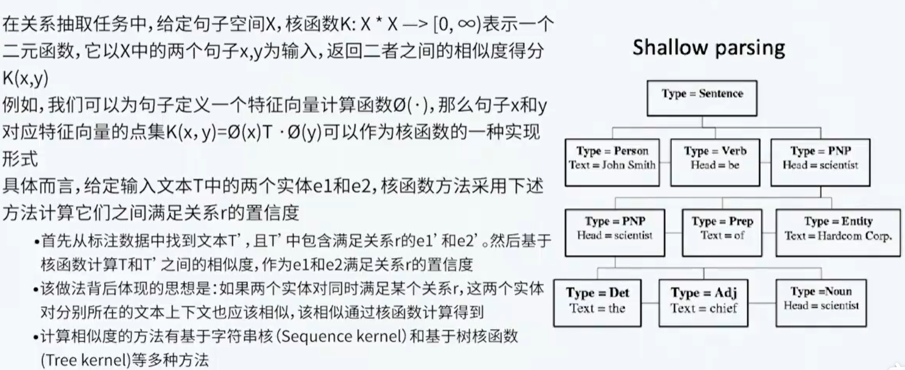
            - 基于深度学习框架：RecursiveNN，CNN，Piece-wise CNN, BiLSTM.
            - 基于图神经网络：利用句子的依赖解析树构成图卷积中的邻接矩阵，以句子中的每个单词为节点做图卷积操作，如此就可以抽取句子信息,再经过池化层和全连接层即可做关系抽取的任务
            - 实体和关系联合抽取
                - 级联三元组抽取：先预测头实体，再把头实体与句子向量拼接来预测尾实体
                - 基于胶囊神经网络：传统模型主要关注单标签关系抽取,但同一个句子可能包含多个关系。采用胶囊神经网络可以帮助实现多标签的关系抽取；模型首先通过预训练的embedding 将句子中的词转化为词向量;随后使用 BiLSTM网络得到粗粒度的句子特征表示,再将所得结果输入到胶囊网络,首先构建出 primary capsule.经由动态路由的方法得到与分类结果相匹配的输出胶囊。胶囊的模长代表分类结果的概率大小
            - 跨句推理、篇章级关系抽取
            - 半监督学习：基于远程监督的关系抽取
                - 基本假设:两个实体如果在知识库中存在某种关系,则包含该两个实体的非结构化句子均可能表示出这种关系。该假设是一个很强的假设，句子中很可能存在噪音，因此需要降噪。
                - 基于多实例学习（降噪学习），强化学习（降噪学习），Bootstrap(存在语义漂移问题)，Bootstrap-Neural Snowball。
        - 概念抽取
            - 定义
                - 概念知识图谱由isA关系、subclassOf关系组成，通常用于本体构建。概念可以用于认知同类实体，可以更好的理解自然语言，可以用于解释现象。实体、概念通常基于词汇进行表达，实体与概念，概念与概念之间的关系属于自然语言处理中语言上下位关系。概念抽取并构建成无环图的过程称为Taxonomy
            - 抽取方法
                - 基于模版抽取：准确率高，召回率低，成本高，泛化性差
                    - Hearst Patterns基于固定的句型可以抽取isA关系；由于构造和维护模板的成本都比较高，人们又发明了Boostrapping的方法,通常由专家构造种子Hearst Pattern,然后基于Boostrapping半自动产生新模板；
                - 基于百科抽取：精度高，但知识带有噪声
                    - 概念知识验证目标：输入概念知识,判断是否合法方法；互斥概念发现->实体相似度,属性分布相似度,领域规则过滤
                - 基于机器学习：准确率和召回率都较高，但需要大量标准数据
                    -  [http://openconcept.openkg.cn]("http://openconcept.openkg.cn")
        - 事件识别与抽取
            - 定义
                - 事件是发生在某个特定的时间点或时间段、某个特定的地域范围内,由一个或者多个角色参与的一个或者多个动作组成的事情或者状态的改变
            - 步骤
                - 事件抽取主要分为事件的发现和分类和事件要素抽取两部分,又可以细分为触发词识别与事件分类和要素检测与要素角色分类
            - 方法
                - 模式匹配（AutoSLog等，基于弱监督的模式匹配AutoSlog-TS)；机器学习(基于特征，基于结构预测（joint Inference, Joint Modeling），基于神经网络（DMCNN等），基于FrameNet的弱监督)
            - 挑战
                - 中文事件抽取的特有问题：不同的分词策略·中文词汇特征·形态时态没有明显变化DuEE
        - 属性补全
            - 定义：一个事物若干属性的取值来对这个事物进行多维度的描述，对实体拥有的属性及属性值进行补全。
            - 方法：抽取式属性补全，生成式属性补全
        - 前沿问题
            - 少样本知识抽取：N-way-K-shot, 原型网络，混合注意力机制的原型网络，基于实体关系原型网络的少样本知识抽取；零样本知识抽取：基于阅读理解的零样本关系抽取，基于规则引导的零样本知识抽取，终身知识抽取：基于表示对齐的终身关系抽取
    - 知识抽取的数据源
        - 结构化数据
            - 通过预先定义的schema来快速冷启动，如r2rml:从关系表到RDF schema的映射
        - 纯文本数据
        - 半结构化数据
            - Scene Graph Construction 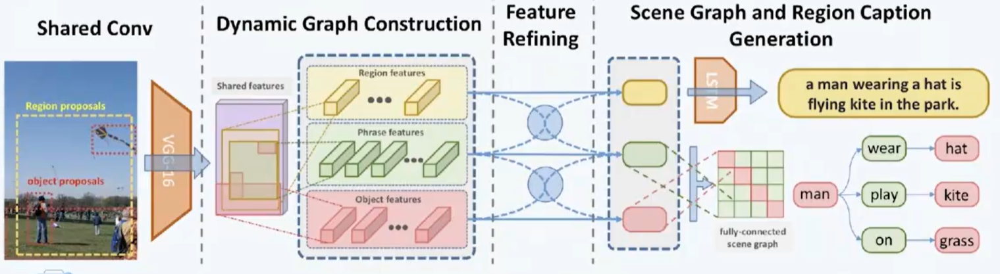
- 知识融合
    - 本体融合：等价类、子类，等价属性、子属性
        - 基于术语匹配的方法：基于字符串，基于语言的方法。基于虚拟文档 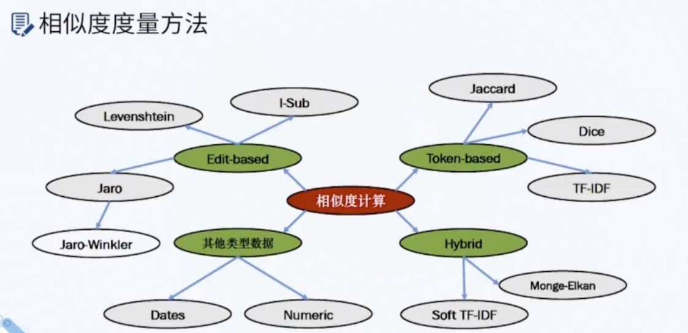
        - 基于结构匹配的方法：利用本体的结构信息来弥补文本信息量不足的情况，本体中的概念和属性往往有大量相关的其他概念和属性,组成了一种图结构，结构匹配器一般不采用图匹配技术，后者代价高昂且效果不理想。Anchor-PROMPT算法
    - 实体融合：等价实例
        - 基于等价关系推理、相似度计算的方法
        - 基于表示学习的方法：1, 合并预先匹配好的实体,把两个网络合并为一个网络,用单一网络的嵌入表示进行嵌入;2, 先用单一网络的嵌入模型分别训练两个网络,然后用一些预先匹配好的实体训练一个线性变换对齐两个向量空间.框架:Silk, openEA, EAKit
    - 目标：解决异构问题，核心在于映射的生成。异构的原因：1，语言层次上的不匹配，包括语法异构、逻辑异构、原语异构和表达异构四类；2 模型异构：概念化、解释的不匹配
    - 技术前沿：无监督对齐、多视角嵌入、嵌入表示增强、超大规模对齐
- 知识推理
    - 推理任务
        - 属性补全
        - 关系预测
        - 问句扩展
        - 语义理解
    - 推理方法 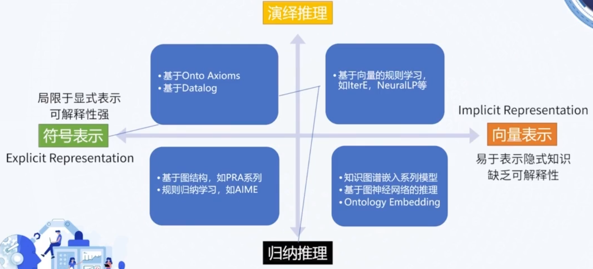
        - 基于符号逻辑和规则:OWL Reasoners, Datalog, Rete。完备的知识图谱包含TBoX即schema,用于定义概念和关系；ABox，包含事实性断言和描述。Deductive Reasoning with Ontological Axioms； 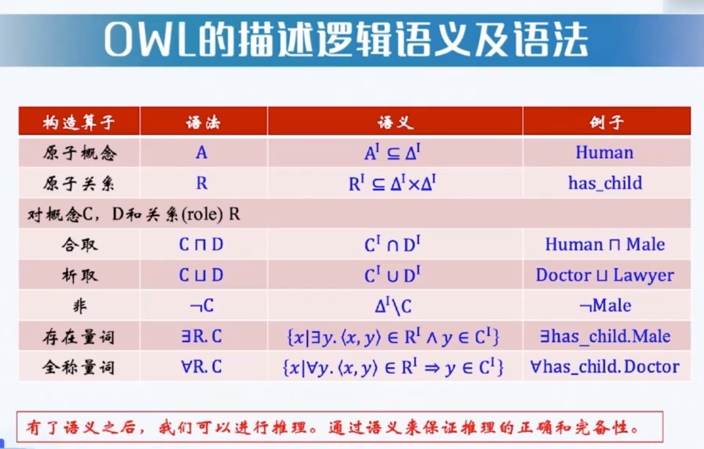
            - owl本体推理：概念包含推理，包含关系推理是定义在Tbox上面的推理,一般基于Tbox中的Axiom推断两个概念之间是否存在包含关系；实例检测推理；OWL本体上实现的各种推理都可以用Tableaux算法来实现，Tableaux算法的基本思想是通过一系列规则构建Abox,以检测知识库的可满足性，Tableaux算法将概念包含、实例检测等推理都转化为可满足性检测问题来实现，Tableaux算法检查可满足性的基本思想类似于一阶逻辑的归结反驳 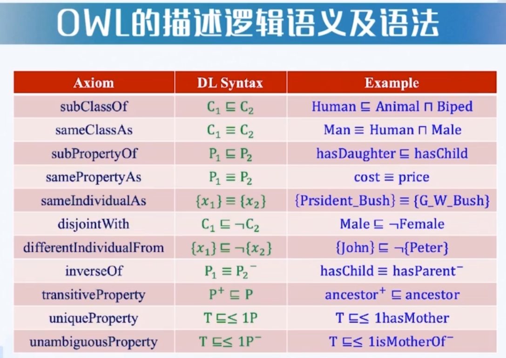 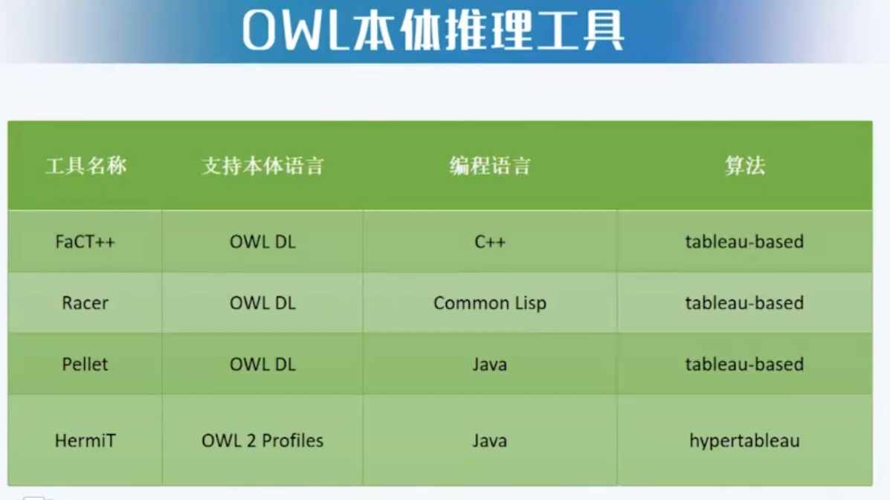
            - 基于规则的推理：Datalog，基于产生式规则的推理（RETE算法） 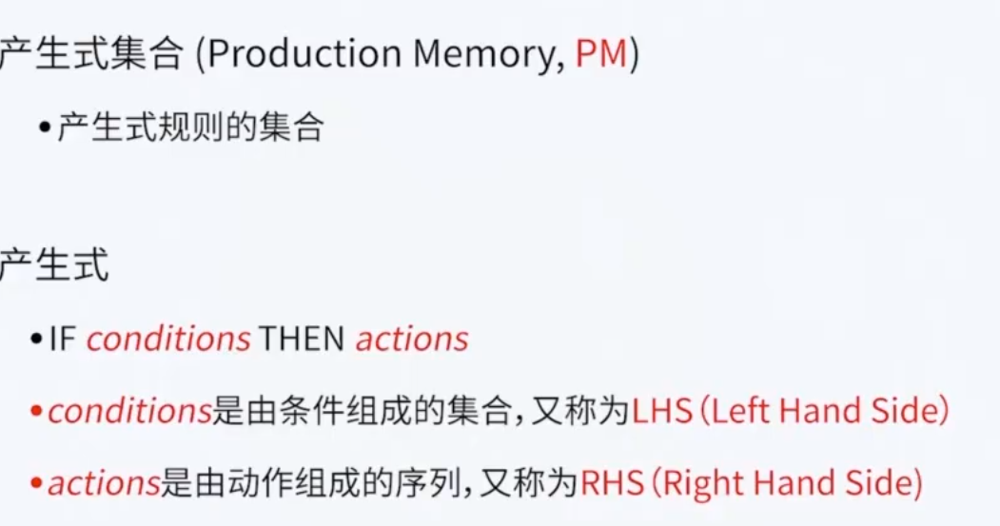 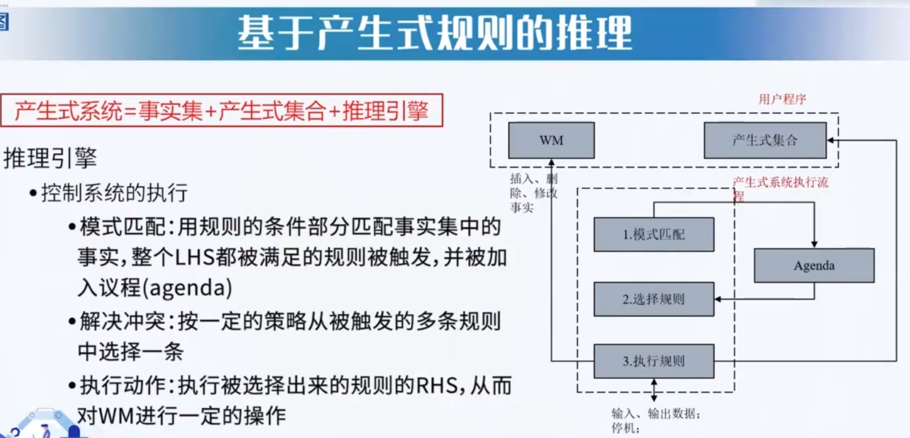
        - 基于图结构或表示学习:PRA,AMIE,TransE, Analogy,DeepPath,NeuralLP
            - 基于嵌入学习
                - 加法模型TransE, TransH,TransR,TransD;基于矩阵DistMul, 利用类比思想Analogy, ComplEx, 基于神经网络ConvE；基于关系旋转RotaE，BetaE基于Beta嵌入的多跳逻辑推理；基于强化学习 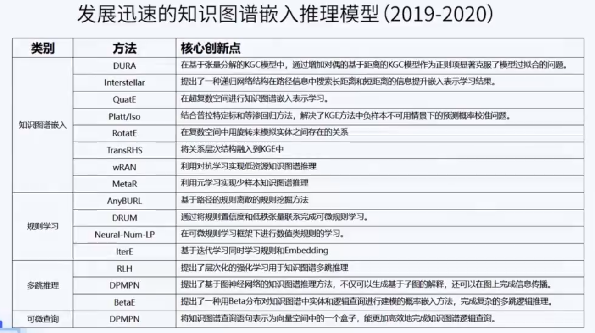
                - 挑战：稀疏性问题，无尺度问题，wRAN,MetaR
            - 基于规则学习
                - Path Ranking Algorithm:将连接两个实体的路径作为特征来预测其间可能存在的关系
                - AMIE: 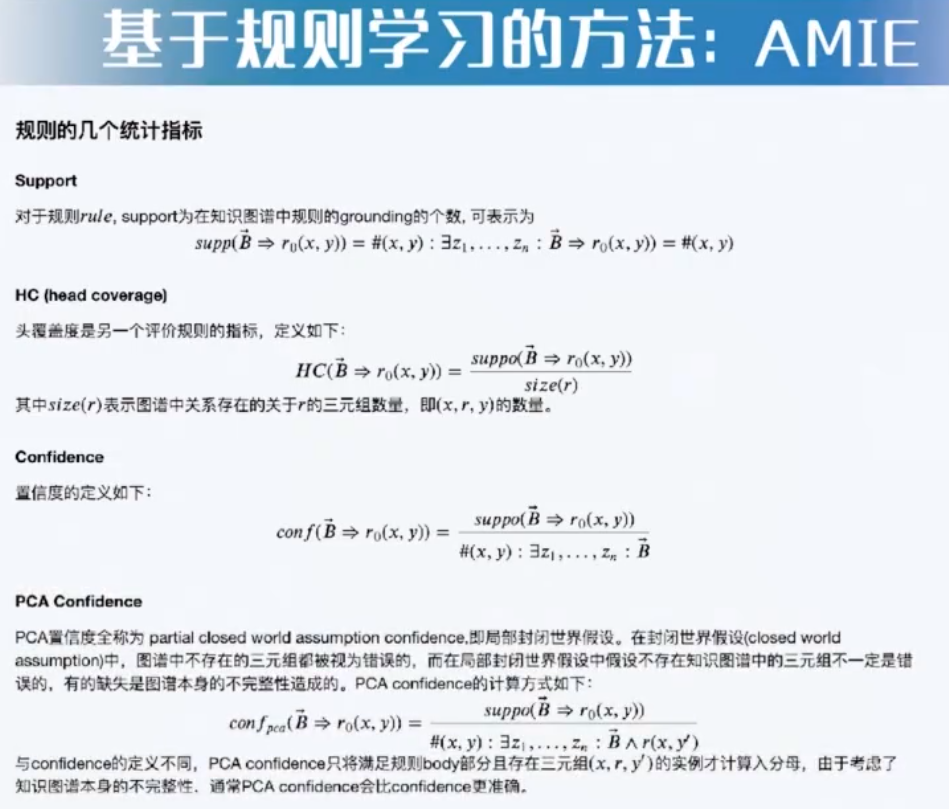 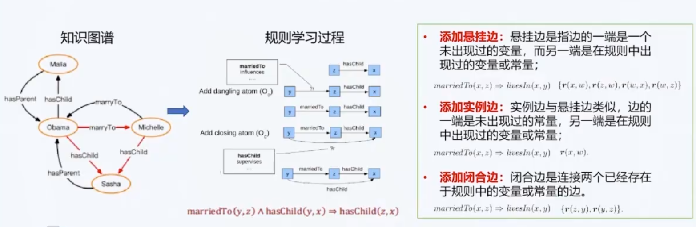
                - 可微规则学习NeuralLP，NeuralLP-N, DRUM,RuleE。规则学习+嵌入学习：IterE 
            - Ontology embedding-本体概念层推理
                - Ontology Embedding的侧重于对本体中概念体系进行学习这包括类与类之间的关系,类与实例之间的关系，以及类与属性之间的关系等;Onto Embedding侧重于Tbox概念层的表示学习,KGEmbedding则更加侧重于Abox实例层的表示学习,概念层的表示学习通常被用来增强实例层的学习效果，同时,实例层也被经常用来实现概念层,如本体axiom的学习。
                - EL Embedding: 1. 首先将所有逻辑原语转换为包含关系；2.核心是两个映射函数:f(x)和r(x)，f(x)函数的作用是完成符号空间到向量空间的映射,即将一个类映射到向量空间中的某个球心,并将关系映射为一个向量
                - Quantum Embedding,0nto2Vec ,OPA2Vec ,OWL2Vec.本体增强的KG Embedding: JOIE,MuPP(基于双曲几何建模)
    - 推理分类
        - deductive Reasoning(P->Q,..),Inductive Reasoning,Abductive Reasoning,Analogical Reasoning
- 概览
    - 知识图谱的技术要素： 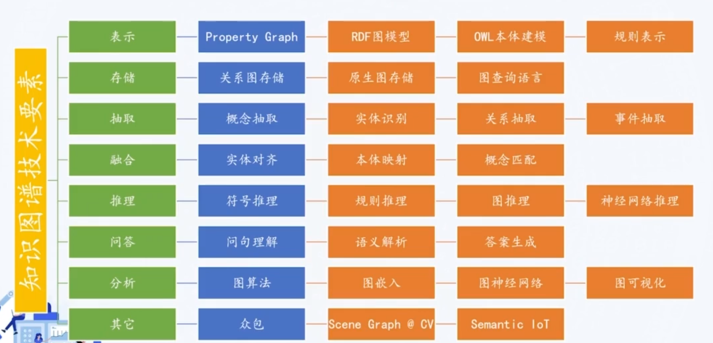
- 知识图谱问答
    - 分类
        -  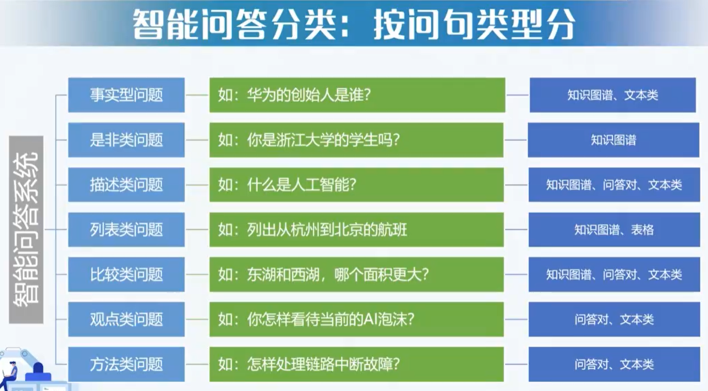
        -  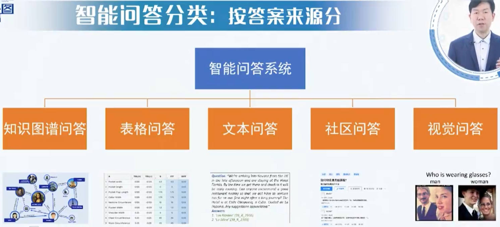
    - 数据集
        - QALD，WebQuestion,SimpleQuestion,MetaQA, 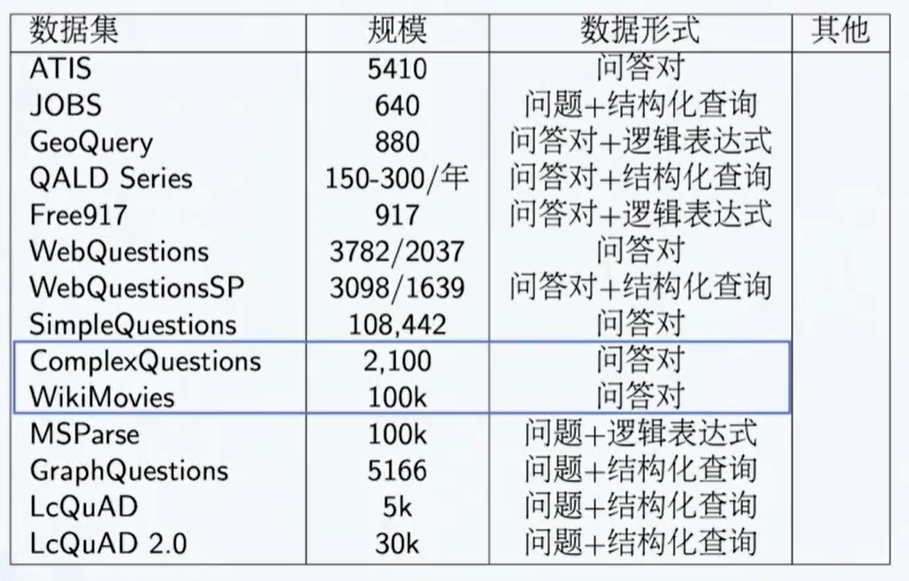
    - 基于查询模版
        - 知识图谱问答的挑战：问句的表示与语义理解，知识库的Grounding和匹配
        - TBSL:主要是将自然语言问句转化为SPARQL本体查询。包含两个方面：词的理解和问句的语义结构映射。词的理解将entity和关系跟已有的知识图谱映射，语义结构映射则将问句的主题映射为查询语言的操作。分为两个步骤：模版生成和模版实例化。模版生成利用问句生成SPARQL模板，用于映射问句的语义结构，包括各种Filters和Aggregation操作算子。模版实例化通过将实体识别和谓词检测将自然语言问句中的词语与知识图谱的本体概念进行匹配，从而将SPARQL模板实例化Instantiate
            - 模版生成：首先，获取自然语言问题的POS信息，其次，基于POS和语法规则表示问句，然后利用domain-dependent词汇和domain-independ词汇辅助分析问题，最后，将语义表示转化为一个SPARQL模板
            - 模版实例化：对于Resources和Classes:· **可用WordNet获取知识图谱中对应标签的同义词,然后计算字符串相似度获得映射关系** ,·最高排位的概念将作为填充查询槽位的候选；对于Property，还需要与模式库中的自然语言表示进行比较，有可能会需要将单个Property分解为多个谓词的组合描述
            - 查询排序与答案选择：每个匹配的资源(Class,Property,Entities)根据String Similarity和Prominence获得一个打分一个查询模板实例的分值根据替换相应Slots的多个资源的平均打分，利用类型检查排除不正确的匹配，例如需要检查property的domain/range是否与<class>一致，对于全部的查询集合，仅返回打分最高的
        - QUINT:根据问句答案对，使用依存树自动学习模版，模版的学习使用远程监督算法，支持自动识别问题答案的类型，使用整数线性规划（ILP）学习问句-答案之间的对齐；利用自然语言的组成特点，实现从简单问题中学到的模版来解决复杂问题：将问题分解为子句，并用模版回答每个子句，结合子句答案获取最终答案。
            - 模版生成：1. 问句依存分析，训练阶段的输入是问题u和它对应的答案Au,使用依存树的好处在于它能够捕捉远距离依赖关系，能够跳过无用的tokens，具有更好的容错性。 2. 为问句构建查询子图，根据问句和答案中的实体，使用实体链接工具与知识图谱中实体进行链接，并从知识图谱中得到相应的最小子图。3. 为问句构建对应查询，从最小子图出发，将answer和实体替换为变量，并添加answer的type边，即问题的答案类型，形成带变量的子图。4. 问句与查询的对齐，包括实体对齐、Type对齐、谓词的对齐，因而需要构建词典库，包括谓词词典库L_p和类型词典库L_c,可以使用远程监督的方式构建。还需要将问题分块，将问题中的短语与KG对齐。5. 进一步依据问句与查询对齐的结果，生成可能的模版。 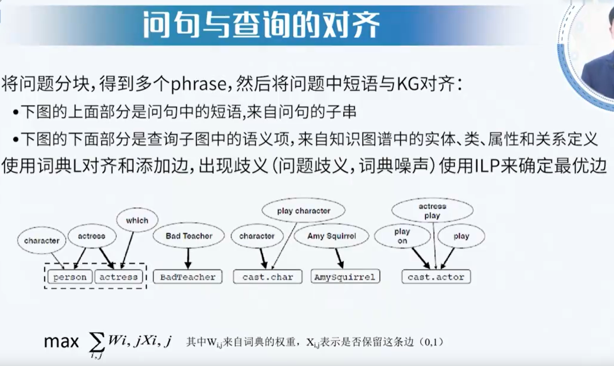
            - 模版实例化：对于新问题首先进行依存分析,并使用实体链接工具与知识图谱建立链接使用子图同构去模板库中进行匹配，图中加粗的黑线为匹配部分再使用词典L对模板中的项进行映射和实例化
            - 候选查询排序：使用Random Forest等学习两个查询之间的顺序
            - 复杂问题处理：依存树重写、子问题回答、答案拼接 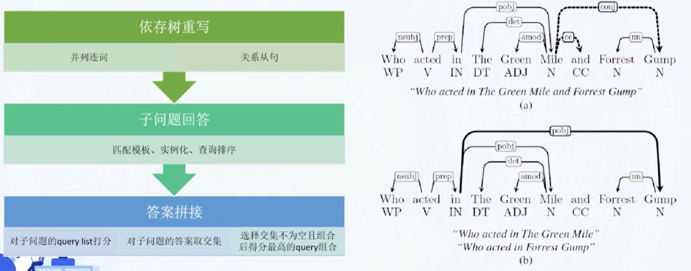
    - 基于语义解析
        - 直接将问题解析为对应的逻辑表达式，然后到知识图谱中查询。通常包含逻辑表达式、语义解析算法、语义解析模型训练三部分。一般步骤是将问句解析成中间表示，再将中间表示向知识库映射，获得最终的逻辑表示。逻辑表达式：lambda-calculus,lambda-DCS, 组合范畴语法。语言解析的基本步骤：短语检测，资源映射，语义组合，逻辑表达生成。语言解析器的训练：目标是通过大规模知识库上的问题/答案对集合训练Parser。
        - 语义解析的Briding操作：通常谓词不是明确表示的,导致问句中的谓词无法与知识图谱中的关系直接映射。Paraphrasing即短语重写。
    - 基于检索排序
        - 以知识图谱为中心的方法，把查询匹配问题转换为排序问题，首先通过实体链接技术从问题中定位中心实体，然后从中心实体出发进行获取知识图谱中有关的实体作为候选答案，然后对候选答案进行排序，选出得分最高的实体作为答案。
        - 实体链接：在文本中对知识图谱中的命名实体进行识别和消歧的任务。方法：1. 将实体链接问题的两部分——识别和消歧——作为一个联合任务,使用端到端的神经网络进行优化；多语言实体链接：在实际应用中,我们经常需要把多语言的文本中的实体链接到一个或多个不同语种的知识图谱上这类型的设定被称为是跨语言实体链接当语种数目足够多时,会出现低资源语种或实体对应的训练数据极少的情况，因此,需要格外关注零样本和少样本的情形。《Entity Linking in 100 Languages》
        - 排序模型： **基于特征的检索排序模型** ， **基于子图匹配的检索排序模型** （从输入问题中定位问题实体,随后答案候选检索模块以该问题实体为起点按照特定规则从知识图谱中选择答案候选,接下来,答案子图生成模块为每个答案候选实体从知识图谱中抽取出一个子图,作为该答案实体的一种表示。最后答案检索排序模块计算输入问题和每个答案子图之间的相似度用来对子图对应的答案候选进行打分,从而排序得到最终答案，Yih等）， **基于向量表示的检索排序** （为输入问题Q 和答案候选 A 分别学习两个稠密的向量表示f(Q)和g(A):并在向量空间中计算问题向量和答案向量之间的相似度，用于对不同的答案候选进行打分）， **基于记忆网络的检索排序** （除问答模块之外,引入记忆网络模块，记忆网络模块负责将有限的记忆单元表示为向量，问答模块从记忆网络模块中寻找与问题有关的答案，Key-value Memory Network）
    - 基于深度学习
        - 问句解析类方法：包含实体识别、关系分类、实体消歧、逻辑表达式改进。
            - Staged Query Graph Generation：充分利用知识图谱来减少问句解析的搜索空间，通过搜索逐步构建查询图，从而简化语言匹配问题。具体步骤：首先定义一个可以直接转化为lambda验算的查询图，然后将语义解析的过程转化为查询图生成的过程，最后对生成的查询图排序，选出最佳答案。查询图的生成过程由三个步骤构成：实体链接、属性识别、约束挂载。对于产生的多个候选路径，使用卷积神经网络进行打分，然后利用向量间的相似度计算自然语言和谓语序列的相似度得分， 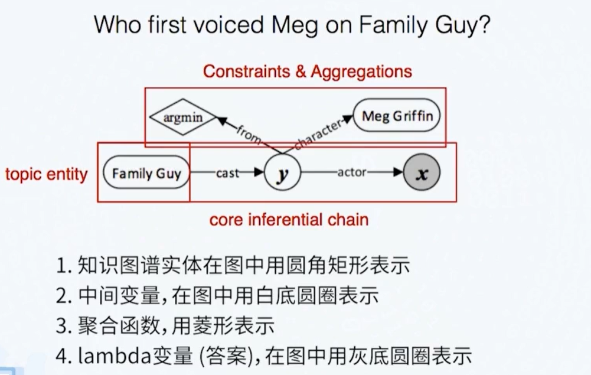
            -  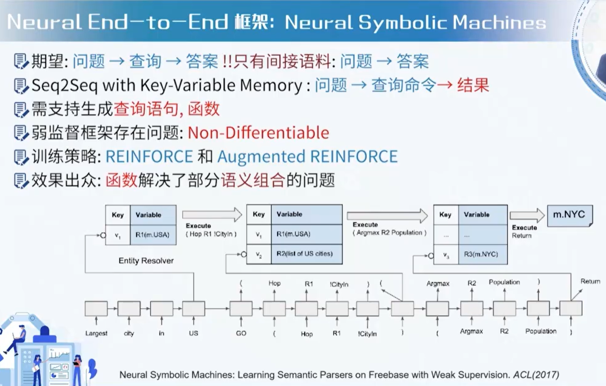
        - 排序检索类方法的改进
            - Simple Embeddings(Question Answering with Subgraph Embeddings)将单词、短语、知识图谱中的候选实体、关系类型都映射为向量，候选答案实体利用三种向量进行表示，答案实体本身、答案实体与主实体关系路径、答案实体与主实体的subgraph，计算答案实体与主实体的相似度来选择正确答案。 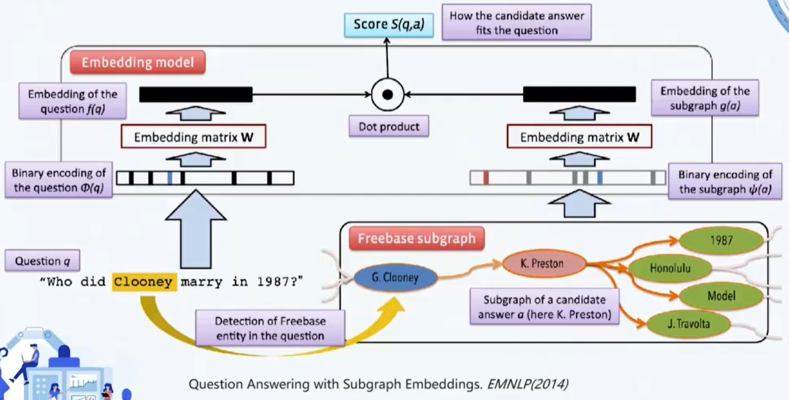
            - CNN+Attention:t提出了一种Multi-column的卷积神经网络，分别对问句、答案的类型、答案实体关系路径、答案实体一条内的subgraph,网络先得到问题的多个向量表示，再分别与答案的类型、答案实体关系路径、答案实体一条内的subgraph进行相似度计算，通过加权获取最后结果。采用word embedding的平均进行语义表示 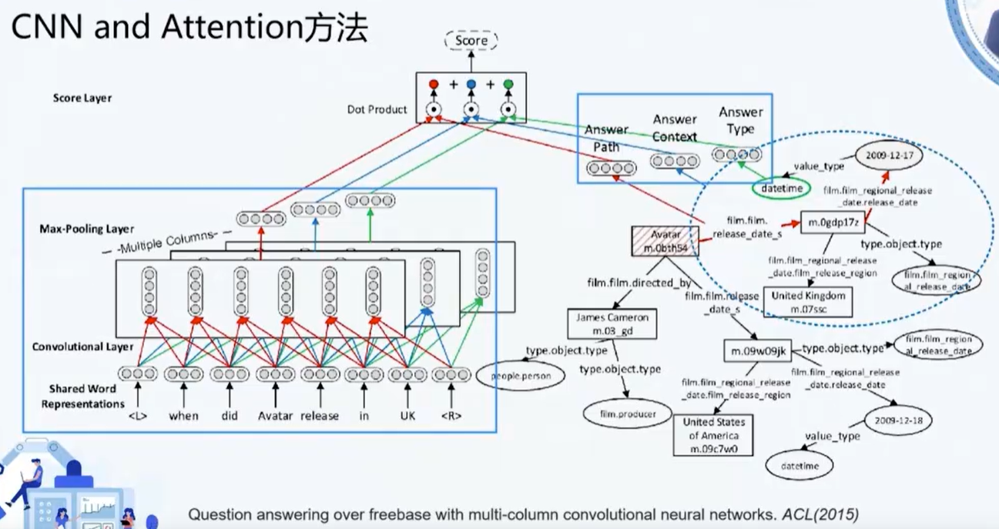
            - Attention+Global Knowledge:将候选答案分成四个维度,包括答案实体、答案实体关系路径、答案类型、答案上下文，然后利用cross attention动态学习不同答案维度与问句中词的关联程度，让问句对不同答案维度根据注意力机制自动学习权重。 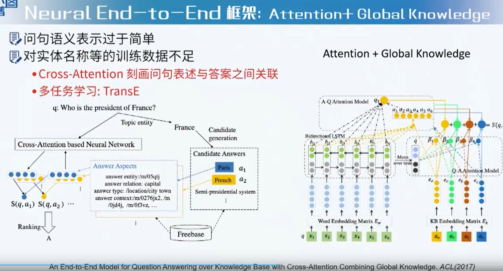
            - Key-value Memory Network:记忆单元为 Key-Value 形式,如<主体+关系,客体>访问时,Query与存储单元的 Key 计算相关度。Enhancing Key-Value Memory Neural Networks for Knowledge Based Question Answering. ACL(2019) 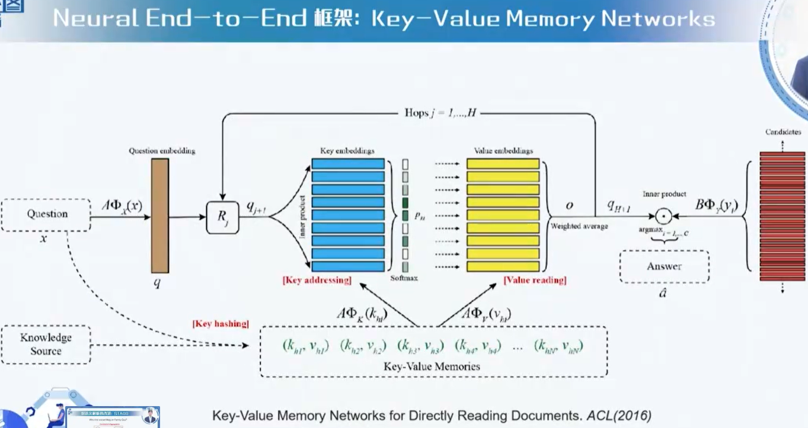
- 图与图算法
    - 若干重要概念
        - 汉密尔顿路径：经过所有顶点且只经过一次的路径；欧拉路径：经过所有边且只经过一次的路径。Weak Tie理论：如果某个节点A与两个节点B、C都有强关联，则B、C也可能存在关联。信息的传播通常是经由Weak Tie传播的。Scale-free理论：很多复杂系统拥有共同的重要特性:大部分节点只有少数几个连结,而某些节点却拥有与其他节点的大量连结；这些具有大量连结的节点称为“集散节点”所拥有的连结可能高达数百、数千甚至数百万。由此看来,这一特性似乎能说明网络是无尺度的。Barabasi-Albert模型用于构建无尺度网络，基于优先依附原则构建。无尺度特性的产生主要来自于网络生成过程中的选择依附,新的节点会优先找已经有很多连接的节点进行连接,类似光环效应。无尺度网络的度分布符合幂率分布。Random Network Model:通过Erdos-Reny模型构建随机网络
    - 图算法
        - 路径发现：寻找两地之间的最小路径，网络路由优化等；中心度理论：寻找社交网络中最有影响力的任务，通信网络或电力网络中易受攻击的节点；社区发现：对商品网络进行聚类分析、犯罪团伙定位等。
            - 最短路径：Dijkstra, Floyd, SPFA算法；最小生成树算法：Prim,Kruskal,Sollin算法； 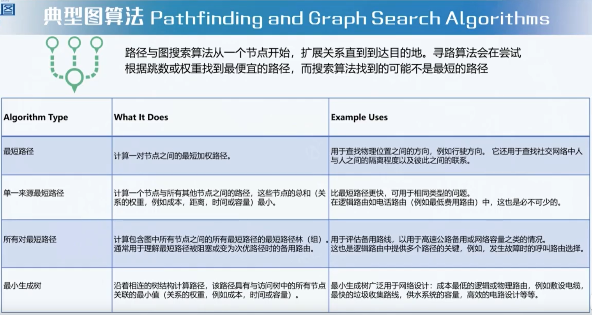
            -  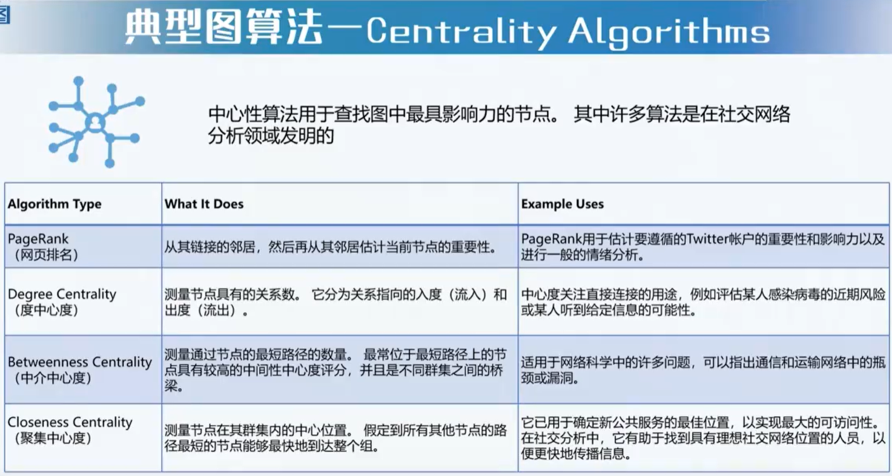
            -  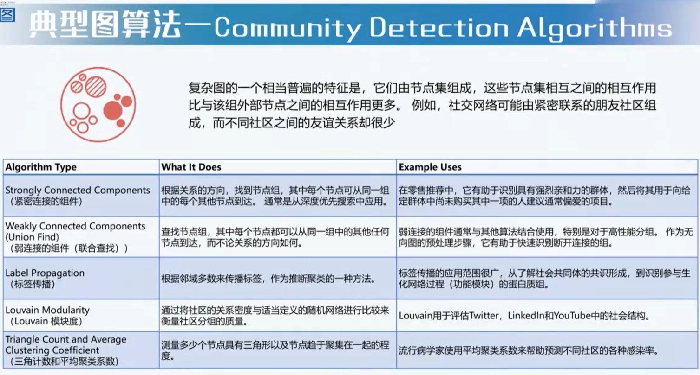
- GNN+KG
    - compgcn同时得到实体和关系的表示(composition-based multi-relational graph convolutional netoworks); Out-of-Knowledge-Base entities, 学习未见过的实体表示；关系迁移，Long-tail relation extraction via knowledge graph embedding and graph convolution networks；实体对齐，RDGCN：Relation-aware entity alignment for heterogeneous knowledge graph; **commonsense konwledge aware conversation genration with graph attention** . 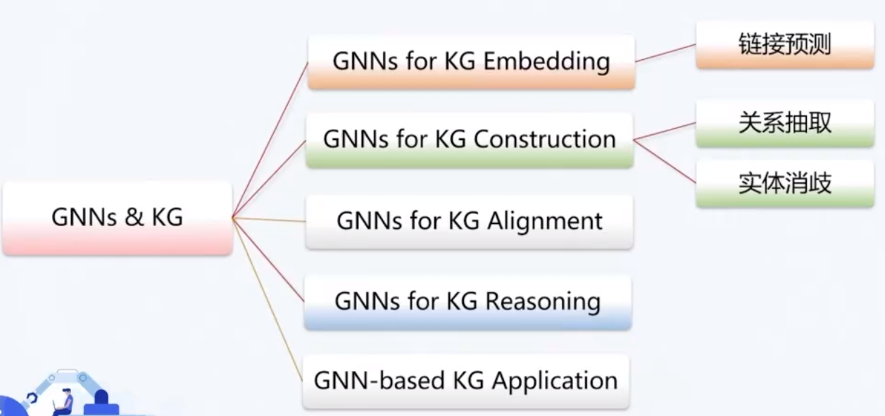
- 知识图谱前沿
    - 多模态知识图谱
        - 人的认知系统由两部分构成：system1负责感知系统；system2负责逻辑系统。认知科学家道格拉斯-霍夫施塔特:“记忆是高度重建的。在记忆中进行搜取，需要从数目庞大的事件中挑选出什么是重要的，什么是不重要的,强调重要的东西，忽略不重要的东西。这种选择过程实际上就是感知，认知的核心过程与感知的关系非常非常的密切->符号知识图谱==>语言知识+视觉知识。IMGpedia, MMKG, ImageGraph, Richpedia. 多模态问答：Out-of-Box，Mucko.场景图与知识图谱融合，Bridging Knowledge Graphs to Gnerate Scene Graph; 多模态推进计算 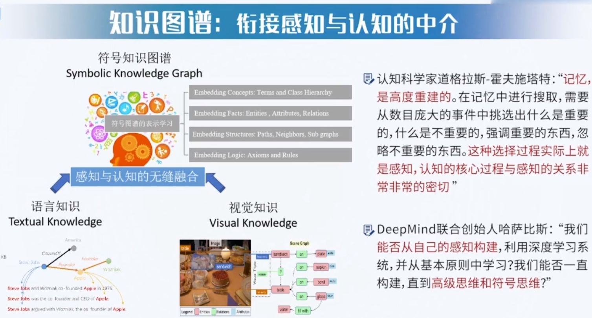
    - 知识图谱与预训练语言模型
        - 预训练模型的发展史 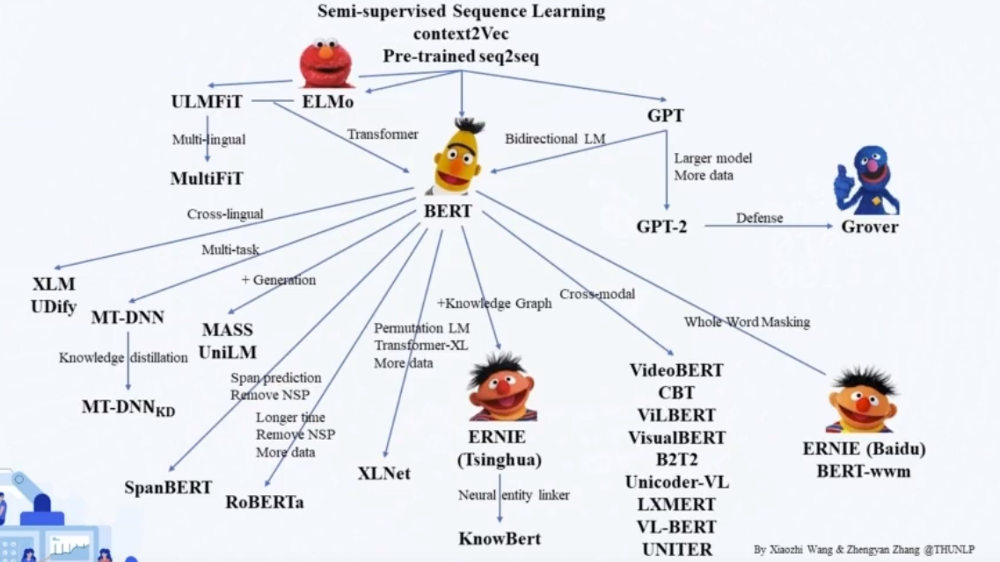
        - 知识图谱驱动的语言预训练模型：ERNIE,K-Adapter, KEPLER, KnowBERT,WKLM 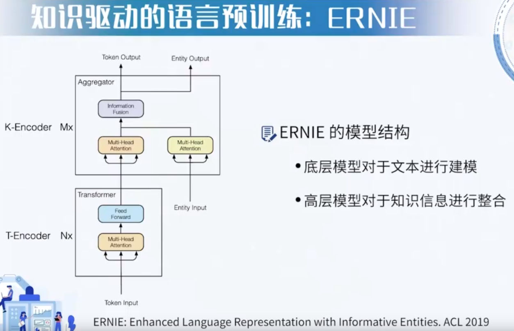
        - 将知识图谱融入到语言预训练模型中大致有三种方法,包括直接把图谱表示向量作为特征输入的ERNIE和KnowBERT等模型;通过设计新的预训练任务实现知识植入的KEPLER和WKLM等模型;通过增加额外的模块的K-ADAPTER等模型 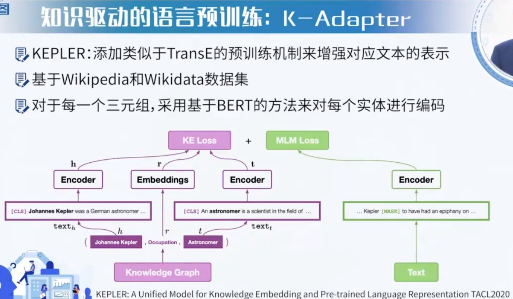
    - 事理知识图谱
        - 事理图谱中的事件:理论上,事理图谱中的事件是具有一定抽象程度的泛化事件，表示为抽象、语义完备的谓词性词或词组,也可以表示为可变长度的、结构化的(主体，事件词,客体)多元组，其中必然包含一个事件词,标志事件的发生,例如:“跑步”而主体和客体都可以在不同的应用场景下被省略,例如:“(元首,出访)”可以省略事件的客体;“(购买,机票”可以省略事件的主体 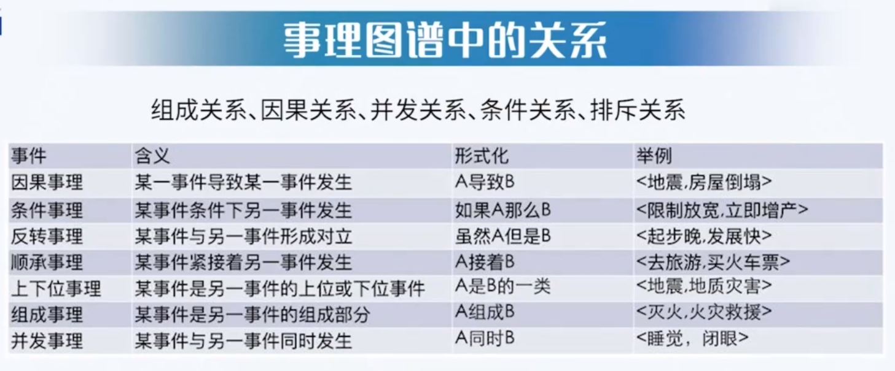
        - 事理知识图谱:事件+事理逻辑事理知识图谱是一个事理逻辑知识库,描述了事件之间的演化规律和模式，结构上事理图谱是一个有向有环图,节点代表事件,有向边代表事件之间的顺承、因果、条件和上下位等逻辑关系 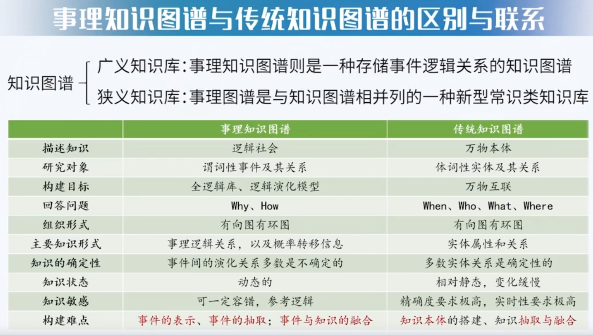
        - 事理图谱的应用：因果问答，消费意图识别，重要新闻判别与推荐，推理与辅助决策
    - 知识图谱与低资源学习
        - LRL4KG:低资源关系学习MetaR,wRAN,ZSRC,ZSGAN，低资源实体学习LAN
        - KG4LRL:KG as Bridge for Transfer,Knowledge as Reason,KG as Explanation。GCNZ, Ontology-guided Senantic Composition for Zero-shot Learning, OntoZSL,Explainable Zero-shot Learning via Attentive Graph Convolutional Networkand Knowledge Graph.Semantic Web Journal.
        - 知识(图谱)的获取和构建,特别是常识类的知识获取绝大部分都是长尾问题,自动化知识获取的主要难点是在长尾知识,因此,低资源学习是知识图谱构建的不可或缺的技术手段;知识图谱可用来建模语义空间,从而建立类别之间的关联关系,从而更好的帮助解决零样本预测等低资源问题;知识可以看作是质量更好、表示更规范的数据,或者是融入更多人的先验的数据。解决低资源问题应该充分发挥知识的作用
    - 语义解析vs.检索排序；描述性语言vs. 过程式语言；属性图vs. RDF vs. OWL；多模态知识图谱；