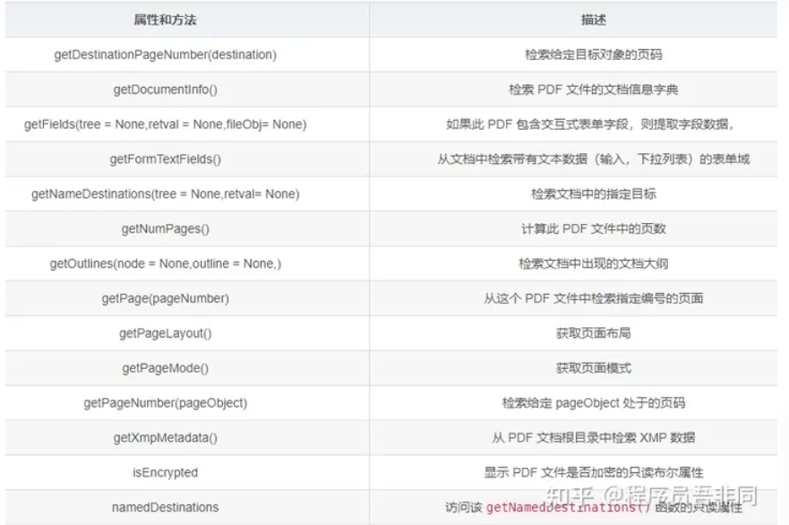
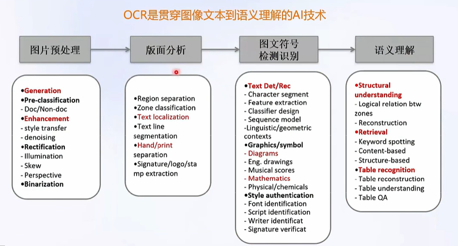
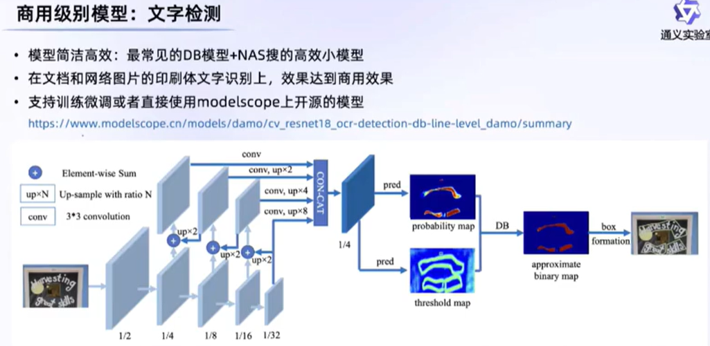
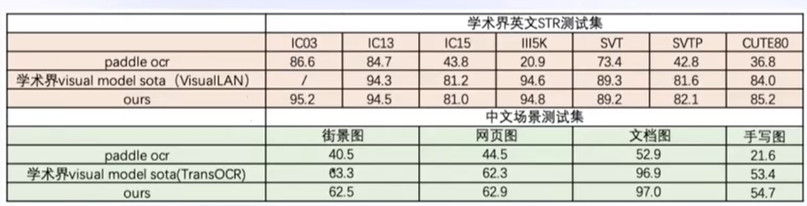
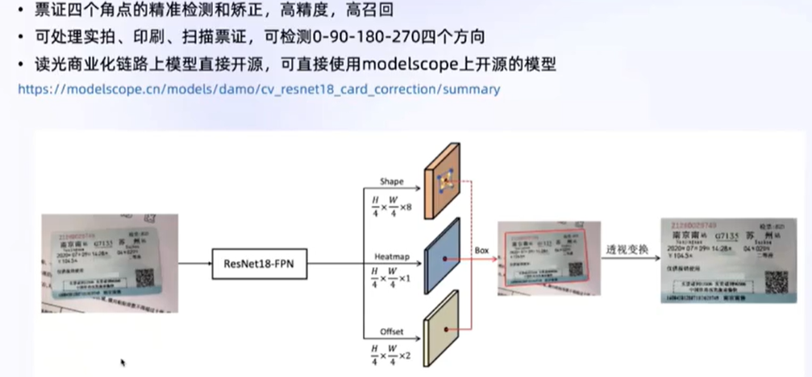

# 非结构文档处理
- 处理工具
    - PDF
        -  [python包]("http://wed.xjx100.cn/news/217028.html?action=onClick")
            - PyPDF2:可以用于读取扫描版 PDF 中的文本。PyPDF2 中有两个最常用的类：PdfFileReader和PdfFileWriter，分别用于读取 PDF 和写入 PDF。其中PdfFileReader传入参数可以是一个打开的文件对象，也可以是表示文件路径的字符串。而PdfFileWriter则必须传入一个以写方式打开的文件对象。 
            - pytesseract：一种基于 Python 的 OCR 库，可用于识别扫描版 PDF 和图片 PDF 中的文本
            - pdfminer：一种用于提取 PDF 中文本和元数据的 Python 库， **完全专注于获取和分析文本数据，如果PDF文档都是图片则无能为力** 。 PDFMiner允许获取页面中文本的确切位置以及其他信息，例如字体或线条。 它包括一个PDF转换器，可以将PDF文件转换为其他文本格式（例如HTML）。
            - textract：一种用于提取 PDF 中文本和元数据的 Python 库，支持多种文件格式
            - PyMuPDF：一种用于处理 PDF 文件的 Python 库，可以用于进行 PDF OCR 识别和文字搜索,提供了丰富的功能来操作PDF文件，如读取、写入、分割、合并、旋转、裁剪等。此外，它还支持加密和解密PDF文档，以及提取文本、图像和元数据等信息。
            - pdfplumber：一种用于提取 PDF 中文本和元数据的 Python 库，支持多种文件格式,可以方便地获取pdf的各种信息，包括文本、表格、图表、尺寸等，它不支持修改或生成pdf，也不支持对pdf扫描件的处理,pdfplumber中有两个基础类，PDF和Page。前者用来处理整个文档，后者用来处理整个 **页面.**
            - Tika：一种用于提取 PDF 中文本和元数据的 Python 库，支持多种文件格式。使用 Tika 需要安装 Tika 库和 Java 运行环境
            - marker: 支持将pdf,epub,mobi转换为md,但仅支持类英语语言
            - pypdfium2:Pypdfium 2是一个绑定到PDF Fium的ABl级Python 3，一个用于PDF渲染、检查、操作和创建的强大且自由许可的库。它是用ctypesgen和外部PDFium二进制文件构建的。自定义设置基础设施提供了无缝的打包和安装过程。预构建的包支持广泛的平台。
            - pdf转md开源工具，基于javascript [https://github.com/jzillmann/pdf-to-markdown]("https://github.com/jzillmann/pdf-to-markdown")
            - unstructured
        - 应用
            -  [itext7]("https://github.com/itext/itext7")
                - 一个创建、编辑、增强PDF的Java SDK，部分开源
            -  [PDF Box]("https://github.com/apache/pdfbox")
                - 一个创建、编辑、增强PDF的Java工具，完全开源
            -  [Stirling PDF]("https://github.com/Stirling-Tools/Stirling-PDF")
                - PDF编辑工具，使用浏览器为UI，完全开源
            -  [pdf2md]("https://pdf2md.morethan.io/")
                - 开源，pdf转md工具,基于JS
        - API
            - readable parser: 支持将 **PDF** 、 **Docx** 、 **HTML** 、 **Excel** 、 **CSV** 等文件转换为 **Markdown** 格式，尤其适合 **处理文档中的表格.免费版对请求频率有限制，每秒只能发出1 个请求，每天只能发出 100 个请求。**
            - Mathpix: 支持将pdf转换为md
            - Azure: docment intelligence
            - Amazon Textract
        -  [python转换包]("https://nikku1234.github.io/2020-09-27-PDF-Conversions-using-Python-Packages/")
- 文档转换工具
    - pandoc
        - 除了pdf，其他都可以转
    - word2md/word2html
        - writage
            - 一个markdown和word互相转换的工具，支持在word中编辑md,支持win和macos。
        -  [mammoth]("https://github.com/mwilliamson/mammoth.js")
            - 原生支持word2html,现在加入了mardown支持
        -  [word-to-markdown]("https://github.com/benbalter/word-to-markdown")
            - 基于Ruby
    - pdf2word
        -  [pdf2docx]("https://github.com/ArtifexSoftware/pdf2docx")
            - 实测不保留标题级别
- 版面检测与提取
    -  [layout-parser]("https://github.com/Layout-Parser/layout-parser")
        - LayoutParser 旨在提供各种简化文档图像分析 (DIA) 任务的工具。LayoutParser 提供了丰富的用于布局检测的深度学习模型存储库以及一组统一的API。LayoutParser 附带一组布局数据结构的 API，针对文档图像分析任务进行了优化
    -  [unstructured]("https://github.com/Unstructured-IO/unstructured")
        - 用于提取和预处理图像和文本文档（例如 PDF、HTML、Word 文档等）的开源库。
    - PP-Structure
        - 安装环境要求的包陈旧，导致安装非常困难，且安装成功后，部分脚本也不能正常使用，似乎官方已经不再更新。
- OCR
    - 任务
        - DAR(Document Analysis & Recognition)
        - STR(Scene Text Recognition)
        - Online Handwritten Character Recognition, OHCR
        -  
    - 对象
        - 公式
            - ：python工具，仅支持英文 [Nougat]("https://github.com/facebookresearch/nougat")
            - MathCapture:仅支持Mac
            - mathpix: 仅收费的API，但效果很好
        - 文字
            - 工具：Umi-OCR，基于Paddle和Rapid-OCR，仅win版本；FastOCR，FastOCR 是一款开源免费的提供在线 OCR 文字识别的桌面工具，将百度、有道、旷世的OCR体验额度集成起来
            - ：基于Paddle-OCR，做了更好的工程化 [Rapid-OCR]("https://github.com/RapidAI/RapidOCR")
            - : 多语言支持，超轻量 [PP-OCR]("https://github.com/PaddlePaddle/PaddleOCR")
            - ：基于darknet框架的CTPN版本文字检测于CNN+CTCOCR文字识别 [darknet-ocr]("https://github.com/chineseocr/darknet-ocr")
            - 阿里读光
                - 文字检测（DB模型+NAS搜索的高效小模型） 
                - 文字识别（CNN+Transformer+CTC） 
                - 票证检测矫正 
            - :是一个基于PyTorch的开源OCR库，它提供了一系列功能强大的中文OCR模型和工具，可以用于图像中的文字检测、文字识别和文本方向检测等任务。它可以识别各种不同风格和字体的中文文字，包括简体字和繁体字，可根据具体需求在 中查找对应的模型作为参数输入实例化cnocr方法。官方也提供有英文的识别模型 [cnocr]("https://github.com/breezedeus/CnOCR") [官方文档]("https://link.zhihu.com/?target=https%3A//cnocr.readthedocs.io/zh/latest/")
            - :是一个基于PyTorch的开源OCR库，可以进行多语言文本识别,支持超过80种语言. [EasyOCR]("https://github.com/JaidedAI/EasyOCR")
            - 是一个开源的多模态OCR工具包，用于处理多模态（如图像、文本、语音等）的光学字符识别任务，可以用于图像中的文字检测、文字识别和文本方向检测等任务。由OpenMMLab团队开发和维护的一个项目 [mmocr]("https://github.com/open-mmlab/mmocr")
            - : Tesseract是一个开源的OCR引擎，支持多种语言的文字 [tesseract]("https://github.com/tesseract-ocr/tesseract")
            - Surya: python多语言文档OCR工具包，可进行准确的文本行检测，即将推出文本识别功能，以及表格和图表检测功能，可以处理各种类型的文档和多种语言。不适用于照片或其他图像，它也不适用于手写文本
            - TrOCR:联合使用预训练的图像和文本 Transformer 进行 OCR 文本识别,适用于照片和手写体。
            - CuneiForm 是当今最可靠的开源 OCR 工具之一。它专门将扫描的文档和图像转换为可编辑的文本。其重点是以输入源和输出格式提供精确的 OCR 结果。该工具支持多种语言并确保跨各种操作系统的兼容性。
        -  [表格]("https://blog.csdn.net/weixin_41819299/article/details/125540996")
            - :智能文档分析系统，支持表格识别，关键信息抽取，版面复原，PDF转Word. [PP-Structure]("https://github.com/PaddlePaddle/PaddleOCR")
                - SLANet： 202210更新的表格识别模型SLENET(Structure Location Alignment Network) [百度飞桨]("https://so.csdn.net/so/search?q=%E7%99%BE%E5%BA%A6%E9%A3%9E%E6%A1%A8&spm=1001.2101.3001.7020")
                - TableRec-RARE：PP-Structurev1的组件
            - TableMaster:平安基于FastOCR,将表格检测分为四个子任务
            - camelot：python包，仅支持文本类pdf
                - camelot-py: camelot的继续维护版本
            - Tabula:基于JS的表格抽取工具，仅支持文本类PDF
            - : 支持有线表格（Cycle-CenterNet模型）和无线表格（LORE模型） [阿里读光]("http://duguang.aliyun.com/")
            - table-ocr: 基于darknet-ocr
- 信息抽取模型
    - DocGraphLM
    - LayoutLM
    - LayoutLMv2
    - LayoutXLM
    - VI-LayoutXLM
    - DocLLM
    - ESP
    - GeoLayoutLM
    - ByT5
    - nougat
    - Layoutlmv3
    - DocLayNet
    - GeoLayoutLM
- 数据工具
    - 半自动标注工具
        - PPOCRLabel
    - 数据合成工具
        - Style-Text
- 文档问答项目
    - PDFTriage
        - 出发点是将PDF视为结构化数据而非纯文本，但需要将PDF解析为json,(感觉没啥价值啊)包含三个步骤：1，提取文档的元数据；2，基于LLM进行类选(triage),询问LLM来选择准确内容（pages, sections, retrieved content);3，基于检索内容进行答案生成。
    - DocVQA
    - ChatDoc
    - ChatBook
    - ChatPDF